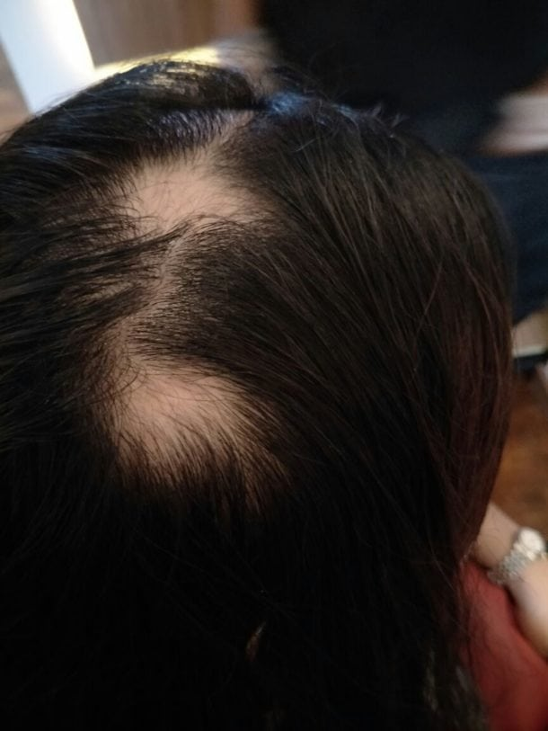
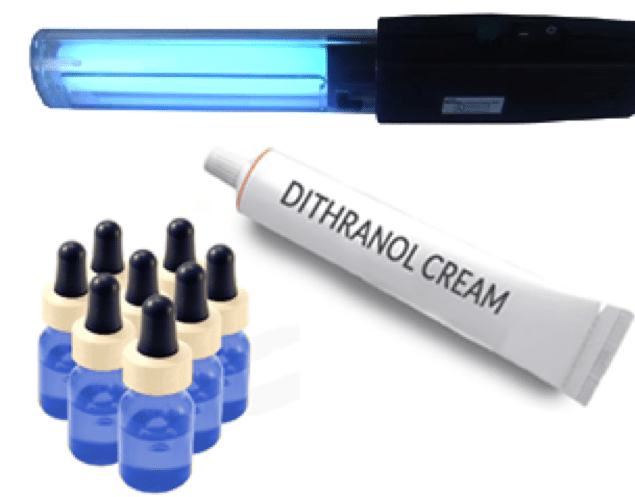
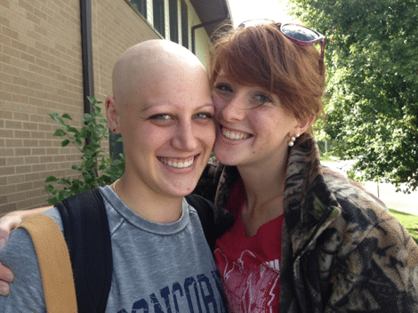
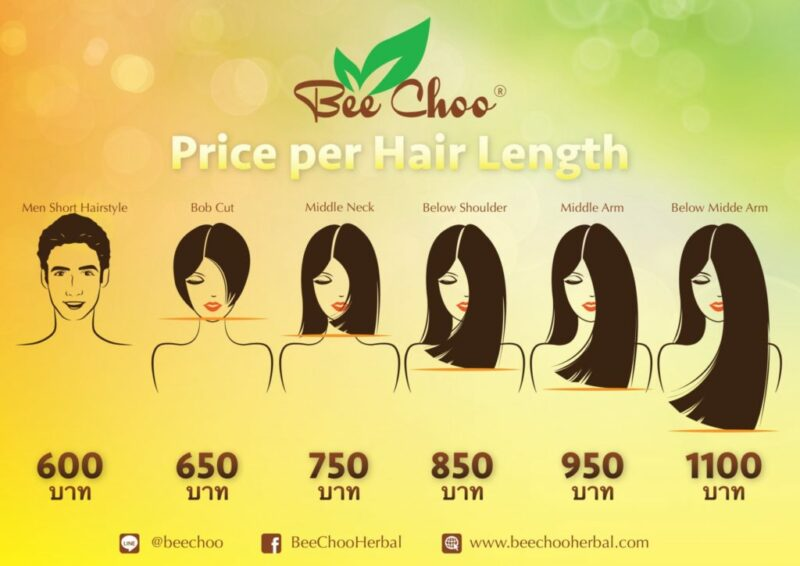

Hair loss is something that can be devastating for us. In this age where our looks are constantly being compared, and where Instagram models are a constant source of pressure for us to look the best we can, having alopecia can be a nightmare. If you have recently been diagnosed with alopecia, and you are feeling lost about all of this, read on, as we will be telling you more about alopecia and how to treat it. Trust us, you are so much more than what you look, and with all this information and tips, you will be able to better cope with alopecia.

In this post, we will cover the following topics:

5 different types of alopecia

What are the causes of alopecia areata?

Are you at high risk of alopecia areata?

How is alopecia areata diagnosed?

Can you prevent alopecia areata?

How do you cure alopecia areata?

Alternative treatments

Minimising discomfort from alopecia areata

Living with alopecia areata

A place to go if you want to treat your hair loss problems

In a nutshell, alopecia means hair loss. However, not everyone suffering for alopecia have the same exact form of hair loss. Different types of alopecia exist, and not everyone with alopecia is diagnosed with the same thing. Here, we will take a look at some of the most common types of alopecia.

5 Different types of alopecia exists

Androgenic alopecia

Alopecia Totalis and Alopecia Universalis

Ciatricial alopecia

Traction alopecia

Alopecia Areata

Androgenic alopecia

This is the scientific name for genetic hair loss. It is divided into male pattern and female pattern hair loss. Genetic hair loss is probably one of the most common type of hair loss that many suffer from. While it usually occurs with age, it can also affect those in their teens or early adulthood. The cause behind this type of hair loss is when enzymes in the body start to turn the hormone, testosterone, into its derivative, dihydrotestosterone. Dihydrotestosterone has the effect of shrinking the hair follicles on our scalp, resulting in hair loss. Androgenic alopecia is genetic, and if your mum or dad suffers from this form of hair loss, you will probably be at higher risk of it too.

Alopecia Totalis and Alopecia Universalis

Alopecia totalis and alopecia universalis can be seen as a more extreme form of alopecia areata. With alopecia totalis, hair loss can occur over the entire scalp, while with alopecia universalis, hair loss can occur all over the body.

Ciatricial alopecia

This form of alopecia is also commonly known as scarring alopecia. It is a form of hair loss where one’s hair follicles are destroyed and replaced by scar tissue. Two different types of ciatricial alopecia exist- primary and secondary. Under primary ciatricial alopecia, hair loss is a direct result of inflammation of the hair follicles. The causes of this is not well understood even today. Under secondary ciatricial alopecia, scarring tissue results in hair loss. Here, this often occurs due to an event or process that is unrelated to the hair follicles, such as infections and burns.

Traction alopecia

This form of alopecia is distinct from the other forms that have been discussed. This is caused by the direct actions of the individual suffering from it, which results in the hair being subjected to excessive tension and hence causing them to break. Your hair style choice to go can be a cause of this, as tight braids and ponytails can put too much stress on your hair from pulling them all back. If you love changing your hair colour, or perhaps are thinking of getting on the unicorn hair trend, think twice before doing so. With our dark, Asian hair, the only way to get that is by bleaching the hair, and such harsh treatments can also result in hair loss, especially if done repeatedly.

Alopecia Areata

*Example of Alopecia Areata, i.e. Ghost Shave*

Most people referring to alopecia on websites and reports are probably referring to this type of alopecia. Here, we will explore in greater detail for this type of alopecia. Under the category of alopecia areata, there are further different categories of hair loss. Alopecia areata causes hair loss in circular patches. Not everyone diagnosed with alopecia areata will lose all the hair on their scalp and body- which only occurs to approximately 5 percent of people. When one is diagnosed with alopecia, this does not mean that their hair will completely not grown. Very often, their hair will grow, but rapidly falls out again.

It is important to note that alopecia is not contagious, so there is nothing for people to be afraid of. Alopecia is caused by the attacking of the hair follicles by the immune system, so unlike a flu or the stomach bug that are caused by viruses or bacteria, you cannot catch alopecia from someone else. It is something that happens within, and can happen to anyone, even those who are young and healthy.

Most patients will be able to be free of their hair loss problems without treatment within the period of a year, but this hair loss can also be permanent. A variety of treatment options are available, but they do not necessarily work the same way for everyone, so it is all about finding the best treatment for you. Unfortunately, many promoted treatments have not been proven to help the situation, so it might take some time to find the type of treatment that will solve your hair loss woes.

What are the causes of alopecia areata?

From current research, what we know today is that alopecia areata is caused by an immune system abnormality. This abnormality results in autoimmunity, which means that your immune system tends to attack your own body. This will lead to your immune system attacking specific tissues of your own body. When one has alopecia areata, the immune system starts to launch an attack on the hair follicles, resulting in the disruption of natural hair formation. Biopsies have been done in the labs on the skin of those with alopecia. These biopsies give us a better insight into what is happening when one has alopecia. Immune lymphocytes can be seen to be penetrating into the hair bulb of the hair follicles, hence disrupting the normal hair growth cycle.

Alopecia areata is commonly associated with other autoimmune diseases. This includes vitiligo, lupus, thyroid disease, ulcerative colitis and rheumatoid arthritis. It is also known to be capable of being inherited and passed on with one’s genes.

Are you at high risk of alopecia areata?

Alopecia areata usually occurs in adults from 30 to 60 years of age. While most alopecia patients come from this particular age group, it can also occur in young children or teenagers. Alopecia has to be distinguished from other forms of hair loss, such as hair shedding that may occur when one stops taking hormonal birth control, or hair shedding that sometimes come with the end of pregnancy.

How is alopecia areata diagnosed?

If you are finding yourself losing hair, and starting to see areas of bald spots, chances are it might be alopecia. If you suspect this, head over to your doctor’s to get a biopsy of your scalp to confirm the diagnosis. Other symptoms include the appearance of short hairs, yellow areas of skin at the follicular orifice, thin hairs, and grey hairs at bald areas.

Can you prevent alopecia areata?

Since alopecia areata is not caused by external factors, it cannot be prevented or avoided. The cause of such hair loss is usually different for each person. Unlike popular belief, alopecia areata is not caused by stress. However, if you have a family member with alopecia or other immune system diseases such as type 1 diabetes, thyroid disease, lupus, vitamin B12 anemia and atopic dermatitis, you are at a higher risk of heving alopecia areata compared to the average person on the street. Those who are diagnosed with alopecia areata but do not suffer from another form of immune system disease usually also have thyroid disease, nasal allergies, and asthma.

How do you cure alopecia areata?

Unlike a fever, where the go to medicine is a Panadol pill, unfortunately, there is no single recognised cure for alopecia areata. However, you can seek the help of a dermatologist, who can provide you with some treatments that may help your hair to grown again. Make sure that you do your research well and find out about the side effects of the treatments before going down for them! Here are a few common treatment options that are prescribed.

Steroid creams

These creams can promote the re-growth of your hair. Common ones are betnovate and demovate. They need to be used over a period of a few weeks without fail. Alternatively, a steroid can be injected directly to the bald area.

Dithranol

Do not get a shock when you first open this up, as it looks like a tar substace in the tub. To use this, you will have to rub it into the bare patches every day before washing it all off. This seems to act by irritation of the skin which ultimately interferes with the hair loss process.

Minoxidill

This can be applied as a solution to the bald patch. It can be used together with the steroid cream, but do a quick check with your local doctor if you are really concerned. This is a temporary measure for you bald spots, but definitely does not qualify for Ross.

PUVA

This form of treatment is only used when you have more than 50 per cent of hair loss. It is a sophisticated process which starts from taking a psoralen, a light sensitive drug, and next undergo a short exposure to UVA, which is a long wave on the ultraviolet scale. The frequency of treatments are usually over a three to six tear week with two to three sessions per week.

Immuno suppressive drugs

These are pills that can be taken and developed to stop or control the immune system from rejecting organs that are transplanted into someone else. Since alopecia has links to the immunity of the body, these drugs can help to calm the body’s immune system down- which is the cause of the problem.

Alopecia areata is an unpredictable condition, and can come and go. There is a high likelihood of sponteanous remission. As a general guide, the longer the period of time of hair loss and the larger the affected area, the less likely hair regrowth will occur spontaneously. While there are many different types of treatments and home remedies out there, none can be confidently said to be guaranteed to work. Nonetheless, many alopecia patients have found a form of treatment that works for them after many rounds of patient testing, so do not give up on treatment options! Another method many alopecia patients take is cosmetic camouflage. Although this cannot exactly be said to be a treatment method, it is still something that can help many deal with the significant and damaging emotional effects of alopecia.

Alternative treatments

*Ginseng, a popular alternative treatment methods.*

For all you people out there who do not want to treat your condition with chemicals and medicines, these alternative treatments can be something that you can try out someday. After all, taking too much medicine cannot be that good for your body too, and there is no harm trying to go the natural way. In fact, for some, natural remedies can help their condition even more, so let us embrace the wonders of nature and give these a try!

Probiotics – The digestive system is closely linked to the immune system, so what is good for your guts will also help with your immune system. Remember the probiotic drinks that your parents made you drink when you were young? Probiotics are commonly taken to improve digestive health, and taking it can also help to treat autoimmune conditions such as alopecia areata. This is backed up by research, as it has been found that feeding probiotic bacteria to older mice resulted in benefits to the integumentary system. Probiotic consumption is also linked to healthier and younger looking skin, so that is always another reason to start taking these good bacteria. Probiotic supplements are an easy way to take them, and can help in improving your immune system so that the body does not overreact when there are no actual threats, causing it to attack your own cells and resulting in inflammation. If you are not used to popping a pill every single day, fret not as there are also food options that are rich in probiotics! This include many fermented foods such as kimchi, sauerkraut, yogurt, kombucha and apple cider vinegar. Who knew the kimchi at your favourite Korean restaurant could have so many benefits for you too!

Zinc – Zinc can help to boost your immune system and is also beneficial for gut health, which is crucial for normal immune system responses. Zinc is also an important mineral that is required for many essential functional activities of hair follicles. Research has found that low serum zinc levels are typical among those with alopecia areata, and those with the most severe form of hair loss usually have the lowest levels of zinc. Zinc supplements that you can get at your local health food store is great to increase the levels of zinc in your body, and are also extremely convenient to take. Alternatively, you can also increase your consumption of foods that are high in zinc, which includes pumpkin seeds, chickpeas, spinach, lamb and beef.

Quercetin – Quercetin is a form of flavonoid antioxidant. It is well known for its ability to reduce inflammation in the body and fight damage caused by free radicals. It has a great effect on your immunity, and works to suppress inflammatory pathways. It is commonly used to treat symptoms that are related to autoimmune disorders. Quercetin supplements or topical creams can be found at health food stores. When choosing which one to get, make sure to do your research and get one that is from a reputable company. You do not want to sacrifice your health just to save a bit of money. Do not simply get any one that has quercetin written on the label- read the ingredient list carefully to make sure that quercetin is indeed the main ingredient to ensure that you are getting what you pay for. Many formulas in the market also come with bromelain, which is another anti-inflammatory enzyme that also fights immune responses.

Ginseng -This is a herbal medicine that is well known in the Asian community. It contains many different pharmacological compounds, and works to reduce inflammation. Besides that, it also has the effect of boosting your immune function. This ultimately has the effect of maintaining immune homeostasis. If you are also receiving corticosteroid injections, you can also consume ginseng to complement the treatment. If you are interested in looking into this remedy, there are many varieties of ginseng in the market for you to choose from. They also come in a variety of different forms, such as in powdered, dried or tablet form.

Lavender essential oil – Lavender essential oil not only smells great, but can also help to treat alopecia. Usually used for aromatherapy, lavender essential oil does not only belong in the spas and saunas. What many people do not know is that it also has a great ability to heal and protect the skin. It is a strong antioxidant, and also helps to reduce any inflammation in the body.

Rosemary essential oil – Rosemary essential oil can be used to increase the thickness of your hair and also to stimulate hair growth. This is done by increasing cellular metabolism, which in turn stimulates the growth of hair. Research has also shown that using rosemary essential oil as a topical treatment can be as effective as minoxidil, which is commonly used as a treatment for alopecia areata. Besides that, rosemary oil also has the added benefit of treating your dandruff problems or dry scalp. To use it as a topical treatment, apply 2 to 3 drops of the oil onto the area of concern once in the morning and another time at night before you head to sleep.

Acupuncture – Acupuncture is an effective alternative treatment option for many alopecia areata patients as it can reduce the T1 cells that attack your hair follicles and hence cause your hair to fall out. It also stimulates your hair follicles, reduce any inflammation and increase the circulation of blood in the affected areas. As a bonus, acupuncture also has the effect of reducing anxiety and depression, which can sometime come together with alopecia.

Anti-inflammatory foods – Food is such a major part of our lives. We are truly what we eat, so to treat alopecia, it is necessary for you to have a nutritious diet to make sure that your body is working well. Making healing, nutrient dense foods a part of your daily diet will help to reduce information and allow your body to recover more rapidly. Processed and sugary foods should be cut out from your diet, as while they might taste good, they are definitely not great for your body. Alternatively, eat more anti-inflammatory foods such as green leafy vegetables, broccoli, nuts, seeds, blueberries, beetroot, spices and salmon. These foods are high in antioxidants and minerals. Make your diet as colourful as possible and try new things to make sure that you are not lacking in any vitamins or minerals that your body needs to stay healthy. Balance is key so have fun experimenting in the kitchen and enjoy your food!

Reduce your stress levels – While alopecia areata has not been found to be directly associated with high stress levels, it is still important for you to find time to relax so that your body will be in the best state for your hair to grow back quickly. While you might be extremely busy at work and with catching up on deadlines, try to find some time to relax. Take time to exercise, meditate, journal, or any other activity that you truly enjoy and will put you into a relaxed state after a hard day at work. Spend more time with your friends and family members, as sharing more about your experience with alopecia with the ones you love will also help you with the emotional aspects that come with alopecia areata.

Minimising discomfort from alopecia areata

Alopecia areata can also come with certain discomforts, as your scalp is usually protected by your hair. To minimise the discomfort that comes with it, you take some simple steps, such as:

Wearing sunglasses to shield your eyes from the glare of the sun and dust floating in the air if your eyelashes have fallen off

Applying sunscreen with a high SPF regularly to protect your exposed scalp from getting sunburned

Wearing a wig or hat to protect your scalp from the elements

Living with alopecia areata

In this society today, where there is so much emphasis on one’s looks and appearance, living with alopecia areata can take a huge toll on your emotional well-being. Some who suffer from it shy from social interaction due to a plunge in their self-confidence as they are embarrassed about their hair loss. Especially for the ladies out there, hair has always been such a huge part of the beauty ideal that is promoted throughout media. From a young age, we have often been taught that having long, thick and luscious hair is a symbol of beauty, and losing that can be a huge toll on you. If you can, embrace yourself for who you are, as losing your hair is not the end of the world. But if you are not ready to walk out without your hair, hairstyling techniques or hair products are out there and can be used to help to cover up your hair loss. Some great products to have stocked in your arsenal include a backcombing brush, volume powder, hairspray and a trusty fill in product. For that, try using a matte, long lasting eyeshadow or brow pencil to fill in any bald patches. Wigs are also an option that you can look into, but make sure to invest in a good quality one. You will probably be wearing your wig quite often, so do not simply get the cheapest one you can find. While there are indeed good quality wigs at reasonable prices, make sure to do your research before you purchase one. You will want to get a well-made wig that looks natural and suits your facial features, so take time to look for one that best suits you and do not jump into a purchase! If you are not exactly sure which wig to go for, ask your friends for a second opinion before adding it to your shopping cart.

If you are really feeling down and want someone to talk to, counselors or support groups can help you to cope with living with alopecia areata. Do not be afraid to reach out, as these support groups can link you up to a community of individuals who are also suffering from alopecia areata. Having someone to talk to, especially someone who truly understands what you are going through, can do wonders for your mental well-being.

A place to go if you want to treat your hair loss problems

While home remedies are quick and easy, sometimes it is good to leave it to the professionals if these home remedies do not seem to be working. If you are looking for a great place to treat your hair loss problems, we really recommend Bee Choo Origin Herbal Hair Treatment. See our locations in Thailand [here](https://beechooherbal.com/locations/).

NATURAL AND SAFE SOLUTION TO HAIR PROBLEMS

We strongly believe in non-invasive, safe and price transparent solutions for hair issues. Be it oily scalp, dandruff, hair loss, bacterial infection or other hair issues, we believe that everyone deserve to be in control of their hair and scalp issues. Very often, when people start losing hair, they feel helpless and do not know who to trust. Finding the right partner to entrust your hair takes trial and error, and it can be quite costly if you choose the wrong company.

At Bee Choo Origin, our Philosophy of integrity and sincerity has enabled us to establish our good name through customer recommendations.

Whether you are facing Hair loss, dandruff, damaged hair or oily scalp, our 100% natural, safe, highly effective herbal hair treatment brings you a healthier scalp. We do this using natural herbs made from a combination by leveraging modern advance extraction technology, that includes Chuan Xiong, Ginseng, Dang Gui, He Shou Wu and Ling Zhi.

We bring with us over 18 years of experience in the hair loss treatment industry to Bangkok. We aim to to provide the beautiful people of Thailand safe, honest and affordable hair care. At our outlets in Singapore, we have a 98.9% satisfaction rating from our customers and also won numerous highly prestigious awards and accolades over the years . Some of our highlights include customized treatment based on your hair type, scalp conditions and individual requirements.

Visit our Hair Growth Consultants for a Healthier Head of Hair today! Let us help you to effectively repair scalp to encourage more hair growth! Consistently voted the best hair loss treatment salon in Singapore for more than 6 years from the Global Business Magazine!

Check our reviews and customer videos on our facebook page: [www.facebook.com/beechooherbal](http://www.facebook.com/beechooherbal)

By the way, we are super price transparent too

Bee Choo Herbal is a well recognised brand in Asia, so do not worry about the quality of treatment that you will be getting there. It is certified with TQCSI in Singapore, and has also passed the stringent ISO standards. Our high quality of service and treatments have also resulted in us receiving a number of awards in the Asia Pacific.

These awards include:

Asia Pacific TOP Golden Brand Product 2011 by Global Business Magazine

Asia Pacific Super Health Brand 2011/12

The 11th Asia Pacific International Entrepreneur Excellence Award 2012

The 10th Asia Pacific International Honesty Enterprise – Keris Award 2011

Golden Eagle Award Emerging Eagle 2013

Promising SME 500 2012 Platinum Category

Singapore Prestige Brand Award – Promising Brands 2012

2013 Singapore Excellence Award

If you are suffering from alopecia areata, and want to find an effective solution to your problems, Bee Choo’s signature herbal treatment is definitely something that you should try. The treatment stimulates blood circulation and cleanses any clogged hair pores. The products that we apply also provides the required vitamins and minerals to your scalp, allowing the scalp to rebalance its condition and recover naturally without the use of any harsh or synthetic chemicals that can be bad for your health. After the entire treatment process, a layer of protecting herbs will coat your hair, which has the effect of thickening it and making your hair look fuller. The treatment works to stimulate hair growth, and its effectiveness has been witnessed by many satisfied customers who have went through the entire anti hair loss treatment at Bee Choo.

It is recommended for you to go for one treatment per week if you are currently suffering from hair loss. However, it is also recommended for you to complement the treatment with daily supplements to speed up your hair growth. The specially brewed Bee Choo Origin Herbal Tonic can be used together with the treatment to boost hair growth. Bee Choo also has a great line of anti hair loss shampoo that helps to reduce hair fall and can be used 3 to 4 times a week as part of the treatment process.

We hope that you have learned more about alopecia, and have found new ways to treat your condition! Most importantly, stay positive, and remember that no one can ever rob you of the beauty you have inside. Try us out! No packages, just upfront payment if you wish

BEE CHOO THAILAND LOCATIONS

Tawanna, Bangkapi Outlet

Tel: 02-108-3938

Siam square one (floor 6)

Tel: 02-115-1300

ratchada soi 7 Lane 4

Tel: 06-1729-3434

The master @ BTS udomsuk
