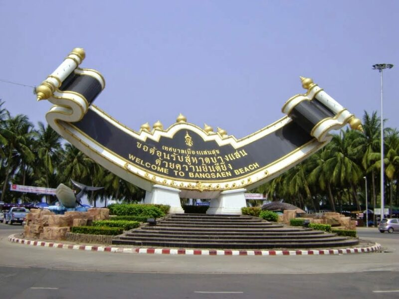
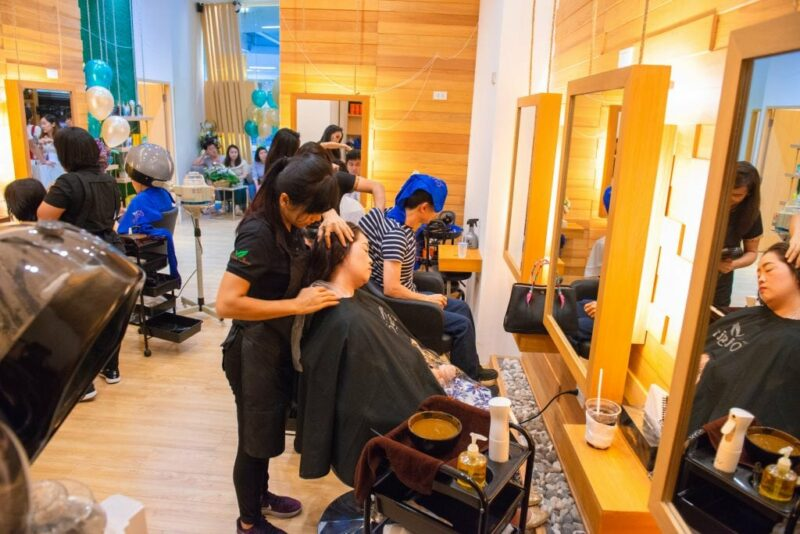
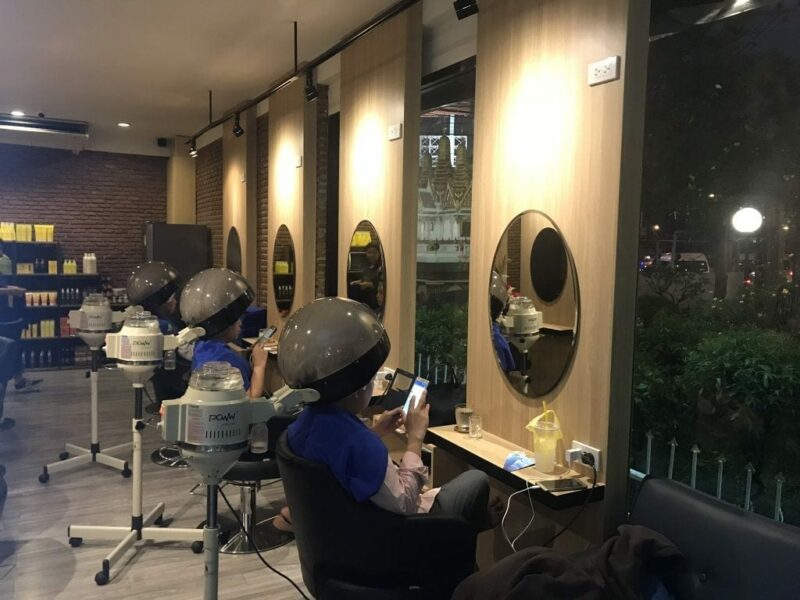

Bangkok is certainly known for its sprawling shopping malls, fascinating night markets and gourmet of food. But after two to three days of shopping, eating, getting stuck in the traffic jam, sometimes you might just want to go to a nice place to chill out. In this blog post, we explore the top ten most chilled out places to visit in Bangkok, some popular, some lesser known but still equally chilled out and less touristy. So if you are looking to kick back and relax, check out these places:

Riva Floating Cafe (Just a bit out of Bangkok, best to drive)

Bang Saen Beach (Nearest beach to Bangkok)

Kenshin Izakaya – Japanese Restaurant

Train Park

Lumpini Park

So Heng Tai – Old Chinese Mansion

Lanlom Udomsuk – Great food with live music

Small Talk Cafe & Hangout

Early Bird Coffee & Dessert Bar

Bee Choo Herbal – Relaxing herbal scalp treatment

1\. Chill by the River at Riva floating cafe

](../../../assets/images/blog/bangkok-chill-places/02-4.jpg)

*Source: [www.edtguide.com](https://www.edtguide.com/review/459178/riva-floating-cafe-new-Zone)*

If you have time to spare, you should go to Riva Floating Cafe. It will be a short drive from Bangkok to Thanon Buddhamonthon Sai 7. The cafe is very unique as it is literally floating on the Tha Chin River. Even though some cafe tables are in open air, the atmosphere is not hot, but rather windy and chill because of the river. Sometimes when boats pass by you would also feel the waves passing through the floating platform of this cafe.

](../../../assets/images/blog/bangkok-chill-places/03-caption.jpg)

*Source: [https://www.tripadvisor.com](https://www.tripadvisor.co.uk/LocationPhotoDirectLink-g1810159-d7075485-i178037759-Riva_Floating_Cafe-Sam_Phran_Nakhon_Pathom_Province.html)*

You can choose to sit on ordinary table, on the floor, or even at tables where you can hang out your foot into the river while sipping on coffee. Amazing right?

](../../../assets/images/blog/bangkok-chill-places/04-l-5824-1468230619334094676.jpg)

*Source: [https://www.forfur.com](https://www.forfur.com/media/idea/5824/5824_1468230619334094676)*

The cafe decorates the food and drinks very nicely, perfect for taking photographs.

](../../../assets/images/blog/bangkok-chill-places/05-2000.jpg)

*Source: [http://www.ipick.com](http://www.ipick.com/bangkok/th/restaurant/30013984)*

If you really really want to escape the busy life, Riva Floating Cafe is probably a good choice even though it requires you to drive outside of Bangkok as it offers a really unique atmosphere and chillax experience.

You will also see the “Dek Wens” on the river as well. “Dek Wen” is the term to describe the young Thai boys who modify their motorbikes such that it makes loud booming sounds to attract attention. There’s always motorbike fanatics in every country, but in Thailand, there’s the aqua version as well!

2\. Drive to the nearest beach to bangkok, Bang Saen Beach

*Source: http://56560011-chatkamon.blogspot.com*

Have you ever thought of visiting a beach to chill? Well, beaches are the ultimate escape from all the hectic things that happen in the city. The water is not clear, the beach is not the best, but if you are looking for a non-touristy beach and very near to Bangkok, Bang Saen beach is just perfect for you.

Source: [http://www.pattayamail.com](http://www.pattayamail.com/thailandnews/long-term-plan-initiated-to-clean-up-bang-saen-beach-48527)

The people that live in the town near the beach consist almost entirely of local Thais. You would be able to spot very little foreigners here comparing to Pattaya beach.

](../../../assets/images/blog/bangkok-chill-places/08-2.jpg)

*Source: [https://tripth.com](https://www.facebook.com/TripTH.con/photos/a.1453708311389038/1453711488055387/?type=1&theater)*

Street food vendors are everywhere so don’t worry. However, if you want to have very high quality seafood, a seafood market that brings in fresh seafood that has just been caught is nearby. It is open very early in the morning, And, in the evening, there are lots of cafes, pubs and open-air bars with live music lining the Bangsaen Beach. Pick your fill.

You would be able to feel the nice weather, clean air, and obviously the chillax feeling that you have been searching for.

3\. Chill at a japanese restaurant, KENSHIN ISAKAYA

Instead of getting stuck in traffic jam and be hungry all the way home, why don’t you stop at a delicious, price-friendly, high quality Japanese restaurant?

](../../../assets/images/blog/bangkok-chill-places/09-1-sb0og6j8wckqkujr1mc2fa.jpg)

*Source: [https://aumjumma.com/](https://aumjumma.com/%E0%B8%AA%E0%B8%B8%E0%B9%82%E0%B8%81%E0%B9%89%E0%B8%A2%E0%B9%82%E0%B8%8B%E0%B9%89%E0%B8%A2%E0%B9%81%E0%B8%AB%E0%B8%A5%E0%B8%81-%E0%B9%81%E0%B8%94%E0%B8%81%E0%B8%A2%E0%B8%B1%E0%B8%87%E0%B8%81%E0%B8%B1%E0%B8%9A%E0%B8%AD%E0%B8%A2%E0%B8%B9%E0%B9%88%E0%B8%8D%E0%B8%B5%E0%B9%88%E0%B8%9B%E0%B8%B8%E0%B9%88%E0%B8%99-%E0%B8%95%E0%B8%B2%E0%B8%A1%E0%B9%84%E0%B8%9B%E0%B8%97%E0%B9%89%E0%B8%B2%E0%B8%9E%E0%B8%B4%E0%B8%AA%E0%B8%B9%E0%B8%88%E0%B8%99%E0%B9%8C%E0%B9%80%E0%B8%9A%E0%B8%B5%E0%B8%A2%E0%B8%A3%E0%B9%8C%E0%B8%8B%E0%B8%B2%E0%B8%81%E0%B8%B8%E0%B8%A3%E0%B8%B0-%E0%B8%97%E0%B8%B5%E0%B9%88-kenshin-izakaya-%E0%B8%AA%E0%B8%B8%E0%B8%82%E0%B8%B8%E0%B8%A1%E0%B8%A7%E0%B8%B4%E0%B8%97-33-5c8d3e46bf0a)*

Kenshin Izakaya is in the middle of Sukumvit road, one of the most jammed roads in Thailand. Surprisingly, despite being in the middle of Sukumvit, where everything is expensive, this restaurant offers quality food that comes with standard prices.

](../../../assets/images/blog/bangkok-chill-places/10-1-4pxnuxutlqvnojxk1-ka1a.jpg)

*Source: [https://aumjumma.com/](https://aumjumma.com/%E0%B8%AA%E0%B8%B8%E0%B9%82%E0%B8%81%E0%B9%89%E0%B8%A2%E0%B9%82%E0%B8%8B%E0%B9%89%E0%B8%A2%E0%B9%81%E0%B8%AB%E0%B8%A5%E0%B8%81-%E0%B9%81%E0%B8%94%E0%B8%81%E0%B8%A2%E0%B8%B1%E0%B8%87%E0%B8%81%E0%B8%B1%E0%B8%9A%E0%B8%AD%E0%B8%A2%E0%B8%B9%E0%B9%88%E0%B8%8D%E0%B8%B5%E0%B9%88%E0%B8%9B%E0%B8%B8%E0%B9%88%E0%B8%99-%E0%B8%95%E0%B8%B2%E0%B8%A1%E0%B9%84%E0%B8%9B%E0%B8%97%E0%B9%89%E0%B8%B2%E0%B8%9E%E0%B8%B4%E0%B8%AA%E0%B8%B9%E0%B8%88%E0%B8%99%E0%B9%8C%E0%B9%80%E0%B8%9A%E0%B8%B5%E0%B8%A2%E0%B8%A3%E0%B9%8C%E0%B8%8B%E0%B8%B2%E0%B8%81%E0%B8%B8%E0%B8%A3%E0%B8%B0-%E0%B8%97%E0%B8%B5%E0%B9%88-kenshin-izakaya-%E0%B8%AA%E0%B8%B8%E0%B8%82%E0%B8%B8%E0%B8%A1%E0%B8%A7%E0%B8%B4%E0%B8%97-33-5c8d3e46bf0a)*

While there are many Japanese restaurant in Thailand and in Sukumvit area, this restaurant is very popular among Japanese customer because the place is fully decorated in Japanese style, which provides customers with the escape route from Bangkok by just entering the front door.

](../../../assets/images/blog/bangkok-chill-places/11-download.jpg)

*Source: [KenshinIzakaya](https://www.facebook.com/KenshinIzakaya/)*

The highlight of Kenshin Izakaya is that it offers very unique beers. The famous “Lavender beer” and “Sakura beer” are what attracts people to come to the shop because they are so hard to resist. The taste is very delightful and very easy to drink compared to ordinary beer.

The restaurant has a strong follower-ship with more than 100k following on facebook! They have three outlets at the moment:

Asoke

Phrom Pong

Central World (Chit Lom Bts)

The map below shows the outlet at Phrom Pong.

4\. Sit around and relax at TRAIN PARK

So what if you are not looking for places to eat, or drink? Just want to sit, chill and do nothing? Train Park or Wachirabenchathat Park is one of those places where you would be able to just sit at benches and observe people working out, running around. You could also rent a bicycle to roam around the park and find the best spot to sit and enjoy nature.

](../../../assets/images/blog/bangkok-chill-places/12-dsc03467-1170x780-qa-94.jpg)

*Source: [https://www.edtguide.com/](https://www.edtguide.com/review/457853/suan-rot-fai-park)*

If you are here to do some exercise other than bicycling, and running, you can also go kayaking, play volleyball, football, basketball, swimming and even tennis at this park.

](../../../assets/images/blog/bangkok-chill-places/13-opip1.jpg)

*Source: [https://reantong.wordpress.com/](https://reantong.wordpress.com/%E0%B8%81%E0%B8%B4%E0%B8%88%E0%B8%81%E0%B8%A3%E0%B8%A3%E0%B8%A1/)*

Or you can just watch people exercise and chill.

](../../../assets/images/blog/bangkok-chill-places/14-12299620-762627077177413-1080869738-o.jpg)

*Source: [http://suthida1995.blogspot.com](http://suthida1995.blogspot.com/2015/11/blog-post.html)*

The park is the second biggest green space that is hard to find in Bangkok.

It is easy to find as it is right next to the Mo Chit BTS and the Chatuchak MRT.

If we were to tell you there is one more thing to do at this park other than all that above, would you believe us?

You can go to a place called Bangkok Butterfly Garden and Insectarium. Inside you will be able to take beautiful pictures of rare butterflies and floras. Most importantly, it is free!

](../../../assets/images/blog/bangkok-chill-places/15-photo4jpg.jpg)

*Source: [https://www.tripadvisor.com](https://www.tripadvisor.es/LocationPhotoDirectLink-g293916-d6452156-i224714715-Bangkok_Butterfly_Garden_and_Insectarium-Bangkok.html)*

If you are done chilling around, you can always go back to shopping at Jatujak Market just next to Wachirabenchathat Park.

5\. Chill in the city center at LUMPINI PARK

](../../../assets/images/blog/bangkok-chill-places/16-aerial-view-of-lumphini-park.jpg)

*Source: [https://th.wikipedia.org/](https://en.wikipedia.org/wiki/Lumphini_Park)*

Another great park for you to go chill at is Lumpini Park. If you happen to be near Siam area, Lumpini Park is the nearest green space to you. You can take a walk, rent a bicycle or even enter a youth sports center located in the park.

](../../../assets/images/blog/bangkok-chill-places/17-dsc04.jpg)

*Source: [www.bansuanporpeang.com](https://www.bansuanporpeang.com/node/28923)*

There’s a lot of people in the park doing various activities such as exercising, walking, feeding the fishes, photography, playing badminton, etc.

](../../../assets/images/blog/bangkok-chill-places/18-1367721453-dsc0016-o.jpg)

*Source: [https://pantip.com/topic/30448219](https://pantip.com/topic/30448219)*

This park also has a nickname among photographers which is “Landscape Park.” The reason behind this nickname is that the park is a really good practicing place for taking nice looking landscape pictures that has nature view with city building background. If you feel like taking a chilled walk with your beloved ones, I recommend visiting the park.

You can reach the park by both BTS and MRT with a short walk.

6\. SO HENG TAI, a relaxing olden chinese mansion

](../../../assets/images/blog/bangkok-chill-places/19-6af7cb61f3d11286737a2ee794f3885e7b4442be.jpg)

*Source: [https://www.chillpainai.com/](https://www.chillpainai.com/scoop/9614/)*

So Heng Tai is an olden Hokkien Chinese mansion which has been around for 250 years. It is older than Bangkok. This place is rich in history as there used to be a Chinese trading port right in front of the mansion and the mansion was built to be home office for Chinese merchants and workers. Now this mansion has turned into a diving school which would also let visitors go in to experience a different world.

A world that was 250 years ago, except the pool in the middle, of course, which was built recently.

](../../../assets/images/blog/bangkok-chill-places/20-4dqpjutzluwmjzy57mztrfif8kei4yiiaduijvakcxjr.jpg)

*Source: [https://www.thairath.co.th/](https://www.thairath.co.th/content/915777)*

Materials that were used to build this house consist of mostly teak wood.

](../../../assets/images/blog/bangkok-chill-places/21-800-tongthaagoon-photos-180-12.jpg)

*Source: [http://thaagoon.thaimultiply.com/](http://thaagoon.thaimultiply.com/photos/8295/%E0%B8%9A%E0%B9%89%E0%B8%B2%E0%B8%99%E0%B9%82%E0%B8%8B%E0%B8%A7%E0%B9%80%E0%B8%AE%E0%B8%87%E0%B9%84%E0%B8%96%E0%B9%88/201364)*

There is a coffee shop at this place so you take a look around or sit and chill while sipping on a cup coffee.

The Hokkien Chinese mansion is located in Talad Noi, one of the oldest neighborhoods in Bangkok, Charoen Krung road. It is closed every Monday.

7\. LANLOM UDOMSUK, a nice and chilling night bar

How about a local bar to chill at? Lanlom Udomsuk is a night bar located in the middle of Sukumvit 103 road. The bar has a really big signboard, easy to notice. It is an open air bar that is not so crowded, decorated with vintage style. There is also a pool table for you to challenge your friends.

/](../../../assets/images/blog/bangkok-chill-places/22-004vgu8489b00e69d48e00px.jpg)

*Source: [https://th.openrice.com](https://th.openrice.com/th/bangkok/review/%E0%B8%99%E0%B8%B1%E0%B9%88%E0%B8%87%E0%B8%A5%E0%B8%B2%E0%B8%99%E0%B8%A5%E0%B8%A1-%E0%B8%94%E0%B8%A1%E0%B8%81%E0%B8%A5%E0%B8%B4%E0%B9%88%E0%B8%99%E0%B8%9A%E0%B8%B8%E0%B8%AB%E0%B8%A3%E0%B8%B5%E0%B9%88-e37016)/*

There are different types of food offered at the bar. Also, a lot of different types of beverage. The price? Well, it is not too expensive considering the location and the atmosphere of the bar.

](../../../assets/images/blog/bangkok-chill-places/23-3hajvw3ayyxbgbs7k328nxu8bcrjkpewua3bf4virabybdymrk4cyfwhkiiw.jpg)

*Source: [https://steemit.com/](https://steemit.com/funny/@auraiwan/travel-in-thailand-2-chill-out-lan-lom-oudomsuk-in-bangkok)*

You will get to experience nice live music performance as well. The band performing is quite good as they can play most of customers’ music request. So whatever you want to hear, try asking them to play for you.

However, you may not be able to park right at the shop, you may have to park at nearby soi. Best if you come by a taxi or you could even try a motorbike taxi if you are rugged!

8\. SMALL TALK CAFE & HANGOUT​

](../../../assets/images/blog/bangkok-chill-places/24-e-sjghgidsz-section-bkjuagy8z-image.jpg)

*Source: [https://www.runlah.com](https://www.runlah.com/events/i/SJGhGIDSz)*

As its name suggests, Small Talk Cafe & Hangout is designed especially for chilling and hanging out. The place is decorated in mild tone, garden style, a lot of green stuff so when you take a look around you would not feel like you are in a city. You would instead feel like you are hanging out in the backyard of your friend’s house. The cafe offers casual food, drink, cocktails, Thai beers or international beers; pricing is very reasonable as well.

Source: [http://blog.fwd.co.th](http://blog.fwd.co.th/small-talk-cafe-by-chillpainai/)

The highlight of this cafe is that during the evening, there is live music in the evening for people chilling in the cafe.

If you happen to get stuck in traffic near the shopping mall, Central Bangna, and want to chillax a little, turn your wheels to soi Bangna-Trad 21. The cafe is not so far inside the soi and has enough parking spots. Why won’t you sit and chill for a while at this cafe and go home after there is no traffic?

9\. EARLY BIRD COFFEE & DESSERT BAR

Another choice for a chill coffee shop nearby Bangna-Trad is Early Bird Coffee & Dessert Bar. It is located just the next soi, Bangna-Trad 23. If you’re looking to get a nice dessert, a drink and have a chat with a friend over coffee, this is a really nice place to do so.

](../../../assets/images/blog/bangkok-chill-places/26-tiewnaidee-earlybird-11.jpg)

*Source: [https://www.tiewnaidee.com](https://www.tiewnaidee.com/food/early-bird-cafe-bangna/)*

As you drive, you will be able to spot a really huge parking spot on the right side and a coffee shop in front of that parking lot.

](../../../assets/images/blog/bangkok-chill-places/27-earlybird-001.jpg)

*Source: [http://don-jai.com/early-bird/](http://don-jai.com/early-bird/)*

The coffee shop is nicely decorated in modern style with very gloomy lighting which would give the chillax feeling. It is also has a good atmosphere for reading a book or doing some work on your laptop.

](../../../assets/images/blog/bangkok-chill-places/28-img-9992.jpg)

*Source: [www.edtguide.com](https://www.edtguide.com/drink/442675/Early-Bird-Coffee-and-Dessert-bar)*

The taste of the coffee and tea is more for expats and health conscious people as it is not overly sweet! Also, the dessert is very delicious. The coffee shop names their drinks after different species of birds.

](../../../assets/images/blog/bangkok-chill-places/29-earlybird02.jpg)

*Source: [http://eataroi.com](http://eataroi.com/early-bird-coffee-dessert-bar-%E0%B8%A3%E0%B9%89%E0%B8%B2%E0%B8%99%E0%B8%81%E0%B8%B2%E0%B9%81%E0%B8%9F%E0%B8%99%E0%B9%88%E0%B8%B2%E0%B8%99%E0%B8%B1%E0%B9%88%E0%B8%87%E0%B8%A2%E0%B9%88%E0%B8%B2%E0%B8%99%E0%B8%9A%E0%B8%B2%E0%B8%87%E0%B8%99%E0%B8%B2/)*

The highlight of this place is not the taste, but it is how nicely the coffee shop decorates the dishes dishes. The dishes are perfect for taking selfies so why won’t you take some nice pictures and post on social network while sipping on coffee and just chilling.

10\. BEE CHOO Herbal, the most relaxing hair and scalp treatment

If you are already at Bangna area which is very near Udomsuk, you might want to check out Bee Choo Herbal Scalp Treatment. You can visit them for a relaxing herbal scalp treatment which would restore your scalp to healthy state.

Bee Choo is famous for its treatment that has the capability to help fix scalp and hair problems such as hair loss, hair thinning, dandruff, white hair, oily scalp and bacterial infection. Unsightly grey hairs will also be covered with a natural copper dye contained in the herbs.

The treatment includes very relaxing scalp acupoint massage.

The treatment is simple, first your scalp would be analyzed through special equipment to check the condition of your scalp (you have to request for the scalp scan if you want it)

Then, ginger wine tonic would be applied to your scalp which would help open up all the pores on your scalp followed by a 5 mins very relaxing head massage to get the blood circulating.

After that, Bee Choo’s specially formulated herbal paste would be applied throughout your scalp and hair. This herbal paste consists of special Chinese herbs which would provide essential nutrition and minerals that your scalp needs.

You will then steam your hair for 45 minutes. This period of time is the most chill experience as you might even fall asleep because the scent of the herbal paste is very nice and the atmosphere of the outlet is very relaxing. You can also bring a book to read while waiting for the steaming process to be over!

*Photo taken at Bee Choo Tawanna*

They will proceed to give you a deep cleansing hair wash after steaming to properly clean your scalp and hair. The menthol shampoo used for washing gives a cooling effect that will make your feel refreshed.

After hair wash, they will cold blow dry your hair so your hair and scalp would not be damaged by heat and also this would let your hair and scalp better absorb the nutrition and minerals.

The entire treatment takes about 2 hours. Bee Choo Herbal is a great place to relax and treat your scalp to a organic, natural, unique, herbal treatment. There are, currently, 9 outlets in Thailand.

You can find out more about them at [www.beechooherbal.com](https://beechooherbal.com/) and [www.facebook.com/beechooherbal](http://www.facebook.com/beechooherbal)

BEE CHOO THAILAND LOCATIONS

Siri Avenue, Sai Mai

Tel: 02-1214419

Siam square one (floor 6)

Tel: 02-115-1300

Phatra Complex (Ratchada)

Tel: 06-1729-3434

The master @ BTS udomsuk

Tel: 02-072-6698 
 
 
 
 
 [Call Udomsuk](tel:+6620726698)

CITY CONNECT - KALLAPAPHRUK 
 
 
 
 Tel: 090-221-7745

Pradraw - Chaiyaphruek

Tel: 0931385214 Tel: 021471459

22 mini mall - krungthep kreetha

Tel : 093-147-1388

Casalunar Avenue - Chonburi

Tel: 096-904-7964

the Crystal park (Ekamai-ramindra)

Tel : 095-536-5556
