12 Best Family Places to Visit in Bangkok, Thailand

Thailand is a place for everyone: Couples, Singles, Teenagers, Retirees and Family. In this blog post, we will be focusing on the 15 Best Family Friendly Place to Visit here in or near Bangkok, Thailand!

Due to the popularity of the Hollywood series, “[The Hangover](https://www.imdb.com/title/tt1119646/)” and mainstream media’s portrayal of Bangkok, unknowing people may perceive Bangkok as a destination for wild bachelor parties, sex tourism, transvestites, bars & pubs etc. But that is far from the truth. These activities only make up a small portion of reality.

Bangkok, Thailand is actually a very family friendly place to visit. In this article, we bring to you 12 Best Family Places to Visit when you’re in Bangkok, Thailand.

12 Best Family Places to Visit in Bangkok (or near Bangkok)

Ayutthaya – Wat Yai Chaimongkol

Ayutthaya – Ruan Thai Shrimp Restaurant

Ayutthaya – Bang Pa In Summer Palace

Ayutthaya – Wat Niwet Thammaprawat Ratchaworawihan

Silom, Bangkok – Unicorn Cafe

Ramintra, Bangkok – Tawandang Ramintra

Lat Krabang Bangkok, Siam Serpentarium

Phrom Pong, Bangkok – Bounce Trampoline Park

Phrom Pong, Bangkok – Quarter CineArt

Temple Fairs in Bangkok

Dream World at Rangsit

Relaxing Herbal Scalp spa at bee choo origin

1\. Ayutthaya - Wat Yai Chaimongkol

If you’re in Bangkok, might as well take a nice 1.5 hours drive to the previous capital of Siam. Due to its proximity to the Chao Phraya River, Ayutthaya was a prosperous international trading port, from 1350 until razed by the Burmese in 1767.

How to get there?

For this visit, we recommend that you rent a car if you’re going with your family.

Take the tollway, it will cost about THB 100 in total; definitely worth it to avoid the Bangkok Jam (#1 in the world)

Also, remember to bring an umbrella along as it can get quite hot! The umbrella will help reduce heat tremulously, trust me.

At the old Capital, you can visit the Summer Palace, Ancient Temple, and a riverside restaurant which are popular destinations at Ayutthaya. Ideally, you should start making your way to Ayutthaya around 9 to 10am. You will probably reach Ayuttaya province by 11am. First place to visit would be Wat Yai Chaimongkol ([Link](https://goo.gl/maps/KWbuVrox3cn) to Google Map).

Wat Yai Chaimongkol

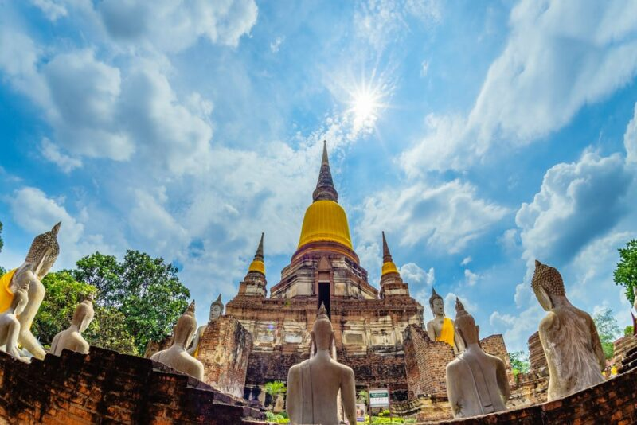

*Photo Credits : www.bkkkids.com*

This ancient temple was built by King U-thong in 1357 A.D. (almost 700 years old!) for the use of the monks who had returned from Ceylon after studying under Phra Vanarat Maha Thera. This body of monks was known as the Pa Kaeo Sect. So this monasteny was originally known as Wat Pa Kaeo. The monks of this sect were engaged mainly in meditation.

When you visit this temple, you will feel a sense of clam and serenity. This ancient building, combined with the lush greeneries, waterbody and natural wind creates a relaxing atmosphere for you to walk around and appreciate the history and the buddhist way of life.

You can climb up the stairs to see a wishing well inside the giant structure. The kids will enjoy aiming for the bucket when tossing the coin from about 4 stories up! Prepare some loose change in advance!

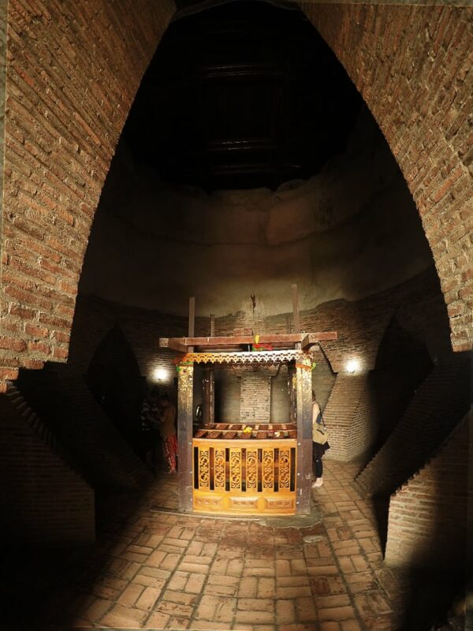

*Photo credits: richieadventuresblog.wordpress.com/*

You will probably spend about 45mins to an hour walking around the temple premise, including offering prayers (if you intend to, not compulsory). Do take note that the temple is opened from 8am to 6pm daily. No entrance fee.

Rules to Respect when visiting Wat Yai Chai Mongkhon and any other temple in Thailand:

Dress properly (knees and shoulders should be covered for, especially for ladies)

Take of your shoes when entering the building

Do not hug and kiss

Do not point using your foot to the buddha image

Do not smoke

Do not step on the doorsill, step over it instead.

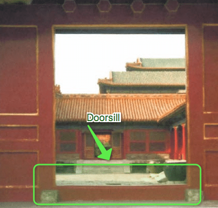

*The doorsill is the raised platform at the entrance*

Once you’re done with the temple visit, your family will probably be a bit hungry, now its time hunt for some food!

2\. Ayutthaya - Ruan Thai shrimp Restaurant

The Ruan Thai Shrimp Restaurant is a 30 mins drive from the Wat Yai Chaimongkol. ([Link](https://goo.gl/maps/s2xcNEQSudD2) to Google Map so you don’t get lost). This is another Family friendly place to visit. The kids can get a quick nap in the car while daddy or mommy drives to the restaurant by the Chao Phraya River.

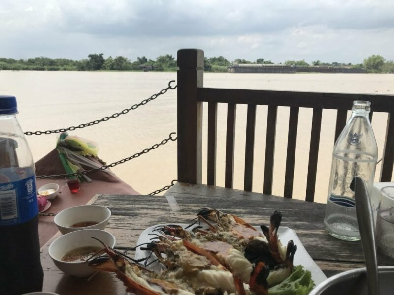

*Actual photo taken by yours truly when I visited*

Do take note that this restaurant can get pretty crowded, do not be taken aback if you have to wait 20-30 mins for your turn. The food thing is, there’s a small temple next to this restaurant so you can take the kids there while waiting for your turn. If the kids are restless, you can also distract them by feeding the fishes in the river. Fish feed are sold nearby for just 20 Baht.

What to oder?

We recommend the giant river shrimp. One shrimp is enough per person, but if you’re very hungry, you may be able to finish 3 shrimps on your own. It is really big!

Giant Thai Fresh Water Shrimp

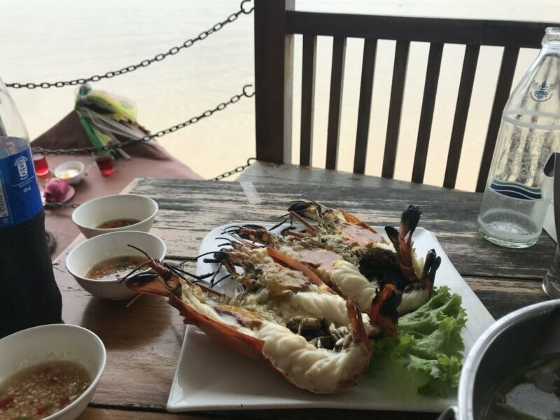

The way to eat this is to mix the eggs of the shrimp with your rice and dip the prawn meat with chilli sauce. Very very yummy. It is a little hard to get the meat out of the shell, so the little ones may need some help from mummy and daddy.

You can also try out the lotus vegetable dish. It is very tasty, a local dish that most people will come to appreciate, and something that won’t be found so easily in Bangkok. Plus, it comes with the pincer of the giant prawn! I did not know you could east the pincers of the prawn! I had to ask the waitress twice to make sure I was not hearing things!

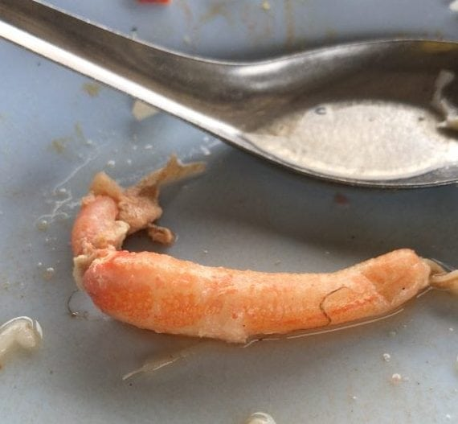

*Is this really the pincers of the giant river prawn?!!!*

The pincer is crunchier compared to crab’s pincer. It is very sweet, and the best part is you do not have to peel it yourself (or for the kids).

They are also famous for their fried rice, although the wait might be a little long (20-30 mins). You can also chill out and have a Chang beer while enjoying the view of the river and boats passing by. There are loads of fishes in the river, so the kids can have some fun feeding the fishes with the leftovers rather than playing with an iPad or smartphone!

3\. Ayutthaya - Bang Pa-In Summer Palace

The summer palace at Ayutthaya is up river of the Ruan Thai Shrimp Restaurant, about a 15-20 mins drive from Ruan Thai Shrimp Restaurant. ([Link](https://goo.gl/maps/vc43UfQ8Kir) to google map). It is definitely one of the best family places to visit. Do take note that the palace closes at 4pm and that you have to wear long pants to enter! So make sure you are dressed appropriately.

The Bang Pa-In Palace in Ayutthaya

](../../../assets/images/blog/bangkok-family-places/08-bang-pa-in-palace.jpg)

*Photo credits: [www.timetravelturtle.com/](https://www.timetravelturtle.com/bang-pa-in-palace-thailand/)*

What’s great about this place is that you can rent the golf buggy for THB 300 – 400 baht and cruise around in it. I am sure the family will love it. You can park your buggy almost anywhere, get down, and go get some nice family photos with the spouse and kids. You can also climb up the wooden stairs in the observatory tower (picture above) to enjoy the unblocked views from the top!

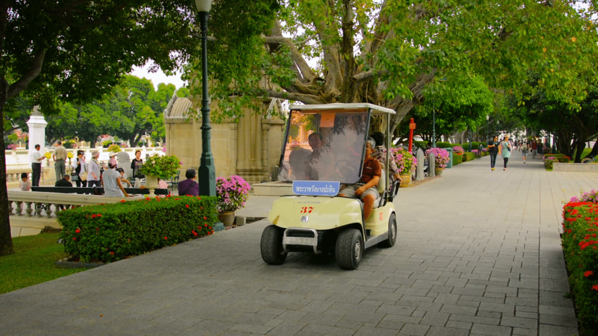

Photo credits: [www.videoblocks.com](https://www.videoblocks.com/video/tourists-move-through-the-park-on-foot-and-by-electric-vehicles-bang-pa-in-palace-nvfyqbuhcliki51e2z)

The sprawling compound is tranquil and lush. It is nice and windy due to the openness of the compound coupled with the waterbody that flows through the estate. At the palace, you can see the beautiful architecture of the different royal buildings which belongs to the different members of the Royal Family. Take walk through the garden, bridge and try to spot the magnificent soft-shelled turtles in the lake!

The shy turtle is looking for bread! Shh or he will run away.

The [Thai tradition of topiary or ‘mai dut](https://www.thaizer.com/tourist-attractions/thai-topiary/)‘ is also on display at Bang Pa In with an elephant family and peacocks decorating the Royal Garden. A nice open place to let the kids run around while the parents take a stroll. When you get tired of walk, just jump back into your golf buggy! Oh, we forgot to mention that you need to show your driver’s license to be eligible to drive the golf buggy. Its very safe for the kids to run around, there are soldiers guarding the palace all around!

](../../../assets/images/blog/bangkok-family-places/10-bang-pa-in-palace-ayutthaya-9-x2.jpg)

*[Photo credits: www.thaizer.com](https://www.thaizer.com/tourist-attractions/bang-pa-in-palace-ayutthaya/)*

Once you’re done with the palace, you will head back to the car park, you will notice that there is a temple on the opposite side of the palace. That’s the next place to visit!

4\. Ayutthaya - Wat Niwet Thammaprawat Ratchaworawihan

Take the cable car across the river, a short free ride, that the kids will enjoy. You will probably not get a chance to see or ride these type of cable cars in other nations! Not for the super faint hearted! It is quite flimsy, so do careful, do not let the children jump about or rock the carriage for their own safety! There is no seat belt or security on the carriage.

Since there is no charge on the cable car, the kids probably will want to ride it several times. For them, this will probably the most fun part of Wat Niwet Thammaprawat Ratchaworawihan as they may be too young to appreciate the architecture of this unique temple.

On the opposite side, you will find the Wat Niwet Thammaprawat Ratchaworawihan, this temple is very unique because it looks like a hybrid between a church and a temple!

Founded in 1878, it is one of the more popular Thai Buddhist temples because its architecture mimics that of a European church, being built in the [Gothic Revival](https://en.wikipedia.org/wiki/Gothic_Revival) style

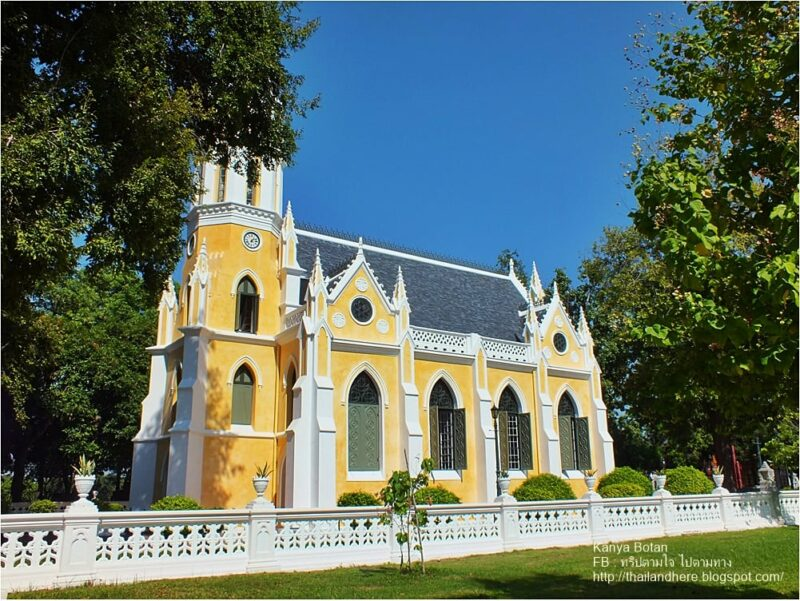

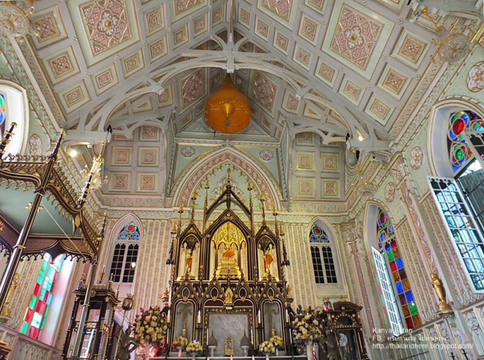

Photo credits: [thailandhere.blogspot.com](https://thailandhere.blogspot.com/2015/11/wat-niwet-thammaprawat-in-ayutthaya.html)

At the temple, you can learn about the Thai Royal history and read about interesting life of Prince Damrong Rajanubhab while taking a stroll through the garden.

The temple faces the Chao Phraya River, so you can go for a nice walk and enjoy the breeze. This temple is smaller, you’ll probably just need 30-45 mins to explore the whole area.

Last but not least, buy this 50 baht Thai dessert (โรตีสายไหม Roti Saai Mai) to try! Its very nice and famous in Ayuttaya. Eat it when its nice and warm! Fresh from the pan!

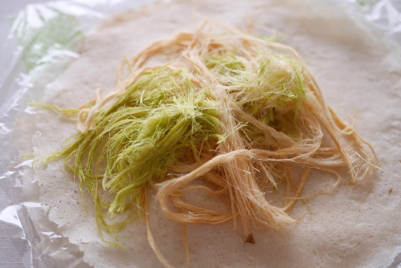

Photo credits: [thaifootprint.com](http://thaifootprint.com/2016/05/17/%E0%B9%82%E0%B8%A3%E0%B8%95%E0%B8%B5%E0%B8%AA%E0%B8%B2%E0%B8%A2%E0%B9%84%E0%B8%AB%E0%B8%A1-%E0%B8%AD%E0%B8%B2%E0%B8%9A%E0%B8%B5%E0%B8%94%E0%B8%B5%E0%B8%99-%E0%B8%9B%E0%B8%A3%E0%B8%B0%E0%B8%99%E0%B8%AD/)

5\. Silom - Unicorn Cafe

Want to visit a truly unique cafe? Go to the unicorn cafe at Silom, Bangkok ([link](https://goo.gl/maps/CMgMWVtnHBF2) to google map). Probably a good idea if you have daughter/s, otherwise, it is probably a tact to girly for the boys. Personally we find this place a bit expensive – pricing for tourists – not the Thai pricing, but it is still worth the experience and seeing the smile on your daughters face when she plays with the Unicorns and soak up in the “princessy” environment. Seriously, check out the photo below!

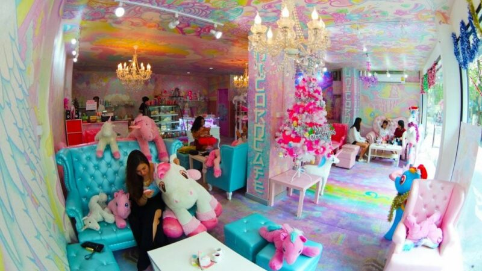

Photo credits: [www.travelwires.com](https://www.travelwires.com/unicorn-lovers-you-should-visit-this-caf-in-bangkok-870)

Surprisingly, the food is pretty decent; the rainbow burger, rainbow cheese fries and rainbow ice cream. However, the drinks I find too sweet; even after I told them to put less sugar! Being Singaporean, we prefer food which aren’t too sweet, it might be suitable for you. It really depends on your taste buds! Anyways, it is just my opinion, just to warn you of the sweetness of the drink!

](../../../assets/images/blog/bangkok-family-places/15-rainbow-burget.jpg)

*Photo credits: [www.pinterest.com](https://www.pinterest.com/pin/528961918729115577/?lp=true)*

Overall, this place is more for the daughters and the wife maybe? It is a decent place to chill out and chat with friends (if you’re coming in a group). Btw, the merchandises are pretty pricy; a unicorn pen for 100 baht and other souvenirs are priced for tourists.

The traffic surrounding this place here is pretty bad, so choose your travel time carefully. The unicorn cafe is walkable from Chong Nonsi BTS Station if you intend to take the BTS to avoid the jam!

So far, the friends I’ve brought here enjoyed themselves or rather enjoyed seeing their kids enjoy the place. A small sacrifice for the dad! But not to worry, the next place is for the dads!

6\. Tawangdang RamIntra (There's Other branches too)

Looking for good food, entertainment and beer? This place is suitable for families with kids (above 4 years old). Tawangdang German Brewery is Thai-German Microbrewery that serves original German beer. Tawandang German Brewery was the first restaurant to introduce the “east meets west” concept to the dining and entertainment scene of Thailand. ([link](http://tawandang.com/about-us/) to their website). Tawangdang actually has many branches, but I like the one at Ramintra the most ([link](https://goo.gl/maps/zBqJpfSM44x) to Tawangdang Ramintra google map).

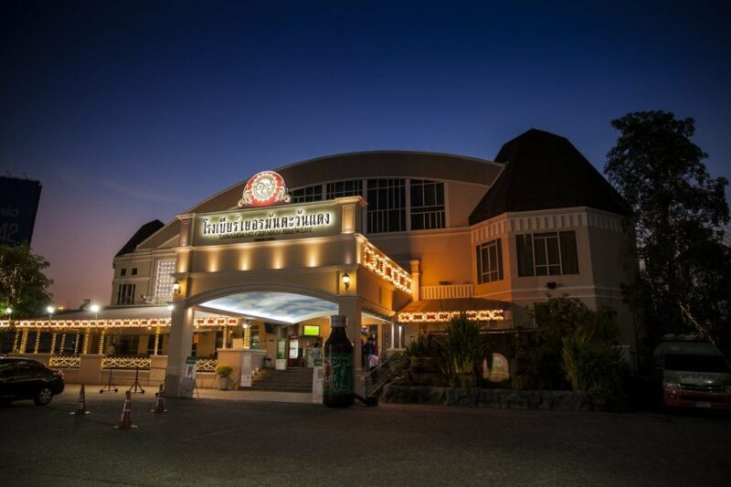

*Exterial facade of Tawangdang Raminthra – There’s Ample parking!*

](../../../assets/images/blog/bangkok-family-places/17-tawangdang-ramintra.jpg)

*Interior of Tawangdang Raminthra [Source: [tawandang.com](http://tawandang.com/)*

So try to be seated by 7pm. The performance starts around 7:30pm-ish, they start by Singing modern pop Thai ballets, sometimes english pop songs as well. So you’ll probably start ordering you food around this time.

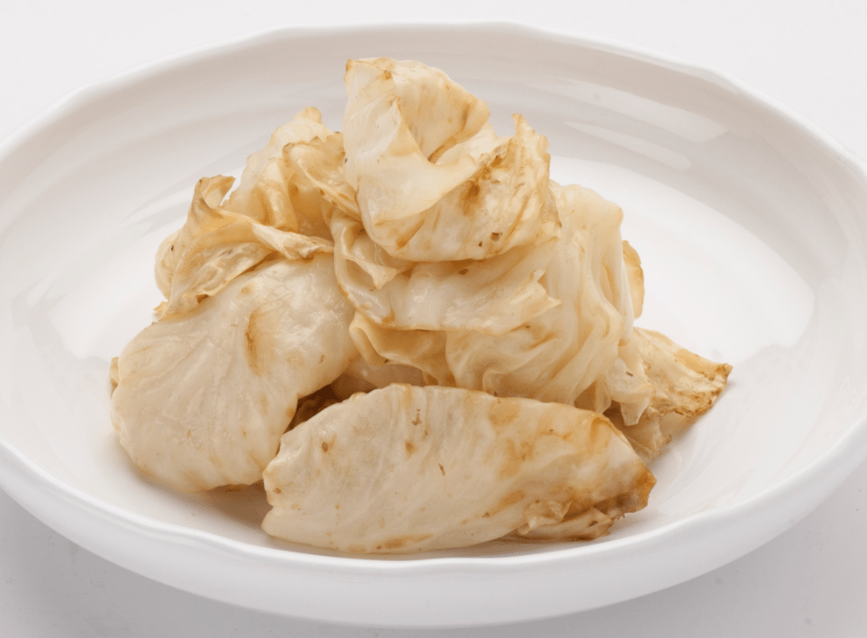

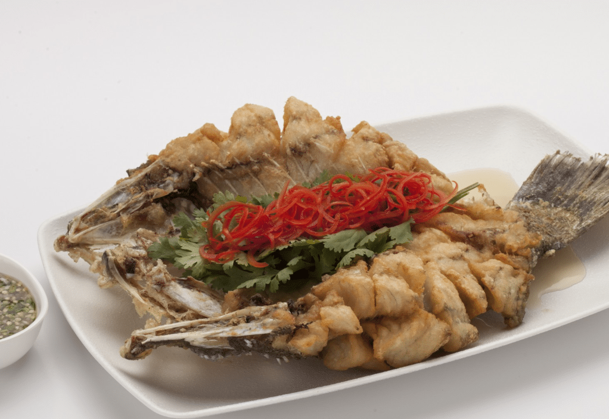

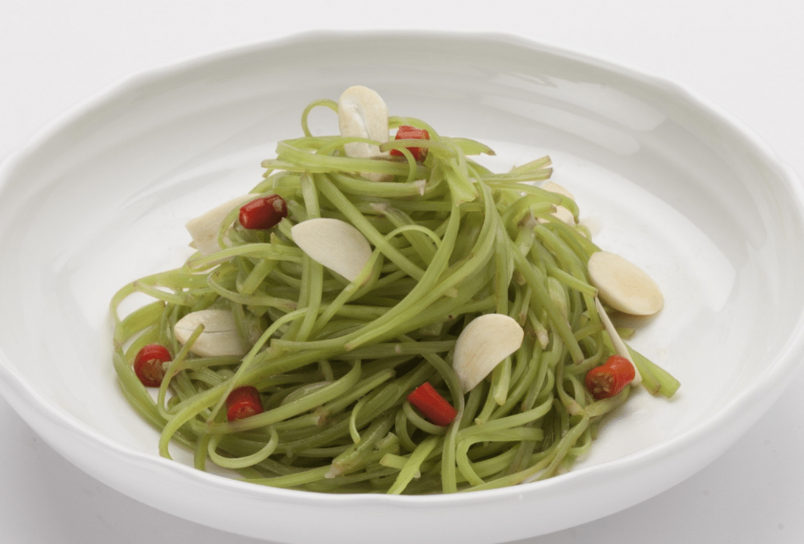

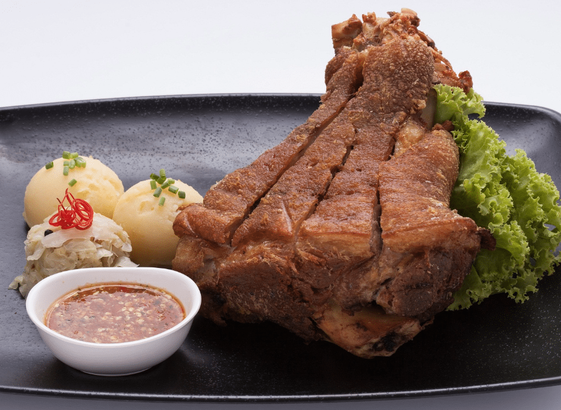

*Dishes we recommend:*

*Deep Fried Pork knuckle served with Spicy Sauce

Deep Fried Sea bass with Fish Sauce served with Spicy Seafood Sauce

Grilled Sea bass with Salt served with Spicy Seafood Sauce

Sautéed Cabbage in Fish Sauce

Sautéed Morning Glory

*For the Pork Knuckle, try to order early as it would be hot and crispy. If you order it later, it might be from the older batch.

If you are feeling adventurous you can also try:

Duck Tongue

Duck Beak

Thai papaya salad (“Som Tum”)

Pricing is very reasonable, I’d say you’ll probably spend about Baht 2000 for a family of 4. We had our company dinner here, we spent about THB 11,000 for 14 pax and we ordered wine too! Btw, they also have Western food and Japanese food, so if you aren’t a fan of Thai food (which I doubt you are because Thai food rocks!), you can go for the Western or Japanese cuisine.

Around 8pm the mood would start to change to Thai folk songs with Traditional Thai dance. After which, at around 9pm there will be musical performances, some are quite funny! The costumes are amazing and detailed. The dancers are all very talented. The best part is that even though you may not understand the language, you will still be able to appreciate it.

After 10pm the fun starts, which is when the most popular Thai songs are played, the customers at Tawangdang will start standing up and dancing at their tables! The Thais aren’t shy and they know how to have a good time! Kids are welcome to dance along too!

Only after 11pm does it start to get more ‘clubbish’ to cater to the dancing crowd (mostly high from the beer), By then the kids would probably be sleepy and you can take them back to the hotel or… stay on and enjoy the night!

7\. Siam Serpentarium

The Siam Serpentarium is located at Lat Krabung and is opened from 9am to 6pm daily. ([Link](https://goo.gl/maps/DMxzY1BxESD2) to google map). As the name suggest, this place is a snake museum where you can take the kids to see all sorts of snakes and even watch a show where the Thai snake trainer would hypnotise the snake and kiss it on the head.

It is pretty far out from the City though, about 1 hour car ride give and take, depending on traffic.

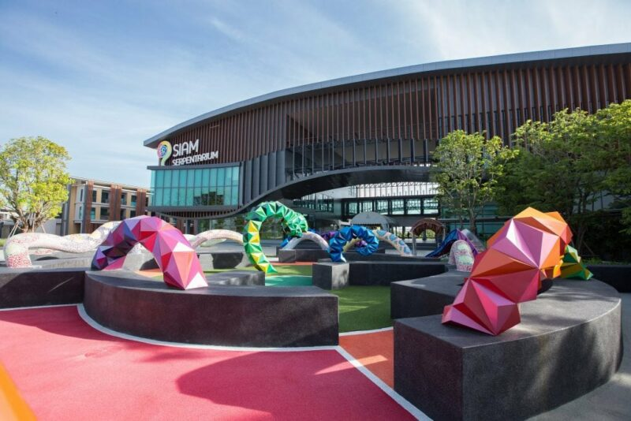

*Siam Serpentarium located at Lat Krabung. Very popular with the Chinese tourists, staff there can speak in Mandarin!*

There will be a guided tour, the guides can speak in English, Thai and Mandarin. The tour starts with you watching a video clip. Basically, you are to imagine that you have been shrank down and reborn as a baby snake. So when you hatch out of the egg, you are surrounded by larger animals: frogs, rabbit, etc.

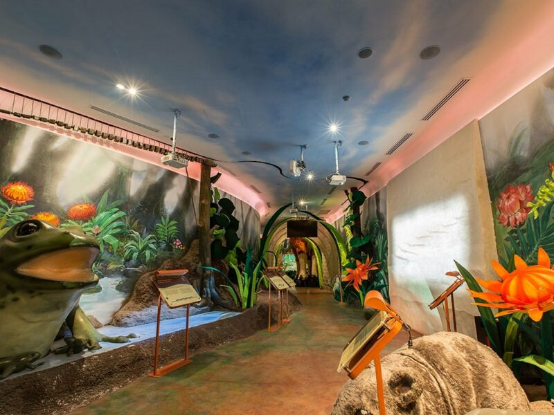

*View point of a baby snake*

I certainly learnt a lot of cool things about the snake when I visited Siam Serpentarium. However, I can’t recall exactly what I learnt right now. Something about their jaw and smelling with their… we’ll let the experts tell you when you visit!

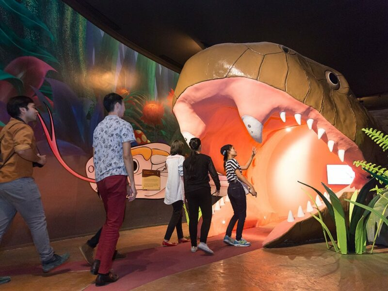

*Enter the snake!*

The family oriented attraction is nice place to visit with the family. A slightly different kind of activity that one might do on a family holiday. The experience is definitely positive, the place is nice, clean and cold. Pricing is reasonable as well:

Price list

 on 5 Sept 2018](../../../assets/images/blog/bangkok-family-places/25-pricing.png)

*Snapshot Taken from [www.siamserpentarium.com/en/](http://www.siamserpentarium.com/en/) on 5 Sept 2018*

One peculiar thing is that when you are done touring the serpentarium, just before you exit, the souvenir shop sell all kind of stuffs not related to snakes, not sure why, but they sell Chinese herbs, facial products, perfume and even condoms. Well, I guess tourist just buy whatever is displayed for them!

8\. Bounce at Emquartier - Trampoline park at phrom pong bts

Let the kids get some exercise at Bounce! A spralling trampoline park located in a beautiful shopping mall.

Finally, the monkeys can jump on something other than the bed.

Located on the 4th floor of Up-market shopping centre EmQuartier (right at Phrom Pong BTS station). Bounce is situated beside the swanky Major runned cinema known as Quarter CineArt, Bounce is a large trampoline park where the kids can jump to their hearts content. Parents can join in the fun, and also get some cardio done after all the eating and dinning in Bangkok! It is actually very tiring!

Here’s the [link](https://goo.gl/maps/HeWx8gsu1V42) to the google map incase you get lost at Phrom Pong BTS which I don’t think you will!

Important Info

BOUNCE Grip Socks are required at all times while on the trampolines

Minimum age allowed to jump is 3 years old

Weight limit of 120kg

In case you have never seen what a trampoline park looks like

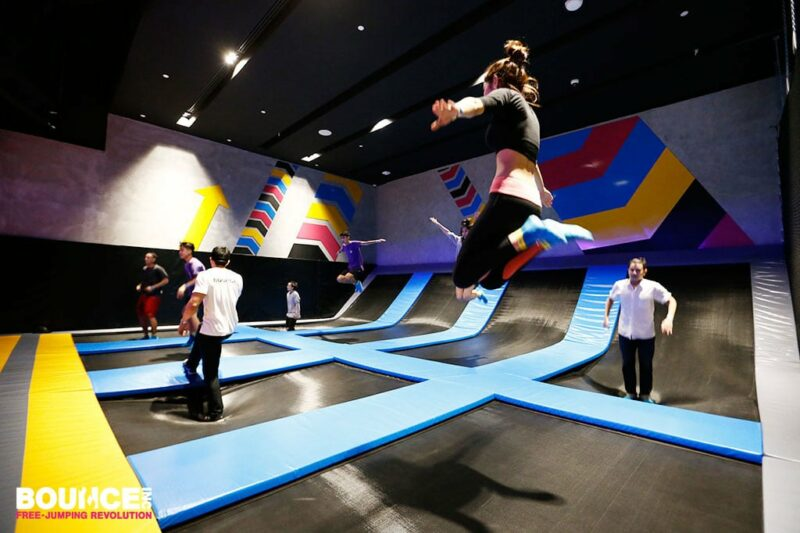

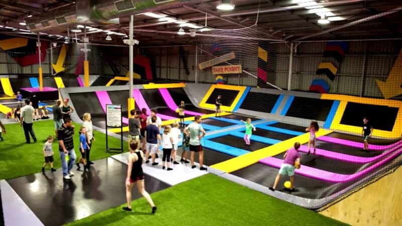

You just have to be careful that they jump properly and not do those crazy somersaults without proper supervision, especially if its their first time at a trampoline park. I expect the kids to be able to jump for about 2 hours before getting bored of it. After which, the family can head next door to catch a movie in style!

9\. Quarter Cineart - Watch a movie, in style

Watch a movie while on holiday? Why not, because the cinemas in Bangkok, Thailand are really awesome! It is so spacious and big and comfortable. The ticket price is reasonable… so why not!

Screen X – Available at Quarter CineArt

Photo taken from [www.majorcineplex.com/en/cinema/quartier-cineart](http://www.majorcineplex.com/en/cinema/quartier-cineart)

You can also experience 270 degrees of movie at Quarter CineArt! The tickets at Screen X is 400 baht per seat. Or you can get the a pair of VIP seat at 1100 (550 baht per seat). At first I wasn’t very used to the 270 degrees format, but you will get accustomed to it in no-time and it doesn’t give you a headache like 3D movies !

Normal theatre seats are priced at THB 250 if you opt from the normal screens instead.

Be sure to choose the movie with the English voice as sometimes in Thailand they dub Thai language over.

After watching movies in Bangkok, I stopped going for movies back in Singapore. In Singapore, its slightly more expensive but the seats are squeezey and small. If you go for the VIP seats, they even provide blanket, cocktail and pillow! Better than taking an economy plane flight!

10\. Visit a Thai temple Funfair!

This is actually one of my favourite! I brought my parents here too and they thoroughly enjoyed themselves!

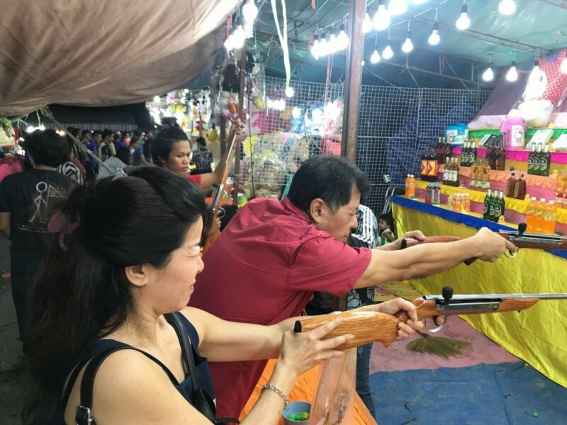

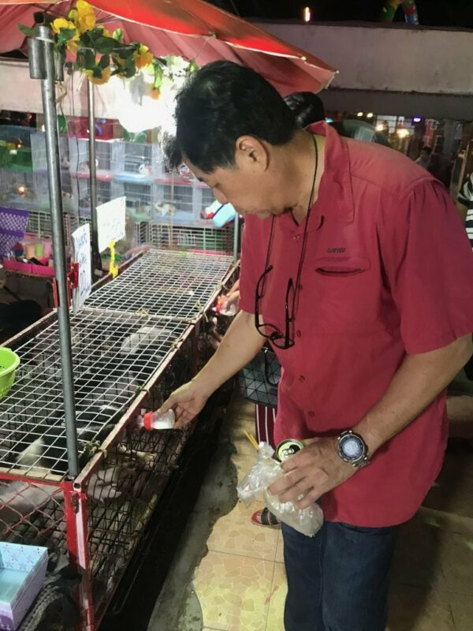

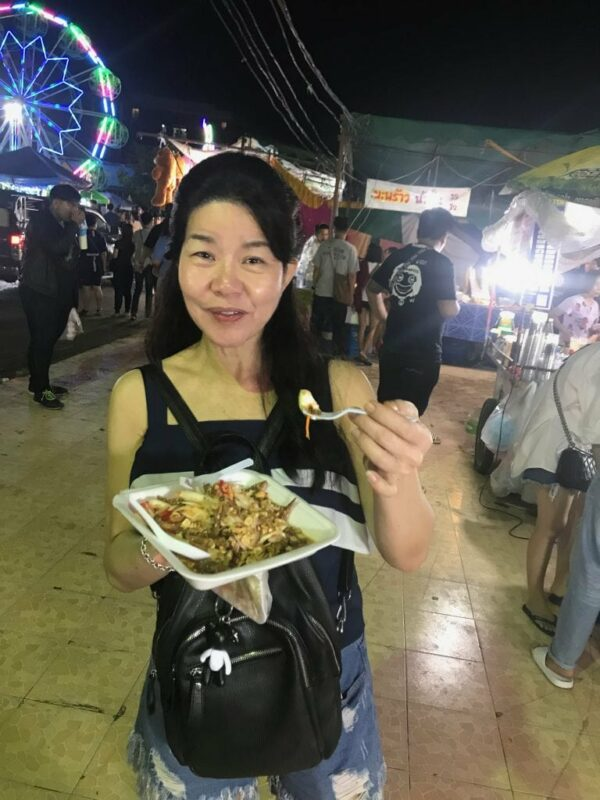

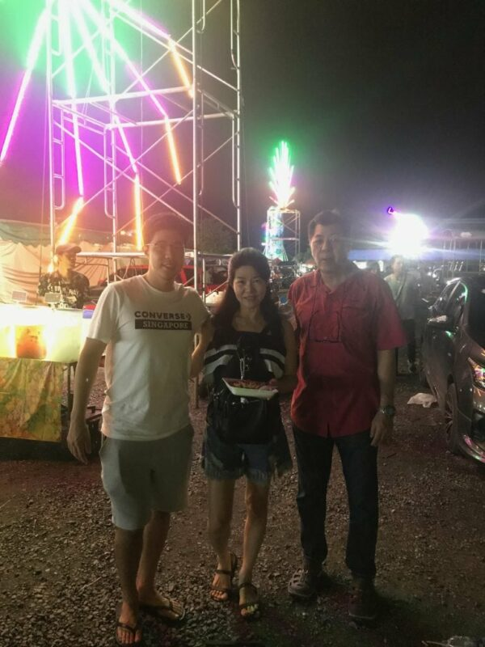

This activity is very local, however it will also depend on the period in which your are holidaying in Bangkok, Thailand. In Thai, these temple funfairs are known as “Ngaan Wat” งานวัด.

So you need to check out local website such as [www.tourismthailand.org](http://www.tourismthailand.org) and [www.facebook.com/TempleFestivalFair/](https://www.facebook.com/TempleFestivalFair/) however the content is in Thai, so you can just check with your Thai friends or the hotel staffs if there happened to be any Ngaan Wats during your visit.

What to expect at a Thai Temple Funfair?

It is a Thai style temple carnival, there’s food, games, music and performances.

The kids will like the games like throwing of the darts, catching guppies using a paper net (it is harder than it looks), shooting of the air gun at cans and sling shots. They give out prizes such as: life sized dolls, baloons and even booze.

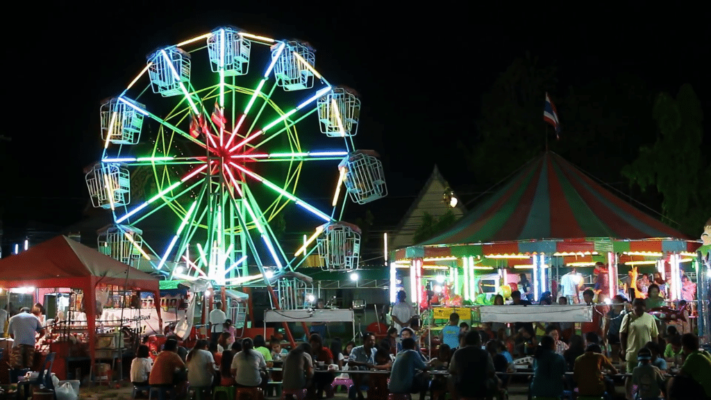

Source: [www.videoblocks.com](https://www.videoblocks.com/video/editorial-footage-of-temple-fair-and-ferris-wheel-in-wadbanchang--rayong-provincr-thailand--circa-april-2014-ryfnmhvbinpw9irf)

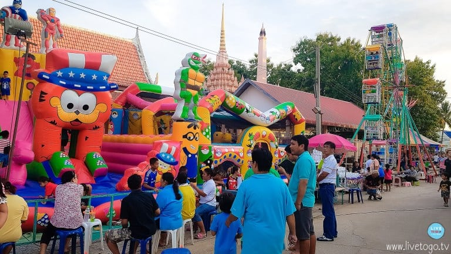

Source: [livetogo.tv](https://livetogo.tv/2017/11/15/%E0%B8%87%E0%B8%B2%E0%B8%99%E0%B8%A7%E0%B8%B1%E0%B8%94%E0%B9%84%E0%B8%97%E0%B8%A2-%E0%B8%87%E0%B8%B2%E0%B8%99%E0%B8%A7%E0%B8%B1%E0%B8%94%E0%B8%8D%E0%B8%B5%E0%B9%88%E0%B8%9B%E0%B8%B8%E0%B9%88%E0%B8%99/)

The kids can play in the giant blowup playground, they may even have bumper cars at the fairs and ferris wheel.

A Thai Temple Funfair is not exactly the same as a night market. It is temporary and usually more spacious than the popular night markets such as Ratchada Train Night Market. Plus, they have rides and carnival games which the night market do not have. Sometimes, they have live band music, typically folk Thai songs are played at these festivals. You’ll get to experience being in a crowd of Thai people dancing to their folk song.

They are really good dancers!

The Ngaan Wat, is super family friendly, this is where you will see the locals bring their family out to the temple fair as well.

Everything for the whole family

Fun and games for the kids, unique foods such as insects, bird, and super sweet Thai desserts and Thai Beers such as Singha (known as Sing in Thailand), Chang and Leo.

These fairs typically start around 5pm in the afternoon and can end as late as 2-3am!

11\. Dream World at Rangsit

Visit the best amusement park near to Bangkok! About an hour’s drive from City Centre. The amusement park opens at 10am and closes at 5pm so you have to leave early!

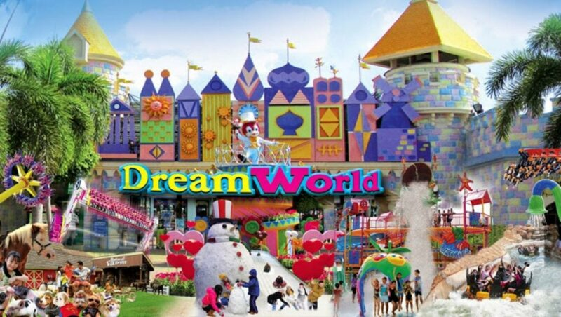

Source: [www.grandsukhumvithotel.com](http://www.grandsukhumvithotel.com/bangkok-destination/bangkok-attractions/dream-world/)

You can take a taxi to Dream World even though is technically in another province (most taxi drivers will be ok with this as it is not very far from Bangkok) [Link](https://goo.gl/maps/6Fzjthjf4Nn) to Google Map. Just tell the taxi driver “Dream World” and they will know the place or you can take Grab to play it safe, albeit more expensive. It should costs about THB 400-500 from Bangkok’s city centre for the ride.

The kids will like the rides.. Parents too? Maybe? Hopefully they are tall enough to avoid disappointment

Bringing the kids here will be a great experience for the kids, unless they have been to one too many amusement parks. It might get a little hot though, so prepare sun blocks and umbrella. You don’t want to get a nasty sunburn while on holiday. Bring swimwear too!

Dream World is truly a beautiful place and it is huge! I think the best way convince you to visit this place is with pictures.

](../../../assets/images/blog/bangkok-family-places/36-water-theme-park-at-dreamworld.png)

*Source: [planvacationasia.com](https://planvacationasia.com/product/dream-world-bangkok/)*

](../../../assets/images/blog/bangkok-family-places/37-dream-world-attractions.jpg)

*Source: [thailandtourism.co](https://thailandtourism.co/things-to-do/an-amazing-experience-in-dream-world-bangkok.html)*

](../../../assets/images/blog/bangkok-family-places/38-tripzilla.jpg)

*Source: [www.tripzilla.com](https://www.tripzilla.com/reasons-visit-dreamworld-bangkok/69400)*

The good thing about dream world is that there are both major rides for older children and smaller rides for kids. Dream World houses a water theme park, a petting zoo and even a snow town! It is a full day experience and but this requires a big sacrifice from the parents who will probably be tired from all the walking!

](../../../assets/images/blog/bangkok-family-places/39-animal-farm-dream-town.jpg)

*Source: [www.tripzilla.com](https://www.tripzilla.com/reasons-visit-dreamworld-bangkok/69400)*

](../../../assets/images/blog/bangkok-family-places/40-snow-town-dream-world.jpg)

*Source: [www.tripzilla.com](https://www.tripzilla.com/reasons-visit-dreamworld-bangkok/69400)*

After a full day at Dream World, you’ll probably be too tired for anything else! Time to go back to the hotel and crash!

After all the sacrifice, I think we now need a place for Mummy and/or Daddy to relax. Nope, not massage, this place is far more unique!

Btw, just a tip, good massage are usually not inside central Bangkok unless you go for the branded massage places like Health Land, Just Relax or Lek etc. If you are looking at those shophouse type of massage, you have to go to places not in central Bangkok. There’s pretty decent massages at Huai Khwang, Bangkapi and Udomsuk area and it is only THB 150-180 / hr, your Thai friends may know.

12\. Relaxing Herbal Scalp spa at bee choo origin

So you’ve been running around Bangkok and nearby provinces for a couple of days, your legs and neck are probably aching, your scalp might feel a little oily and itchy from using the generic shampoo provided by the hotel and from the fervid heat in Bangkok combined with the oily spicy food.

Why not get a herbal scalp and hair treatment with Bee Choo Origin while you’re a Bangkok? You might be familiar with the brand name as it has 21 outlets in Singapore, 70+ in Malaysia and many outlets in Philippines, China, Indonesia, etc. If you have not yet heard of Bee Choo Origin, here’s some history on this Singapore brand.

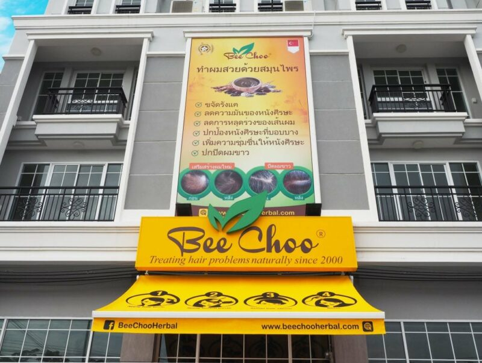

*Bee Choo Udomsuk – 4th Outlet in Bangkok Opened July 2018*

Bee Choo Origin originated from Singapore in year 2000, and has since expanded to over 12 countries. The brand has won prestigious Singapore corporate brand awards continuously and is a very reputable and trusted brand in the Singapore and Malaysian Community.

Herbal treatment in Action

Enjoy the relaxing head massage prior to paste application and during washing

It can get quite busy during peak hours!

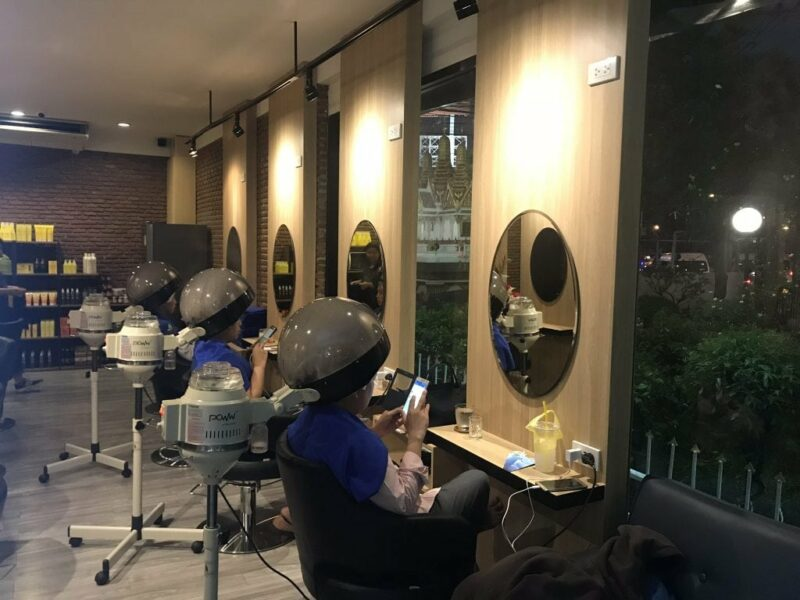

*Customers steaming hair for 45 mins at Bee Choo*

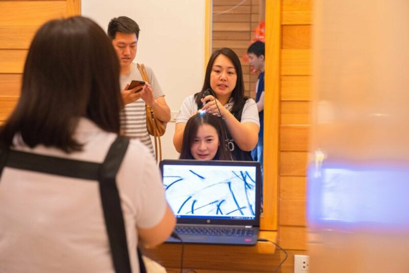

*Scalp Analysis by Bee Choo*

*Customers enjoying the 1:30mins herbal treatment*

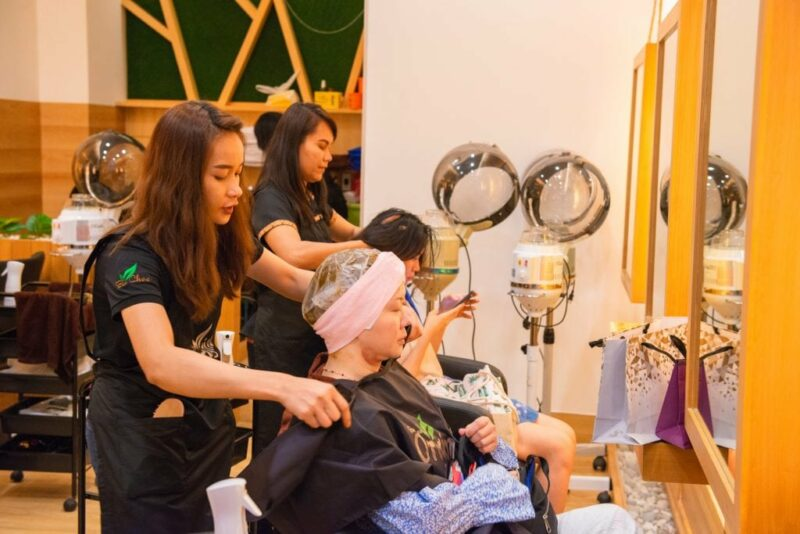

*Bee Choo’s hair therapist at work*

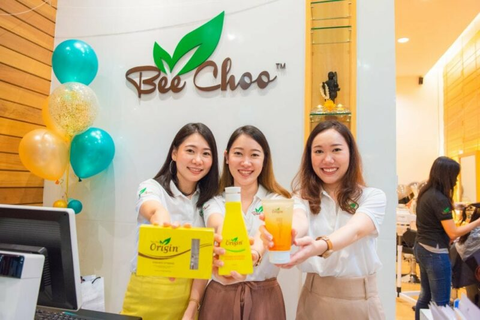

*The Beautiful Team at Bee Choo Siam*

Visit Bee Choo in Bangkok to relax and pamper yourself to a herbal scalp and hair treatment. The treatment combats common hair issues such as:

Dandruff

Oily scalp

Hair Loss

Sensitive Scalp; and

Covers white hair with a coppy dye

The locations of Bee Choo Herbal is family friendly, so if you have to bring the kids along, leave the wife at the shop and daddy can bring the kids shopping nearby.

Bee Choo Ratchada is located at 252/193 P-105G Muangthai Phatra Complex MRT Sutthisan Exit 3, walk left towards Muangthai Complex, turn left again at entrance. The shop will be on your left, before carpark.

Bee Choo Saimai is located is located in Siri Avenue Sai Mai project. Directly opposite PTT gas station and across from Sai Mai Soi 56

Bee Choo Krungthep Kreetha Branch is located In the shopping center @22 mini mall Krungthep Kreetha Road, near Soi Krungthep Kreetha 22, opposite Soi Krungthep Kreetha 41

Bee Choo Siam Square One is located at Siam Square One, 6th Flr.

Bee Choo Udom Suk is located at Sukhumvit street 103, The Master. The parking space is available in front of the store.

Bee Choo Kallapaphruk is located at City Connect, Kallapaphruk rd. towards Sathorn. It is between Homepro Kallapaphruk and Metro Town, opposite Makro Food service.

Bee Choo Chaiyaphruek is located in Pradap Dao Village, Ratchaphruek Road, new PTT Gas station. Shop no. 15/68

BEE CHOO THAILAND LOCATIONS

Siri Avenue, Sai Mai

Tel: 02-1214419

Siam square one (floor 6)

Tel: 02-115-1300

Phatra Complex (Ratchada)

Tel: 06-1729-3434

The master @ BTS udomsuk

Tel: 02-072-6698 
 
 
 
 
 [Call Udomsuk](tel:+6620726698)

CITY CONNECT - KALLAPAPHRUK 
 
 
 
 Tel: 090-221-7745

Pradraw - Chaiyaphruek

Tel: 0931385214 Tel: 021471459

22 mini mall - krungthep kreetha

Tel: 093-147-1388
