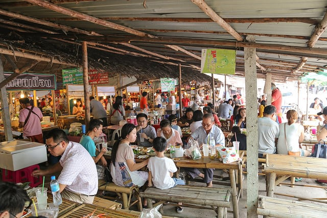
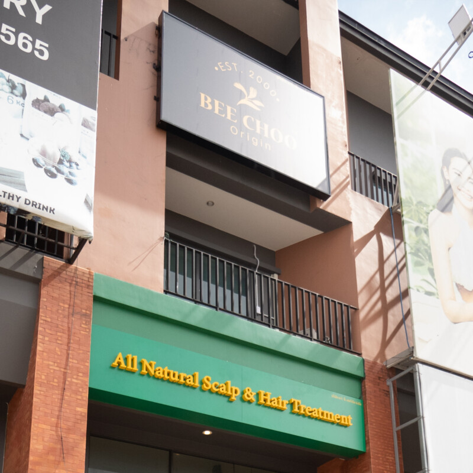
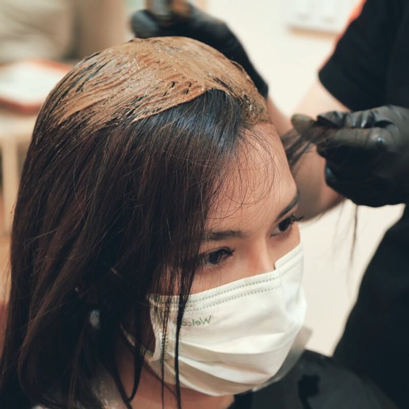
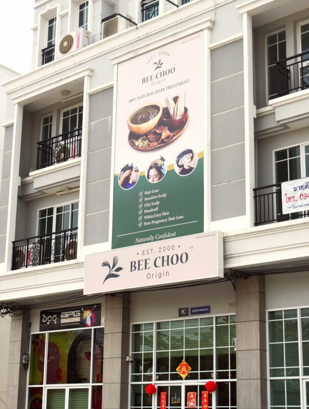
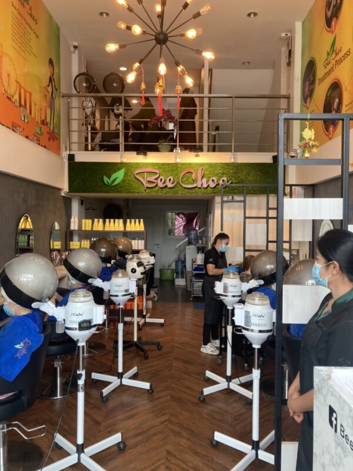

I am a Singaporean guy, living and working in Bangkok. Having moved here for over a year, I realized that visiting Bangkok as a tourist and living here as an expat is very different. Having mixed around with the locals, I have found many interesting places which are lesser known to tourist because they are not advertised widely on the internet but are extremely popular with the residents here.

These places aren’t as touristy but it is (at least to me) better than most of the highly recommended places on TripAdvisor! So read on more to find out what are the top 10 non-touristy things that even locals do in Bangkok!

Top 10 Non-Touristy Things (off the beaten track) to do in Bangkok:

Huamum night market

Khlong Lat Mayom Floating Market

Wang lang market

Kudee Jeen District

Wat Saket

Siriraj Medical Museum

Waterside Resort restaurant

Studio Lam

Montra spa

Bee Choo Herbal Hair and Scalp Treatment

1 – HUAMUM NIGHT MARKET

*Starting with, the Thai bustling night markets.*

The most touristy night market is probably [Ratchada Train Night Market](https://www.tripadvisor.com/Attraction_Review-g293916-d8130989-Reviews-Train_Night_Market_Ratchada-Bangkok.html), but if you are looking for something non-touristy or less crowded, you can drive out further to Huamum Night Market located at Lat Phrao (point to note: it is not near any MRT or BTS station!).

Personally, I like Huamum night market more because its bigger and has less repetitive shops. The vendors are less pushy and the pricing is also better. Huamum is home to The Famous Entertaining Seafood Restaurant known as “Have Oyster Station”. This is a direct translation, but if you understand Thai, it actually means “Pussy Station.” The waiters of this restaurant are skimpy dressed men. While entertaining and funny, this seafood at this restaurant is surprisingly fresh and tasty. You can try out their oyster and the grill giant fresh water prawns.

*Staff of the “Have Oyster Station”*

Huamum night market’s sprawling compound makes it child friendly as well, because you can easily keep an eye on your kid as you stroll around this night market without worrying about losing sight of your child.

There are lots of interesting artefacts and clothings sold here as well. You can even get a trendy hair cut as well in this market!

Another good thing about this market, is that parking is cheap (compared to the touristy night markets). Although you’ll need some luck in finding a convenient parking location. However, it can get a bit jammed driving to and out of Huamum night market. But, heck, traffic jam is a normal affair here in Bangkok, Thailand.

Google Map to Huamum

2 - Khlong Lat Mayom Floating Market

Floating markets are unique to Thailand. You see the locals peddling all sorts of food, fruits and merchandise while on their small boat. The Khlong Lat Mayom Floating Market is a short taxi-ride away from Bang Wa BTS Station. If the taxi driver turns on the meter, you should be charged about 60-70 baht for the taxi ride.

What I like about this floating market is that you can take a nice boat ride in a canal, you may even see the village boys swimming in the canal and experience the old settlements around the canals where the residents there use the sampan boats to get to and out of their houses.

In the past, traveling by sampan boat was actually one of the main forms of transport in Thailand. But that has changed in recent times, nevertheless, you still can experience and see this first hand at Khlong Lat Mayom Floating Market!

The boat ride is not just a round trip, there are two stops. The first stop would be at a temple which you can visit. It is not crowded, so you can relax and enjoy the peaceful moments. The second stop is at a large florist, if you are into plants, you can find unique Thai vegetations and flowers at this local florist. If you’re not into vegetations and flowers, then bring along a camera and snap those wonderful memories.

The food at Khlong Lat Mayom is cheap and good. If you are looking for authentic Thai food, this place is right for you! The seafood here is pretty fresh as well, shrimp, oyster and crab. You can also try the Thai Esan food as well if you are up to the task, but warning, Esan (Northeast) food is not for everyone. It is has a really strong taste due to the use of Anchovy gravy (fermented fish sauce)!

*Dine like a local (non-touristy) at Khlong Lat Mayam Floating Market*

This market is not as commercialize or very non-touristy, so if you can’t speak Thai you may have a hard time communicating with people who live here. However, people here would try their best to communicate with you until there is an understanding.

3 - Wang lang market

*Tha Wang Lang Pier*

If you are into markets and street food you should visit Wang Lang Market. When I went to this market I saw many different kinds of shops from homemade food, clothes, souvenirs, and even hipster shops. These shops have so much varieties from vintage clothes, eye wear, handmade stuff that would make you look cool like the hipsters. If you are one of them, you should not miss this place.

The prices of these souvenirs are low and because of this I am positive you will not walk out of this market empty handed. However, the market gets very crowded during noon because the people living and working in this area love the low price and the taste of food at this market.

*Part of the market is also sheltered, so you do not have to worry even if it starts to rain.*

Directions:

I would recommend taking a boat from Sathorn pier, Taksin Bridge. You will also get to see the Chao Phraya River with chill breeze while getting off at Wang Lang pier. Or if you were at Tha Phra Chan Pier, you can take a ferry to get to this market.

4 - Kudee Jeen District

When you are already at Wang Lang Market, it is worth to check out this historical neighborhood next to the market. Kudee Jeen is a preserved district is a small area located next to Chao Phraya River. If you are into architecture, you should definitely take a walk around this small district. The architecture is very distinctive because of the influence by the diverse Portugese and Chinese migrants in the past.

Sneak Peak into the Santa Cruz Church – Source: [https://www.flickr.com/photos/iprahin/6563570787](https://www.flickr.com/photos/iprahin/6563570787)

You can easily spot the church, Santa Cruz Church, the oldest church in Bangkok, from the river. The church name is a Portuguese word meaning “holy cross.” This area is home to different religions and cultures that has been perfectly mixed which are Portuguese, Chinese, and Thai.

Another place in this area that you should visit is Guan Yin Shrine, 建安宮. The place, like other places in this area, is more than 100 years old and so well preserved. If you are fascinated by history and old places, you have to visit the shrine. It is also great to pay respect to Guan Yin.

People have live here in harmony since the end of Ayutthaya era. There are cafes here which preserve the style of this area that you can relax after a long walk. Also, there is a dessert which is hard to come by which is called khanom farang Kudi Chin. It is believed to be the first cake introduced in Thailand.

5 - Wat Saket

Wat Saket is an ancient Buddhist temple that is located in Pom Prap Sattru Phai district. The temple has Phu Khao Thong when translate to English it would mean “golden mountain.” Phu Khao Thong is an artificial hill with a chedi on top that contains a relic of the Buddha inside. People living here usually come to Wat Saket to conduct religious ceremony such as the circular walk around Phu Khao Thong. It is believe that if you walk all the way to the top of the Golden Mountain, which is 344 steps from the ground, you would reach the top of the heaven.

If you are looking for a beautiful temple with beautiful view then Wat Saket might be the place you want to visit.

Also, if you are lucky enough and happen to come to Thailand during the Loy Krathong festival in November, the temple would hold a carnival for seven days and seven nights straight until the full moon of the month. In the carnival, you will find a lot of exciting things to do such as a carnival wheel, a ghost house, and even dunk tank.

*Best time to visit:*

We advise you to reach the temple early in the day to avoid the queue. The temple is opened from 9am till 5pm daily.

6 - Siriraj Medical Museum

This museum also has a nickname, “the museum of Death” because the Siriraj Medical Museum has many exhibits of taxidermy of human.

If you were a Thai, you would know Si Quay since you were young because your parents would be telling a story of how he abducts and eats organs of children. Your parents would also tell you to behave if you don’t want such thing to happen to you. The Siriraj Medical Museum has the mummified remains of Si Quay, the first known serial killer in Thai history.

People living here who are interested in medical stuff or want to see the real Si Quay himself would come to this museum. The museum is open to public from 10AM to 5PM and closes every Tuesday.

7 - Waterside Resort restaurant

After all, everyone has to eat. If you are looking for a nice place for dinner that is non-touristy or less known to tourists, I suggest you visit Waterside Resort Restaurant at Raminthra area, north of town.

The restaurant has varieties of food to choose from. From delicious authentic Thai food German pork knuckles, to Japanese sushi. I’ve brought foreign friends here together with my Thai friends, everyone will have a dish that they like. Usually the Thais will eat the papaya salad (Som Tum), the foreigners will try one mouth of the papaya salad and that’s about it.

The taste is quite nice, and the prices are decent for restaurant resort with live band, drinks and beautiful waitress.

There are also private karaoke rooms which people who live here often hold an event that invites all their co-worker to have fun together. Sadly, when I visited this place, the karaoke rooms were all fully booked. If you plan to hold a party in one of the karaoke rooms, you should plan ahead, call and book early!

*The restaurant is located on Pradit Manutham Rd. and opens from 5pm until 1am.*

8 - Studio Lam

What about some things to do at night in Bangkok? One of the unusual things to do in Bangkok is to visit Studio Lam. It is a special bar that is hard to come by because it plays a unique music type that is mixed from traditional Thai music with other genres.

When I first came to Thailand, I found traditional Thai music hard to listen to, but as I stay longer I get used to the style and eventually started liking it. Strangely, most foreigner likes the Thai folk music, however, it isn’t very popular with the younger Thais that are born and bred in Bangkok.

People who live here that loves traditional music would come here after dinner with their friends to enjoy special cocktails that are mixed from Ya Dong (traditional Thai alcoholic concoction mixed from different herbs) and international liqueur. Ya Dong is very strong, and I don’t think its very healthy, but no harm trying once!

In case you are wondering what Ya Dong is! Source: [http://www.taeglicher-wahnsinn-thailand.de](http://www.taeglicher-wahnsinn-thailand.de/2014/11/krauterschnaps-mit-giftigen-schlangen.html)

The bar recently has been featured in a Thai movie making it more well known to the people living here. If you want to visit this bar, it is located at Sukumvit Soi 51. It opens from 5pm to midnight and is closed every Tuesday.

9 - Montra spa

Well, after days of hardworking people living here need a place to relax. Montra Spa is a nice place to go to for a massage. There are different types of massage here such as Thai massage or aroma massage and more.

Getting a massage from time to time can help ease all the muscle aches I get after sitting for hours each day working in my office. Spending one or two hours at this place really help me relax. Sometimes I even fell asleep during a massage because it is so relaxing.

The price here is not expensive too starting at 400 baht, actually considered one of the cheap things to do in Bangkok, whether in the day or night!

Montra Spa has many branches which makes it very easy to access. I usually go to the branch in Central World because when I have to take care of business in central Bangkok I usually use the BTS to escape the traffic and Central World is not so far from the BTS. Sometimes when there is traffic jam and you need to hit the road, you may instead go have a massage because at the end you may even end up reaching home the same time, but with out having to spend time in the traffic.

Opening hours:

The Spa is opened daily from 10:30am till 8:30pm!

[http://www.montraspa.net/](http://www.montraspa.net/)

10 - Bee Choo Herbal Hair and Scalp Treatment

When you come to Bangkok, with the hot weather and all the pollution here, your hair and scalp may get very oily and uncomfortable. This is one of the most unusual, non-touristy things to do – visit a hair treatment salon!

Why not kick back and relax at Bee Choo Herbal and get a scalp treatment. The prices are extremely reasonable at THB 800 baht for men and THB 900 to 1200 Baht for women depending on hair length. Considered as one of the cheap things to do it in Bangkok, compared to other countries.

The treatment starts with a relaxing scalp massage which prepares your scalp for the specially formulated herbal paste. After which, they will apply the herbal paste and steam for 45 mins.

After the steaming process, they will wash off the herbs and do a deep cleansing hair wash. At the end of the treatment, your scalp will feel fresh and extremely clean.

The treatment helps with common hair issues such as: oily scalp, dandruff and hair loss. Interestingly, Bee Choo Origin is actually a Singapore brand (they are extremely popular in Singapore, Malaysia and China too!) Bee Choo Herbal is also know in China as 奥琳欣.

They have a total of 9 branches here in Bangkok and Chonburi , Thailand (as of Nov 23 ). We have listed the address below:

*BEE CHOO THAILAND LOCATIONS*

Siri Avenue, Sai Mai

Tel: 02-1214419

Siam square one (floor 6)

Tel: 02-115-1300

Phatra Complex (Ratchada)

Tel: 06-1729-3434

The master @ BTS udomsuk

Tel: 02-072-6698 
 
 
 
 
 [Call Udomsuk](tel:+6620726698)

CITY CONNECT - KALLAPAPHRUK 
 
 
 
 Tel: 090-221-7745

Pradraw - Chaiyaphruek

Tel: 0931385214 Tel: 021471459

22 mini mall - krungthep kreetha

Tel : 093-147-1388

Casalunar Avenue - Chonburi

Tel: 096-904-7964

the Crystal park (Ekamai-ramindra)

Tel : 095-536-5556
