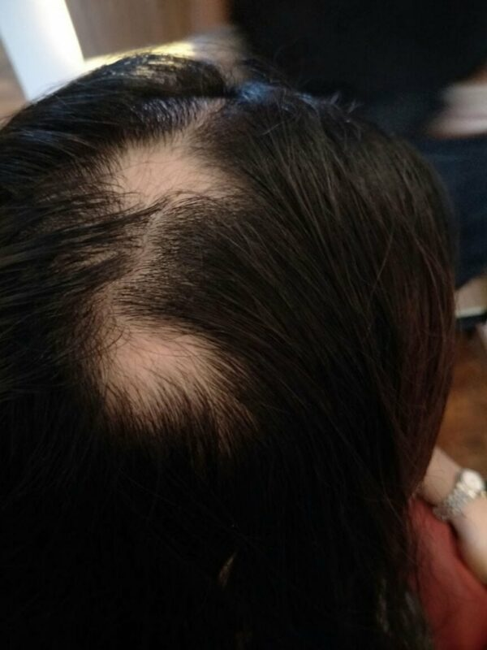
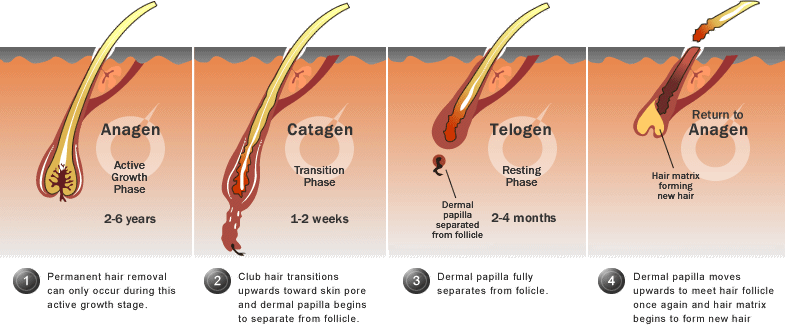
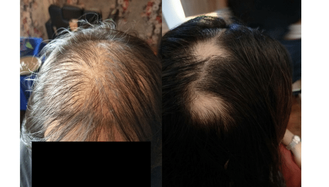
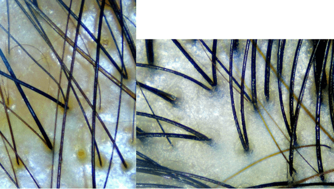
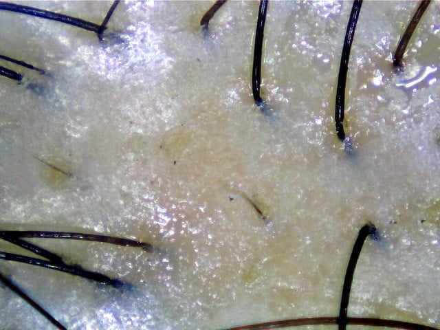
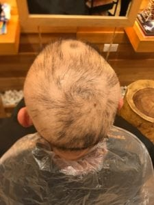
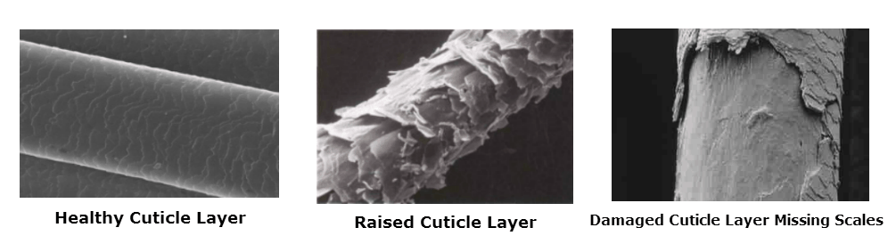
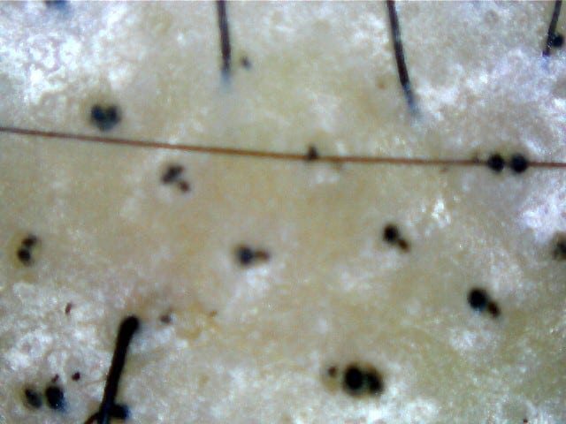
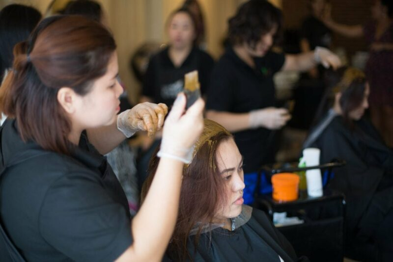
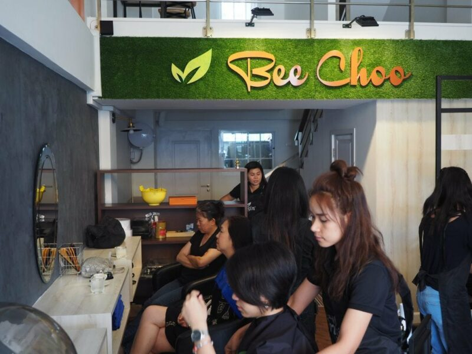

Article originally posted on [www.beechooladies.com.sg](https://www.beechooladies.com.sg/10-most-possible-causes-of-hair-loss-in-young-women/)

There are many causes for hair loss, it could be due to a myriad of factors or a singular key cause to hair loss. If you are experiencing hair loss and want to know the causes, read on. In this post, we will discuss the 10 most possible causes that results in hair loss for young ladies. After understanding the possible causes, you may like to try our recommended solution to regrow your hair, not only through nourishing good anti hair loss shampoo that works better than keratin, but also through a treatment using herbs that has proven effective, yet affordable.

What can cause hair loss in young women?

Most young women experience hair loss because of the 3 main following reasons (non-exhaustive):

genetics

influence of hormonal changes

aging and stress

Some hair loss are temporary, some semi-permanent and some may even be permanent. Below we will be sharing about the 10 possible common causes for female hair loss. This is also based on what we have seen in the salon.

10 Most Possible causes of hair loss in young women

Genetics

Auto-immune diseases

Stress or trauma

Tyroid diseases

Inappropriate supplements and medication

Over-exposure to sunlight

External damage to hair and scalp

Chemical dyes

Unsuitable hair products

Bacterial and infections

1\) Genetics

Genetics is one of the most common cause of hair loss with about 50% of women with hair loss issues because of genetics. There’s a commonly held notion that hair loss stems from the mother’s side of the family. However, this is not true, genes governing common baldness are autosomal (i.e not relating to the sex chromosome). This gene is dominant. This means that only one pair is sufficient for the trait to manifest itself.

Simply put, if only one of your parents passed on the baldness gene, you are likely to be a victim of hair loss, but before this happens, this gene needs to ‘express’ itself first for hair loss to occur. Hence, you could be a carrier of the gene but never experience hair loss because this gene did not get ‘expressed’.

Expressiveness occurs based on several factors, but even till today, experts aren’t able to point out how exactly each factor affect expressiveness. So far some of the things that are said to cause expressiveness in the gene is hormones, age and stress. Sudden hair loss in young women can occur when the genes get triggered and gets expressed.

2\) Auto-immune diseases

*Customer suffering from Alopecia Areata taken on 2017-05-09 by Bee Choo Origin*

Have you ever experienced your hair falling out in clumps?

The possible reason is because you have Alopecia areata. Alopecia areata is an autoimmune disease which causes patchy hair loss. Alopecia areata develops when the immune system mistakes healthy cells for foreign substances causing your own immune system to attack your hair follicles, eventually, the follicles reduce in size and stop producing hair. Till today, there is no known trigger for this auto-immune disease.

Alopecia areata is easy to recognize as the hair loss pattern is distinctively circular. A small circular bald patch will suddenly appear with the skin on the bald patch being smooth and shiny. The good news is that 70% of people suffering from this condition will recover on their own within 3-6 months. However, some do not recover and their condition may even worsen. More patches may appear as seen in the picture below.

If left untreated, it could lead to permanent balding. This condition often strikes before the age of 30, and about 30% of sufferers find themselves with bald patches appearing every now and then turning into a cycle of hair loss and regrowth.

While a handful of people, will go on to develop Alopecia Totalis, the advance form of Alopecia Areata, which is essentially means going completely bald but this is a very rare scenario for women. Women rarely go completely bald, men on the other hand are more likely to go fully bald.

3\) Stress / Trauma

Stress has a greater influence on women versus men with regards to hair loss as women with a genetic predisposition usually have a higher ratio of miniaturized hair (miniaturized hair is hair that is thinner than the regular hair shaft thickness). When a person experience stress caused by a major life event such as a loss of a child, pregnancy or a major illness, telogen effluvium might get triggered. Telogen effluvium is the condition whereby hair roots are pushed prematurely into the resting state.

*Source: https://www.keratinresearch.com/phyto-life/understanding-hair-growth.html*

Telogen effluvium can be acute or chronic.

Acute telogen effluvium, for example, is when a person contracts dengue (the major life Event) and about 2-4 months after the Event she finds herself wondering: Why does my hair fall out easily?

This is because, there could be as many as 70% of her scalp hairs had shifted prematurely into the resting state immediately after the Event. As seen in the diagram above, there are 4 cycles. People with healthy hair will have about 85% of their hair in the Anagen Phase, so when a large portion of hair gets pushed into Telogen Phase, this portion of hair in the resting phase becomes weak and fragile 2-4 months after the event.

For acute telogen effluvium caused by a major event, it is a temporary change to amount of hair in the telogen phases. Hence, lost hair is likely to grow back with time, but there are still people take a much longer time to recover (or even never recovering), a condition known as chronic telogen effluvium. This is when the hair continues to shed for more than 6 months.

People suffering from chronic telogen effluvium will often complain of increase hair fall. A person with health scalp sheds about 100 hairs per day, a person suffering from chronic telogen effluvium could lose up to 300 hairs per day. Chronic telogen effluvium could be due to the lack of nutrition and blood supply to the scalp and hair follicles, causing the hair to consistently shift to the telogen phase, falling off prematurely.

4\) Thyroid Diseases

Your thyroid is the butterfly-shaped gland in front of your neck. This gland is responsible for several metabolic processes in the body. Hypothyroidism is when the thyroid is producing too little thyroid hormones. Hyperthyroidism is the opposite; the thyroid produces too much thyroid hormones.

In both cases, sever and prolonged hypothyroidism or hyperthyroidism will lead to hair loss. Hair loss pattern relating to thyroid is diffused across the scalp. i.e. the hair appears uniformly spares.

*Diffused hair loss vs patchy hair loss*

The photo (left) above is a clear example of severe diffused hair loss, this causes the entire scalp to be highly visible although there are no bald spots. This hair loss pattern is very different from those who suffer from alopecia areata. That said, you could suffer from both thyroid and alopecia areata, in fact, people with thyroid disorder are more likely to suffer from alopecia areata.

*unhealthy vs healthy hair scan*

Taking a close up look at her scalp (image on the left), you can see that most of her hair follicles contains only 1 strain of hair with some follicles being empty and few having 2 or more strains of hair.

Furthermore, most of her hair strain is thin with a few hair strains having the regular thickness (60-80 µm) compared to Asians with healthy hair (black hair type) will typically have 3-4 strains of hair per follicle (image on the right). Thus, the combined effect of the thinning of the individual hair strains and the reduction of hair count that causes the extreme sparseness of her scalp.

Most of the time, hair loss caused by thyroid disorders is not permanent. However, because of the hair growth cycle and because our hair growths slowly (by the way, Asian hair grows at the fastest rate at 15-16cm per year compared to the rest of the races). It will take several months for hair to regrow and overall thickness to regain.

If possible, avoid wearing wigs or covering your head for prolong periods of time during the recovery process because these will affect the health of your scalp due to the dirt and bacterial that accumulate in these hair systems. Try to be patient and ensure that you have a healthy scalp to hasten the recovery process.

5\) Supplements and medication

Taking steroids, medication or dietary supplements can cause hair loss. For example, whey-based nutritional supplements which are popular amongst bodybuilders can cause hair loss. This is because the growth hormones fed to the cows affects the diary produced. Whey, which is a by-product of cheese production, may contain some of these growth hormones.

This causes steroid-like impact from the milk source. Steroid increases in testosterone levels in your body. Testosterone converts to dihydrotestosterone (DHT) with the aid of the enzyme 5-alpha reductase. DHT is the main culprit. DHT shrinks and attacks hair follicles causing hair loss.

In addition, medications such as blood thinners, gout medication, hormone pills and antidepressants can trigger telogen effluvium which we discussed in point 3. Thankfully, most of these effects are temporary. Once you get off these medications, your hair is likely to grow back in 4-6 months.

6\) Sunlight / UV Light

This might sound weird, but overexposure to sunlight can cause hair loss indirectly. Too much sun causes hair to become dry and brittle. Sometimes leading to ‘split ends’. Direct sunlight onto the scalp, on the other hand, causes the sebaceous glands to go into overdrive and produce more oil.

Excess oil on the scalp can clog up hair follicles, if left untreated for too long, it inhibits the natural hair growth cycle. As seen in the photo below, the hair growing on oily scalp is not healthy with only 1-2 strains per follicle.

*Example of hair loss caused by oily scalp Bee Choo Origin*

7\. External damage to hair and scalp

Traction alopecia is when you lose hair gradually due to prolonged tension on the hair follicles. One example is bunning. Bunning the hair for long periods of time can damage your hairline at the font, causing breakage and even a receding hair line. Persistent traction alopecia can lead to scarring, causing permanent hair loss in that region.

Avoid this problem by reducing the duration of your bun and loosening the grip of the bun. Furthermore, if you are using an elastic band to hold your hair, it can cause dryness at the joint and eventually breakage. It is better to use satin covered bands or scrunchies to hold your hair in place.

Burn victims – anyone who had severe burnt injuries to the scalp may have permanent hair loss because the hair follicle has been damaged beyond repair, a condition termed “scarring alopecia”. Radiation therapy can also cause the same kind of damage and hair loss to a person.

8\. Chemical dyes

First off, NEVER use chemical dye on the roots on your hair. Chemical hair dyes contain lots of harmful chemicals including peroxide and ammonia. These chemicals damages and weakens your hair. If these chemicals get in contact with your scalp, it can cause scalp burns, itchiness and sensitivity. Using third grade chemical dyes without proper licensing can lead to disastrous results. Just see the photo below:

*Man lose hair after chemical dye*

Where possible, opt for natural hair dyes which contain no chemical such has henna. Especially if you intend to dye your hair to the roots. Otherwise, leave a good 1cm space from your scalp when doing your chemical dye. Done properly, it can reduce or eliminate the damage on your scalp.

However, these chemical dyes will still damage your hair. Chemically dyed hairs are usually thinner, dry and brittle. This is because, in the process of changing your hair colour, the dye has to break through your hair’s natural protection, the cuticle, to get into the hair shaft. The ammonia contained in the dye raises the cuticle, allowing the peroxide to bleach out your natural hair colour. Finally, the colouring component comes in and does its job.

Source: [http://www.howtomakeyourhairgrowfastertips.com/wp-content/uploads/2014/06/hair-cuticle-layer.png](http://www.howtomakeyourhairgrowfastertips.com/wp-content/uploads/2014/06/hair-cuticle-layer.png)

9\. Hair products

Gel, hair sprays, wax and other hair products do not cause hair loss. Not directly of course. But if used wrongly, it can indirectly cause hair loss. These products are meant to be used on the hair not on the scalp. Applying it on the hair and washing it out afterwards will not cause hair loss.

However, if you applied these products wrongly onto the scalp and did not wash it out cleanly with shampoo afterwards, it can lead to scalp irritation. Now, when your scalp gets itchy, what happens? You scratch. In particular, women with long sharp finger nails, can damage their own hair follicles when they scratch too hard.

Most of the time, the damage is not permanent, and the hair follicle will heal on its own with time. It is important that proper hygiene is maintained. Keeping your scalp nice and clean will help you maintain beautiful into your advance years.

Do you experience your hair falling out in the shower? Some people blame their hair loss on their shampoo. Most of time people are more conscious when they change shampoo, so they check for hair fall after trying a new shampoo, they often see a couple of strains of hair falling off and jump to the conclusion that the new shampoo is not good.

However, shampoos are unlikely to cause hair loss, unless you are allergic to a particular chemical contained in that shampoo. If the shampoo you are using is truly bad for you, you should see clumps of hair falling out and your scalp will turn pinkish and sensitive after your first use of the shampoo.

That said, you should still choose the right shampoo for your hair type. Not all hair type and scalp types are the same, some people have oily scalp, some have dry scalps and some sensitive scalp. Using the wrong shampoo for long periods of time can damage your hair and even weakening your hair roots leading to hair loss.

Using the correct shampoo will make you feel good and give you a healthy scalp and hair. Very often, hair issues such as dandruff and oily scalp is caused by using an unsuitable shampoo. It is important to understand your hair type, the best way to do so is to visit a hair care specialist, an experience professionals will be able to tell your hair type after examining your scalp and/or doing a hair scan.

10\. Bacterial and Infections

Bacterial and fungus infection and cause severe hair loss for women. One of the most common infection is known as Tinea Capitis also known as Ringworm. This is a kind of infection that causes patchy hair loss, similar to alopecia areata, the difference is that the affected area is reddish and inflamed versus alopecia areata where the affected area is smooth. You will also see a “black dot pattern” which are actually broken-off hairs.

*Broken off hairs caused by tinea capitis, photo taken by Bee Choo Origin*

This infection is often seen in children and more often in boys than girls. The fungus that cause this infection can be commonly found in soil. In addition, animals carrying the fungus can pass it on to humans. It is contagious and it can be passed via skin contact and even through sharing of hair combs and other hair accessories.

A person suffering from Tinea Capitis can recover only to suffer from patchy hair loss again. This is because the source of the fungus is still in close proximity of the victim. Thus, anyone suffering from this should dispose of all her hair accessories immediately and use disposable ones for the time being.

If you do know of other types of hair loss causes not listed here, do feel free to comment and leave us a word!

We hope that this information has been helpful to you

What can I do if I am suffering from Hair loss?

*Bee Choo Herbal Scalp Treatment for Hair loss and other common hair issues*

Well, if you’re living in Bangkok, Thailand, and you are suffering from hair loss, you can visit Bee Choo! Bee Choo is an affordable and effective herbal hair treatment salon (some call it scalp treatment clinic as our customers have seen more effective results here than at the other “hair clinics”) chain brand from Singapore.

Bee Choo has 21 outlets in Singapore and ~ 200 outlets all over Asia. As of the writing of this article, Bee Choo Thailand has 4 outlets and their locations can be found in this [link.](https://beechooherbal.com/locations/) You can also find their facebook page [here](http://www.facebook.com/beechooherbal) and read all about their services and reviews.

The prices are reasonable with a per session costing only 600 baht to 1100 baht! Visit Bee Choo today!

*Bee Choo Establishment located at The Master @ BTS Udomsuk*

*Customers at Bee Choo Udomsuk doing herbal treatment*
