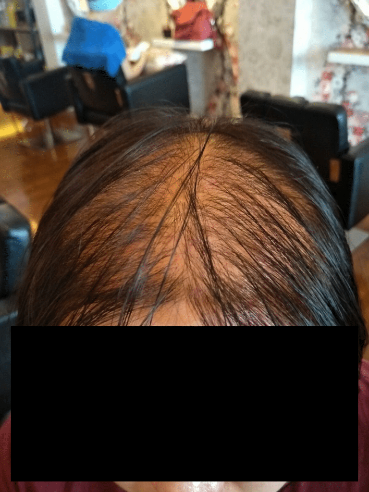
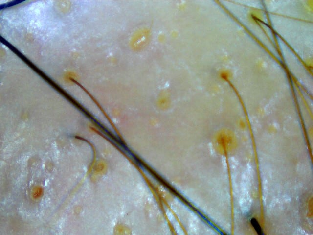
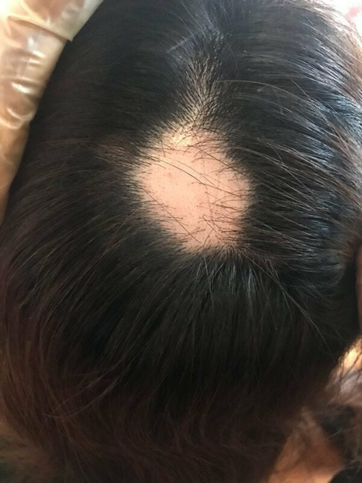
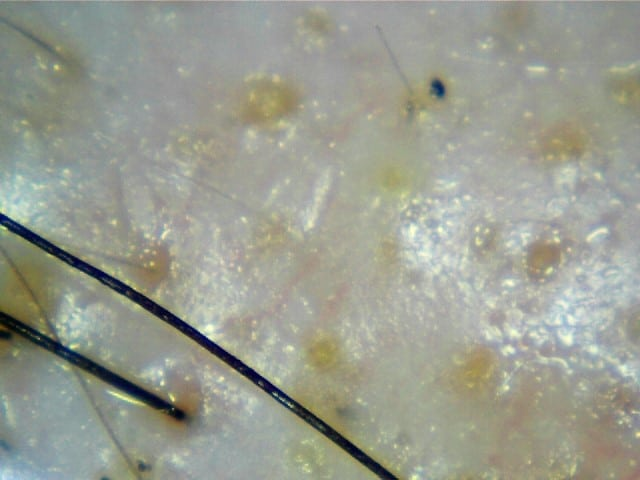
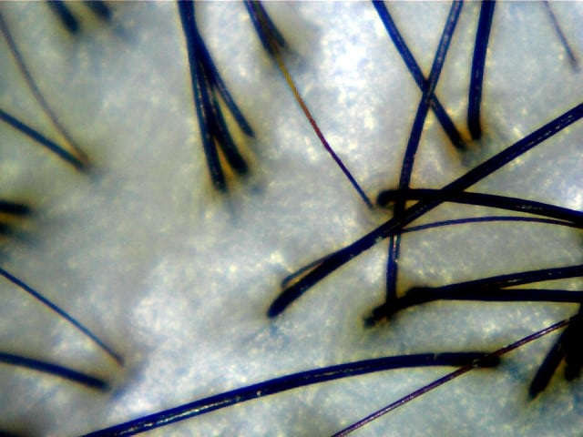
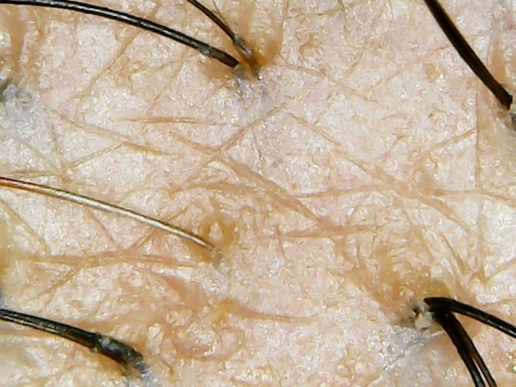
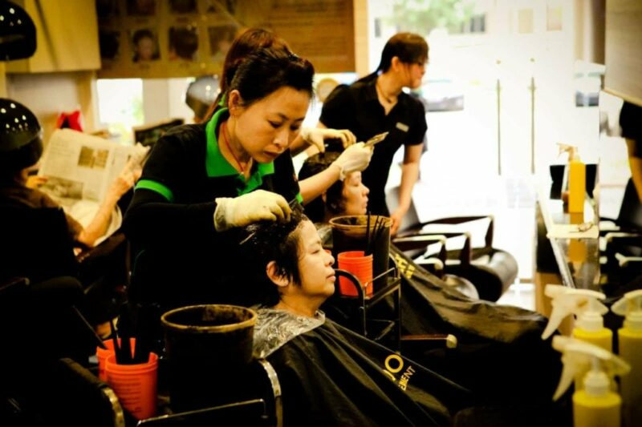

Through our years of experience in the hair care industry, these are the 5 most common causes of hair loss that we see in Customers. It is important to understand the root cause of the problem so that you can treat the root cause, prevent further reoccurrence. If the root cause can’t be treated, then it is also better not to waste money on a treatment that claims to be able to help.

1\. Genetics. This is a major one, especially for men. 98% of men with hair loss issues are in this category. Thankfully, only 7% of men have advanced balding pattern. On the other hand, 50% of women with hair loss issues are in this category.

*Severe genetic hair loss*

*hair scan of severe genetic hair loss*

2\. Internal Conditions. Hormonal influences, such as thyroid diseases and anaemia. Pregnancy is a big cause of hormonal changes as well. Autoimmune diseases may also cause patchy hair loss.

*Photo of alopecia areata (autoimmune disease)*

*hair scan of alopecia areata*

3\. External factors. Lifestyle and other habits such as daily bunning of hair, tight braiding, wearing of turbans/tudung, excessive use of hair wax/gel/spray and dyeing/rebonding/perming of hair.

This lady had been suffering from hair loss due to a rebonding session. She finally got things sorted out after she started going for regular herbal treatments. Watch the video below to see her results and her testimonial:

4\. Stress. This is also why urban dwellings see a higher rate of hair loss issues. This may also affect people without genetical conditions. Sudden hair loss caused by stress is called telogen effluvium.

*example of healthy hair scan*

*hair scan of a person suffering from telogen effluvium*

5\. Medication. Anabolic steroids, birth control pills, antidepressants and sleeping pills can cause hair loss.

*Certain medication can cause hair loss!*

