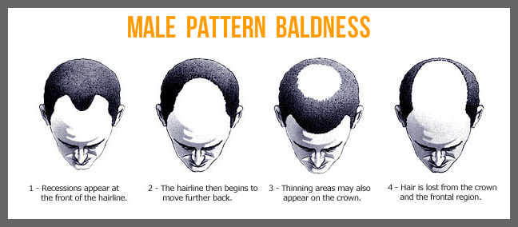
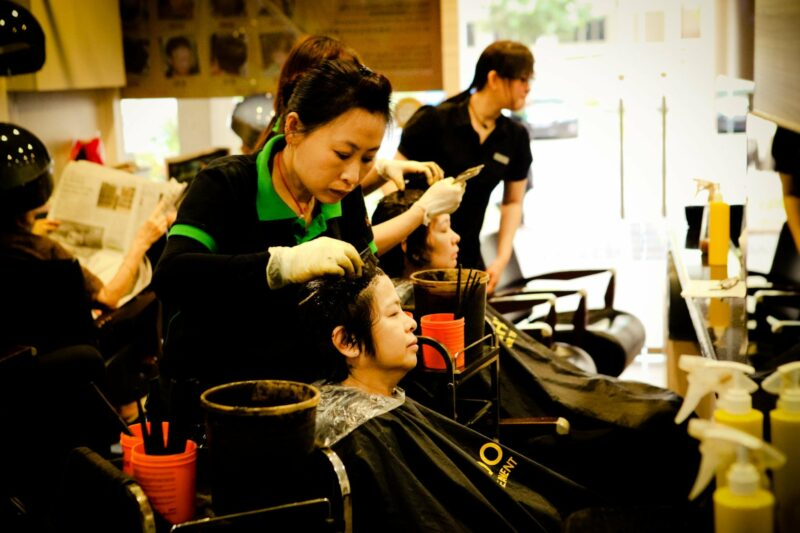

Genetic Hair loss in Men

Male genetic pattern baldness (hair loss) starts its invasion through the creation of receding hairline and after that hair thinning would occur at the crown.

*Source: https://orlandohairtransplant.org/male-pattern-baldness/*

Genes and male sex hormones testosterone and dihydrotestosterone (DHT) are the direct cause of male pattern baldness. Thinning of hair occurs when the hair follicle shrinks over time due to DHT and testosterone breaking down the hair cycle causing the anagen phase (growth phase of the hair) to become short and short while the telogen phase remains unchanged. This means that your hair sheds faster resulting in thinning and eventually baldness (when the follicle full close up).

Male celebrities who tone up their body by working out regularly at the gym usually have higher levels of testosterone and this could lead to increased levels of Dihydrotestosterone (DHT) that causes hair loss. An obvious example would be Daniel Craig, the actor who played as James Bond. It is a requirement for actors in his category to be very fit consistently in order to fulfil needs of demanding roles that they play ([link](http://www.dailymail.co.uk/femail/article-2228685/Is-James-Bond-going-bald-Hair-surgeon-says-Daniel-Craig-receding-temples.html) to article). Daniel Craig, the current Bond actor is the latest victim to hair loss issues, which is similar to his predecessors: Sean Connery, Pierce Brosnan, Roger Moore, Timothy Dalton and George Lazenby.

](../../../assets/images/blog/male-pattern-baldness/03-fast-and-furious.jpg)

*Source: [http://www.epictopcomments.com/fast-furious-bald-127-etc-comments/](http://www.epictopcomments.com/fast-furious-bald-127-etc-comments/)*

Hair is an invaluable asset to help boost the appearance and confidence of an individual. Hair loss could result in a person looking much older than his age. If you start treatment early, you would most likely be able to combat hair loss or at least delay it. However, if left unattended, your hair might never come back again! This is a proven condition known as Cicatricial alopecia. When you experience permanent hair loss, scalp becomes shiny and smooth with the degeneration of hair pores. Permanent balding occurs and it would then be impossible to regrow the lost hair.

How to get help?!

Visit Bee Choo Origin in Bangkok, Thailand for a herbal treatment. Bee Choo’s herbal treatment is safe, natural and effective. Just check out their reviews on [facebook](http://www.facebook.com/beechooherbal) or the many before after pictures and videos they have of their clients. Bee Choo is a renown brand in Asia with 200 outlets across 12 countries. The herbal treatment is safe and non-invasive and helps with male hair loss. Start treatment early and you won’t be worried about balding in the future!

*Example of herbal hair treatment done at Bee Choo Origin*

This guy below is one of the first few customers Bee Choo Origin ever helped since starting the business in 2000. Since then, we have gone on to help ten of thousands of people regain their lost hairs!

](../../../assets/images/blog/male-pattern-baldness/05-before-after-chinese.png)

*One of the first few customers credits [Beechoohair.com](http://www.beechoohair.com)*

Check out Bee Choo Herbal’s anti-hair loss treatment in this [link](/?page_id=57).

For more information, give us a call at 02-108-3938. We currently have 7 outlets in Bangkok, Thailand

BEE CHOO THAILAND LOCATIONS

Siri Avenue, Sai Mai

Tel: 02-1214419

Siam square one (floor 6)

Tel: 02-115-1300

Phatra Complex (Ratchada)

Tel: 06-1729-3434

The master @ BTS udomsuk

Tel: 02-072-6698 
 
 
 
 
 [Call Udomsuk](tel:+6620726698)

CITY CONNECT - KALLAPAPHRUK 
 
 
 
 Tel: 090-221-7745

Pradraw - Chaiyaphruek

Tel: 0931385214 Tel: 021471459

22 mini mall - krungthep kreetha

Tel: 093-147-1388
