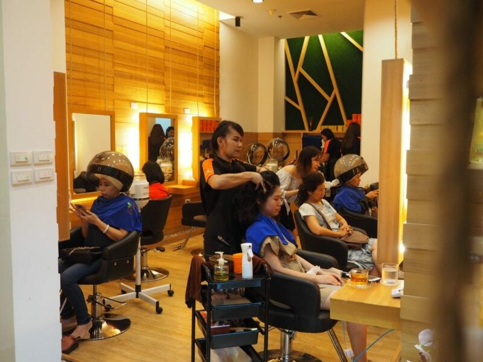
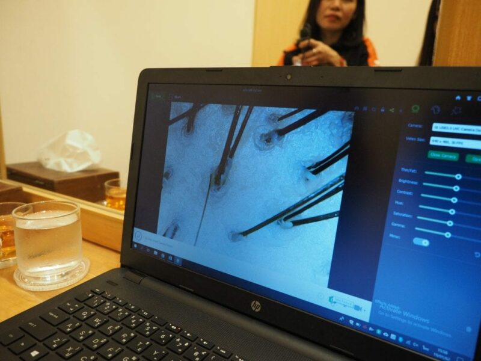
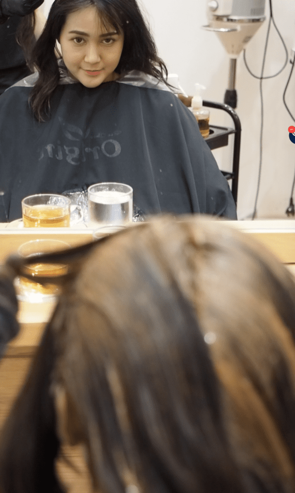
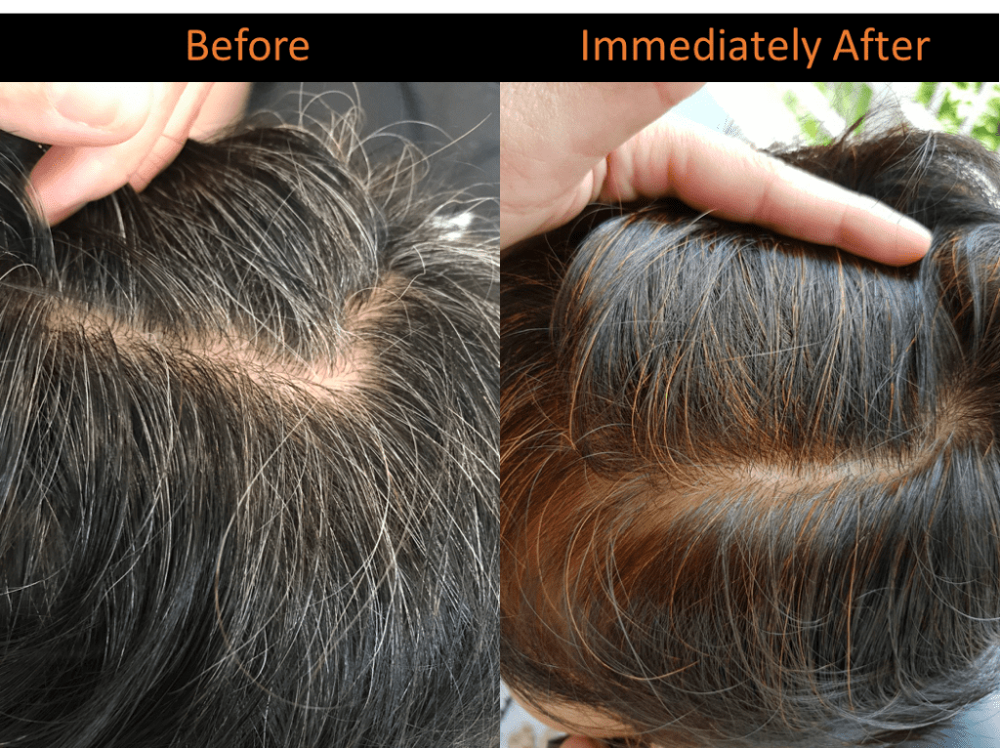
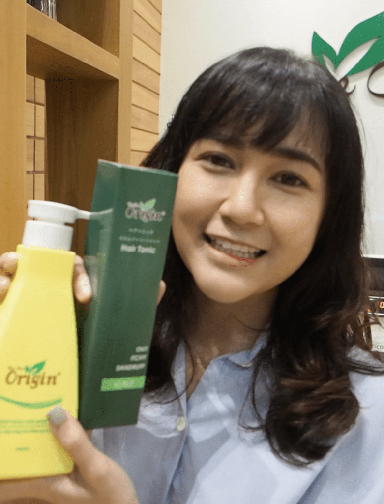
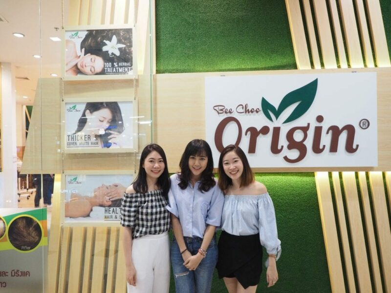

I noticed that I was having minor hair fall and an increase in oiliness in my scalp!

Hi, I am Ploy, I am writing this blog post for any ladies out there, who are probably in their 30s-40s, who had recently experience an increase in hair fall and whose scalp may be feeling oilier than usual. I had the same issue, and now I want to share with you the best way to solve it.

This is my experience with [Bee Choo Herbal.](https://beechooherbal.com)

In this post I will share my experience in this manner as an overview:

1\. Some history about Bee Choo Herbal

2\. My worry about hair fall

3\. Scalp analysis with Bee Choo

4\. Herbal Treatment Process

5\. Did the treatment help and was it effective?

Bee Choo is a Singapore company that provides herbal scalp treatment at affordable prices, that is their philosophy. The price in Thailand ranges from THB 800 to 1,200; which I find reasonable. I’ve seen other scalp treatment being priced at THB 4000 and they are pretty pushy with the package sales. But with Bee Choo, I did not experience any pushy sales people, this is something I really liked about Bee Choo.

Anyways, let’s go down to my story, it started when I notice that my hairs on my bathroom floor trap was accumulating faster than usual. There was so much hair to the point that the water flow was being blocked by my fallen hairs! I had to remove the hairs every week or else my shower old flood. Furthermore, I started feeling an itchiness in my scalp. My scalp just didn’t feel comfortable anymore. I felt horrible and my confidence was affected.

The thing is, I do not know what triggered this episode of oily scalp and increased hair fall. Perhaps it is due to my age, as I am now in my 30s.. or perhaps its the bad weather here in Bangkok, Thailand. The haze is just terrible! Well, whatever the case, I know that I want to solve my hair and scalp issues ASAP as it was starting to annoy me.

And to be honest, I was getting a little worried, I thought to myself… what if my hair loss gets worse? Will I become a bald lady?! Would I ever need wig? Hopefully not!

Naturally, I asked my mom and aunties what to do to stop the hair fall. Most of them suggested changing my shampoo. Some recommended me anti-hair loss shampoos that you can buy off-the-shelve at supermarkets. I did try a couple of shampoos, but it doesn’t seem to work for me. My scalp was still oily and my hair fall did not stop.

A friend of mine even recommended me to take oral medications, but I felt that my hair loss was serious to the extent of having to consume taking oral medication. Plus, I did not want any side-effects from taking medications. I’ve heard that side-effects could be growing of facial hairs, or even putting on weight! Eww, I don’t think I want that for now!

I was looking for some sort of treatment, something non-invasive, something safe, something affordable and trustworthy.

It was during a regular meet up with my university friends where I learnt about my friend’s sister who recently opened a franchise of a brand called “Bee Choo Origin” at Siam Square One Level 6. She explained to me that Bee Choo specialises in herbal scalp treatment that nourishes the scalp, and once the scalp is healthy, it solves many common hair issues such as oily scalp and even hair loss! She showed my pictures of her sister’s shop and it surprised me that there were so many customers!

*Full house at Bee Choo Herbal Thailand!*

She then invited me to do this blog post for her if I liked their treatment. I thought, why not?! This is one of the benefits of being a part-time blogger 😀

We locked in a date and I went for my first herbal scalp treatment.

Btw if you are lazy to read, you can skip to the end and just watch the video of my experience with Bee Choo!

Scalp ANalysis with Bee Choo!

*My scalp scan!*

First, the hair therapists at Bee Choo conducted the complementary scalp analysis for me. They said that the scalp analysis is something they usually do for their first time customers and those who’ve done 4-6 treatment so that they can see the results of the treatment. However, they did mention that during weekends, when the outlet is very crowded and they may not have the time to do the scalp analysis, so if it is your first time and you really want to understand your scalp condition better, best to go down during the weekdays before 5pm.

As you can see from the hair scan, I have about 2 hairs per pore, which is still decent, according to the therapists. They mentioned that Asians, normally have 2-4 hairs per pores. So, I am slightly below average already 🙁 but thankfully, they said that my individual hair strains are still thick! Yay! And since I sought treatment early, the therapist said I really have nothing to worry about. It is just mildly oily scalp and minor hair loss. Whew!!

I guess I was probably overreacting a little when I saw my hair clogging up the floor traps. Opps… hehe..

Overall, I learned a lot about scalp conditions from the therapists. For example, it is normal to lose 50-100 hairs / day, these lost hairs are constantly being replace with new hairs. Also, the best way to tell if you are having hair loss is to do a scalp analysis rather than just running your fingers through your hairs and counting the number of fallen hairs.

After the scalp analysis, we proceeded with the herbal treatment!

Bee Choo's herbal treatment process

*My first herbal treatment with Bee Choo 😀*

The treatment process is very simple and the entire process takes about 2 hours.

Step 1:

The hair therapist applied the ginger wine tonic onto my scalp and give me a 5 mins scalp massage. According to the therapist, the ginger wine tonic coupled with the scalp massage helps open up the pores on my scalp and promote blood circulation. This prepares my scalp for the next step.

Step 2:

Application of the herbal paste. The herbal paste is applied onto my scalp rather than just my hair. The treatment is mainly targeting the scalp, their philosophy is “healthy scalp, healthy hair”. And this makes a lot of sense to me as I never really cared for my scalp and had always taken it for granted.

Step 3:

A 45 mins steaming session for absorption of all the herbal essence into my scalp 😀 I took the time to do some reading, although I was a bit distracted by facebook and line. haha.

Step 4:

This is my favourite part; they have a very special washing technique that is different from most salons, it was very relaxing and I even fell asleep while they were washing my hair! Opps!

Step 5:

They partially blow-dried my hair because, according to the therapist, full drying damages the hair ends and should not be done immediately after the herbal treatment. They mentioned that it is best to let it dry on its own (about 10 – 15mins). Although I did not like my hair partially damp, I believe the health of my hair and scalp is more important so I went with it.

Also, these are some tips for those who want to try Bee Choo’s herbal treatment:

Do not wear white clothes when you go for treatment, the herbal paste contains a copperish dye, so it may stain your white clothes!

For the next 3-4 days post-treatment, avoid white towels when drying your hair, the herbal colouring may run off abit and stain your towel

Give yourself about 2 hours + for the entire treatment process, especially on weekends, as there might be some waiting time when their outlet is crowded.

The herbal treatment contains a natural copper / reddish dye. If you do not like that colour, you can ask for the colourless version, but do check in advance if they have stock for the colourless version!

*Copper dye in the herbal treatment covers white hair naturally!*

Did the herbal treatment help?

Immediately after the treatment, my scalp felt sparkling clean! It is a different kind of clean, different from your normal daily washing. I can really feel that my scalp has been thoroughly cleansed; my scalp felt comfortable and I no longer felt the oiliness.

I bought 2 of their products back to try at home. The therapist recommended me to buy the Purity Scalp Shampoo which is suitable for mildly oily scalp and they also recommended me the green scalp tonic, which they said is good for oily and itchy scalp.

*Bought the Purity Scalp Shampoo and Japan Scalp Tonic from Bee Choo!*

My hair ends felt smoother and softer after the treatment. The therapists said that this is because I have not done any chemical dyes to my hair recently. She said for customers who recently dyed their hair with harsh chemicals, their hairs may not become smoother and softer immediately but may require a few more treatments. Lucky for me!

Is the Treatment effective?

The oiliness and itchiness in my scalp did not reoccur over the next 5-7 days. My scalp felt much more comfortable after washing with the scalp shampoo and using the right washing techniques taught to me by the therapists! I had realize I have been washing wrongly all my life! You can check out this awesome article on washing techniques by the Bee Choo here – [“WASH YOUR HAIR THE PROPER WAY. HERE IS HOW TO WASH YOUR HAIR CORRECTLY!”](http://www.beechooladies.com.sg/wash-your-hair-the-proper-way-here-is-how-to-wash-your-hair-correctly/)

As for my hair fall, I feel that it got better. I will check my hair scan again in 3-4 months, and update with a photo. Hopefully I will have 2-3 hairs per pores on average in 3-4 months!

Speaking honestly, even though the shop is owned by my friend’s sister, I can promise you without any biasness that their treatment is really good! I can see why Bee Choo is so big in other neighbouring Asian countries! Did you know that they have 23 outlets in Singapore, 70+ in Malaysia, 7+ in Myanmar and they already have 7 outlets here in Bangkok, Thailand! ([locations of all the Thai outlets](https://beechooherbal.com/locations/))

Bee Choo hair therapists recommended me to come down once per week for the first month, after which, I can just come down once per month for a monthly maintenance. I am already looking forward to my next visit! I really enjoy my time at the shop, I can get some time to myself while getting my scalp treated so that I can ensure my scalp stays healthy even when I am older. Better to start taking care now than to find a cure when I have a serious problem, afterall, I am a firm believer of “prevention is better than cure”!

Thumbs up to Bee Choo!

*The two lovely sisters and myself at Bee Choo Siam Square One*

They even did a video for me 😀

I did some acting back in university, and it has been a long time since I appeared on camera. We made a little video of the entire experience at Bee Choo Origin Thailand, do check out this candid video we made.

If you want to find out more about Bee Choo Thailand, you can check out their facebook page [here](https://facebook.com/beechooherbal)! Btw, they have 71k followers on facebook! That’s very impressive for a hair salon business!

If you are based in Singapore, check out [Bee Choo Ladies.](http://www.beechooladies.com.sg)

For all other countries, you can check out [www.beechoohair.com](http://www.beechoohair.com)

Here’s the video 😀
