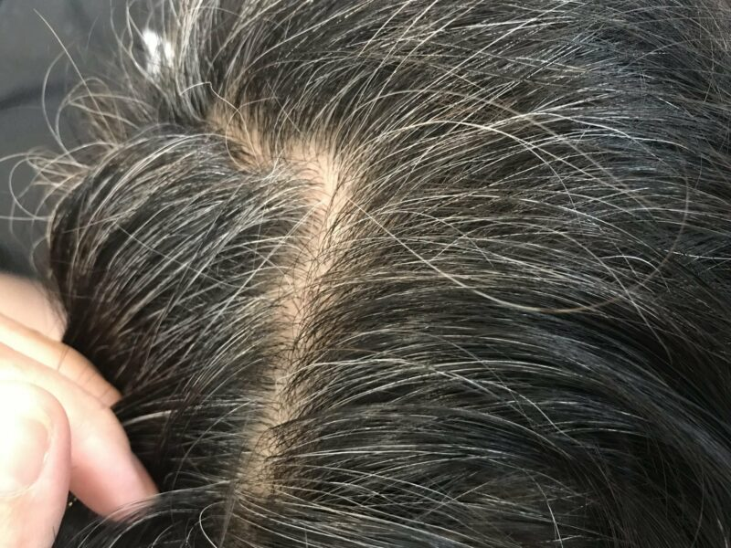
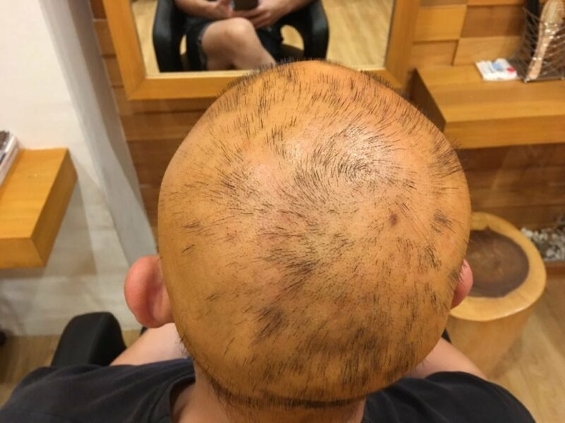

Why do I have white hair?

White hairs normally start to appear when your body stops producing melanin. Melanin provides your hair with its natural hair colour. Melanin also preserves moisture for your hairs. When it is not provided sufficiently for your hair follicles, your hair will start to become white and fragile and they will appear lifeless. The problem of white hair is mostly due to genetics and lack of nutrition such as vitamin B12, and having problems with your [thyroid](https://www.healthline.com/health/white-hair) is also likely to cause it.

*(Greying of hair, photo by Bee Choo Origin, Aug 2017)*

Using a chemical dye to colour white hair is the most common approach nowadays, however, such dyes are highly hazardous to hair follicles and there’s a possibility of ruining your scalp permanently forever if you use too much of those or if you go to an unprofessional hair salon. Please be aware that chemical dye should never be applied to the scalp. Here is an example of a man who used to have a head of healthy hair, but he lost it all in 5 months due to an allergy to a chemical dye he did at a non-professional local salon.

*(Hair loss due to chemical dye, photo by Bee Choo, May 2017)*

If you want to look presentable and take care of your hair and scalp at the same time, here is an option for natural colouring of your white hair. Go to Bee Choo Origin for a herbal treatment.

It fulfils 3 goals all at once!

Covering of white hair

Hair & Scalp Treatment

Thorough hair wash done by trained haircare specialists.

If you are not looking to have very ‘loud’ hair colour, and going for a subtle brown/copper tone, we would recommend you to go natural with your hair now!

Check out this video of to see how we cover white hair naturally using Bee Choo Herbal Treatment! You can find out more about our treatments and pricing [here](https://beechooherbal.com/reverse-premature-grey-white-hair-by-herbal-treatment/) as well!

Content reproduced with permission of [www.beechooladies.com.sg](http://www.beechooladies.com.sg)
