ผมเป็นคนประเทศสิงคโปร์ที่ปัจจุบันได้ย้ายมาอยู่ในไทยและทำงานในไทยได้ราวหนึ่งปี ผมมีความรู้สึกว่าการที่ได้มาประเทศไทยในแบบนักทักท่องเที่ยวนั้นแตกต่างจากการที่ได้มาอยู่ใช้ชีวิตที่นี่โดยสิ้นเชิง จากการที่ได้ใช้ชีวิตร่วมกับคนท้องถิ่นคือคนไทย ผมได้รู้จักกับสถานที่ต่างๆที่ไม่ค่อยเป็นที่รู้จักเพราะสถานที่เหล่านี้ไม่ได้ถูกโฆษณาหรือโปรโมททางสื่อต่างๆมากนัก แต่สถานที่เหล่านี้กลับเป็นที่นิยมสำหรับคนท้องถิ่นมากๆและนักท่องเที่ยวมักจะไม่ค่อยรู้จักสถานที่เหล่านี้ สำหรับผมแล้วสถานที่เหล่านี้น่าไปมากกว่าที่ๆเว็ปไซด์ต่างๆแนะนำเสียอีก อ่านเพิ่มเติมเพื่อมาดูกันว่า 10 สิ่งที่ผมจะพูดถึงคืออะไร

10 สถานที่น่าไปและสิ่งน่าสนใจในกรุงเทพฯ

ตลาดหัวมุม

ตลาดน้ำคลองลัดมะยม

ตลาดวังหลัง

ชุมชนกุฎีจีน

วัดสระเกศ

พิพิธภัณฑ์ ศิริราช

วอเตอร์ไซด์ คาราโอเกะ เรสเตอร์รองท์

สตูดิโอลำ

มนตราเฮลท์แอนด์สปา

บี ชู เฮอร์เบิล ทรีทเม้นสำหรับเส้นผมและหนังศีรษะ

1\. ตลาดหัวมุม

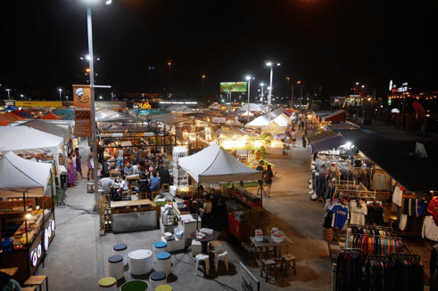

*เรามาเริ่มด้วยตลาดกลางคืนกันดีกว่า*

ตลาดกลางคืนที่ผมคิดว่าน่าจะดังที่สุดและคนไปมากที่สุดคือตลาดรถไฟรัชดา แต่ถ้าคุณกำลังมองหาสถานที่ที่มีนักท่องเที่ยวน้อยกว่าหรือสถานที่ที่ไม่แน่นเอียด เบียดเสียดจนเดินยาก ผมว่าคุณน่าจะลองขับต่อออกไปอีกนิดนึงเพื่อให้ถึงตลาดหัวมุม ตลาดหัวมุมนี้ไม่ติดบีทีเอสหรือรถไฟใต้ดิน ฉะนั้นการเดินมาที่นี่อาจไม่สะดวกเท่าตลาดรถไฟ

ส่วนตัวแล้วผมชอบตลาดหัวมุมมากกว่าเพราะผมรู้สึกว่าตลาดหัวมุมใหญ่กว่า และร้านต่างๆไม่ซ้ำจำเจ เหล่าพ่อค้าแม่ค้าก็ไม่ค่อยคะยั้นคะยอให้ผมซื้อของเท่าที่อื่น ราคาทั่วไปของสินค้าก็ถูกกว่า ไฮไลท์ของตลาดนี้คือร้านอาหารซีฟู๊ด @สถานีมีหอย ร้านนี้มีพนักงานเสริฟเป็นผู้ชายกล้ามใหญ่ที่แต่งตัวเป็นผู้หญิง พวกเขาสามารถทำให้บรรยากาศร้านนี้ดูตลกและมีสีสัน อาหารของร้านนี้ก็นับว่าอร่อยใช้ได้

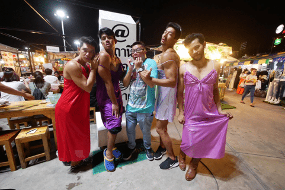

*พนักงานเสริฟของร้าน @สถานีมีหอย*

อีกข้อดีของตลาดหัวมุมคือความกว้างของที่นี่ การนำลูกๆของคุณมาเดินเล่นด้วยเป็นความคิดที่ไม่เลวเพราะที่นี่กว้าง คนจึงไม่เบียดเสียด และทำให้คุณสามารถมองหาลูกๆของคุณได้ง่าย คือว่าง่ายๆ การที่ลูกคุณกับคุณจะหลงกันเป็นไปได้ยากกว่าตลาดอื่นๆที่คนแน่นๆ

ที่นี่มีสินค้าหลากหลายประเภทอาทิเช่าเสื้อผ้าหรือของตกแต่งต่างที่ราคาไม่แพงเลย คุณสามารถมาตัดผมที่ตลาดนี้ได้ด้วยนะ

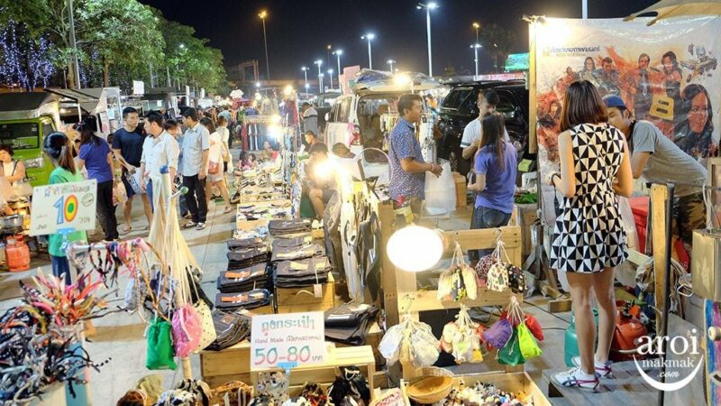

ตลาดแห่งนี้มีที่จอดรถเป็นของตัวเอง อาจจะมีค่าจอดนิดหน่อยแต่ก็ถูกกว่าค่าจอดที่ตลาดรถไฟรัชดาแน่นอน อย่างที่ผมบอกว่าตลาดหัวมุมมีพื้นที่กว้างมาก การหาที่จอดรถใกล้ๆอาจไม่ได้ง่ายเสมอไป คุณอาจต้องเดินไกลเพื่อที่จะได้ที่จอด อีกอย่างที่คุณควรรู้คือ ถนนเส้นที่ตลาดนี้ตั้งอยู่ปกติแล้วจะติดมากๆ แต่จะว่าไป เรื่องรถติดเป็นเรื่องธรรมดาในประเทศนี้จริงๆ

แผนที่ตลาดหัวมุม

2\. ตลาดน้ำคลองลัดมะยม

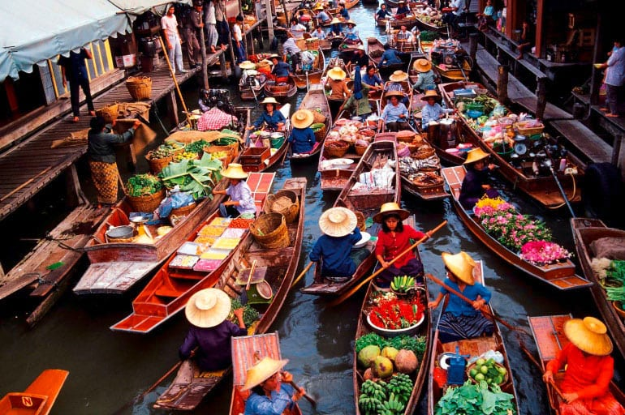

ตลาดน้ำเป็นสิ่งที่เป็นเอกลักษณ์อย่างหนึ่งของประเทศไทย คุณสามารถเห็นพ่อค้าแม่ค้าพายเรือออกมาขายของบนเรือของพวกเขา ตลาดแห่งนี้อยู่ไม่ไกลจากบีทีเอสสถานีบางว้า ค่าแท็กซี่ประมาณ 60 ถึง 70 บาทจากสถานี

สิ่งที่ผมชอบเกี่ยวกับตลาดน้ำคลองลัดมะยมคือ ผมสามารถขึ้นเรือชมวิวและวิธีชีวิตของคนริมคลองได้ ผมได้เห็นเด็กๆเล่นน้ำในคลอง และเห็นบ้านเรือนและผู้คนที่ใช้ชีวิตโดยมีคลองแห่งนี้เป็นศูนย์กลาง

ผมได้เรียนรู้ว่า วิธีการเดินทางโดยเรือแบบนี้เคยเป็นหนึ่งในวิธีหลักที่ใช้ในการสัญจรของคนไทยในอดีต ถึงแม้ว่าปัจจุบัน คนไทยไม่ได้ใช้วิธีนี้เป็นวิธีหลักแล้ว คุณยังสามารถมาดื่มด่ำประสบการณ์ย้อนยุคนี้ได้ที่ตลาดน้ำคลองลัดมะยม

เรายังได้ล่องเรือไปแวะชมฟาร์มกล้วยไม้ที่มีกล้วยไม้หลากหลายชนิด คุณสามารถถ่ายรูปสวยๆได้มากมาย

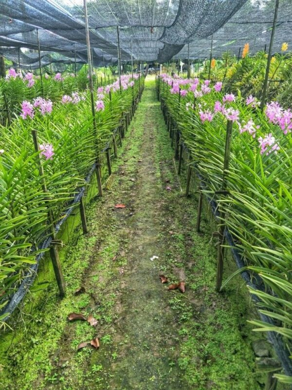

*อาหารที่ตลาดน้ำคลองลัดมะยมถือว่าถูกมากและอร่อย หากคุณอยากลองอาหารไทย ที่นี่เหมาะมากสำหรับคุณ*

ตลาดน้ำคลองลัดมะยาไม่ได้ถูกโปรโมทมากนักจึงทำให้มีนักท่องเที่ยวไม่มากเท่ากับที่อื่นๆ และคนที่นี่ไม่ได้พูดภาษาอังกฤษเก่งนัก แต่ว่าพวกเขาจะพยายามสื่อสารกับคุณจนเข้าใจ

3\. ตลาดวังหลัง

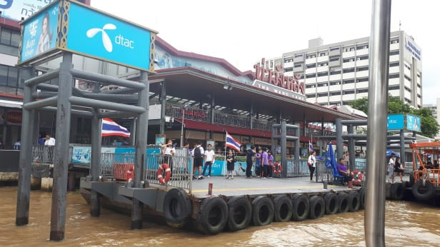

*ท่าวังหลัง*

หากคุณเป็นคนที่ชอบตลาดและสตรีทฟู้ด คุณน่าจะลองแวะไปที่ตลาดวังหลัง ตอนผมไปที่ตลาดนี้ผมสังเกตุเห็นว่าที่มีของมากมายหลากหลายให้ช๊อปปิ้งจากอาหารปรุงสด เสื้อผ้า ของฝากต่างๆ และของแนวๆ อาทิเช่นเสื้อผ้าแว่นตา ของแฮนด์เมดเท่ๆที่เวลาใส่แล้วจะดูเป็นเด็กแนวขึ้นมาทันที

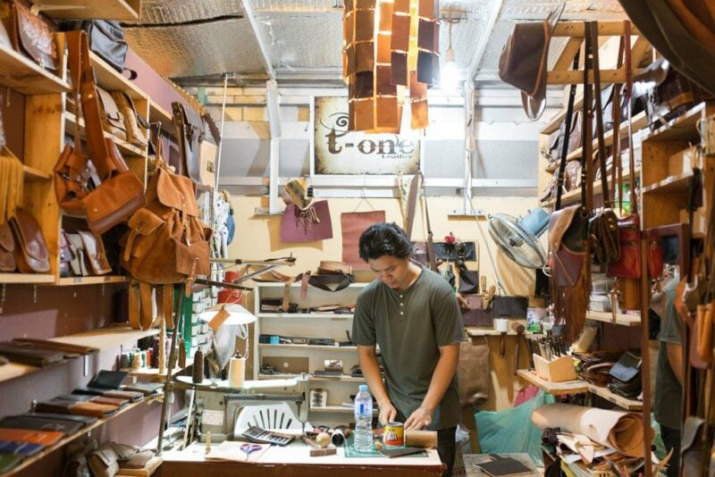

ของฝากต่างๆในตลาดวังหลังมีราคาไม่แพงนักและผมมั่นใจว่าคุณจะไม่เดินกลับบ้านมือเปล่าอย่างแน่นอน ตลาดแห่งนี้จะมีคนหนาแน่นมากๆช่วงกลางวันเพราะผู้คนต่างมาแวะทานอาหารกลางวันกันที่นี่

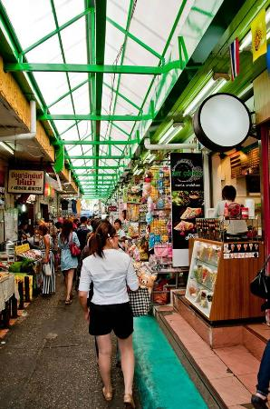

*บางซอยของตลาดวังหลังมีร่มกันแดดกันฝนฉะนั้นหากคุณมาเดินช๊อปปิ้งที่นี่ คุณไม่จำเป็นต้องกังวลเรื่องฝนฟ้าอากาศเลย*

วีธีการเดินทาง:

ผมขอแนะนำให้ขึ้นเรือด่วนเจ้าพระยาจากท่าสาธร ตรงสะพานตากสิน คุณสามารถได้รับลมชมวิวแบบพอประมาณในเวลาที่คุณร่องเรือมายังท่าวังหลัง แต่ถ้าหากคุณอยู่ที่ท่าพระจันทร์ คุณสามารถนั่งเรือข้ามฟากมาได้เลย

4\. ชุมชนกุฎีจีน

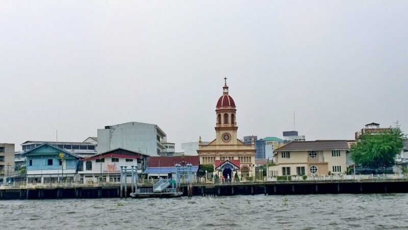

หากคุณได้ไปตลาดวังหลัง ผมว่าเดินไปอีกนิดนึงก็ถึงชุมชนกุฎีจีนแล้ว ชุมชมกุฎีจีนคือชุมชนเก่าแก่ที่อนุรักษ์สถาปัตยกรรมของชาวต่างชาติที่มาตั้งรกรากในไทยตั้งแต่สมัยโบราณ หากคุณชอบอะไรย้อนยุคย้อนสมัย ผมขอแนะนำให้แวะไปชมที่นี่ บ้านและตึกต่างๆมีความผสมผสานกันระหว่างวัฒนธรรมโปรตุเกส จีน และไทยอย่างลงตัว

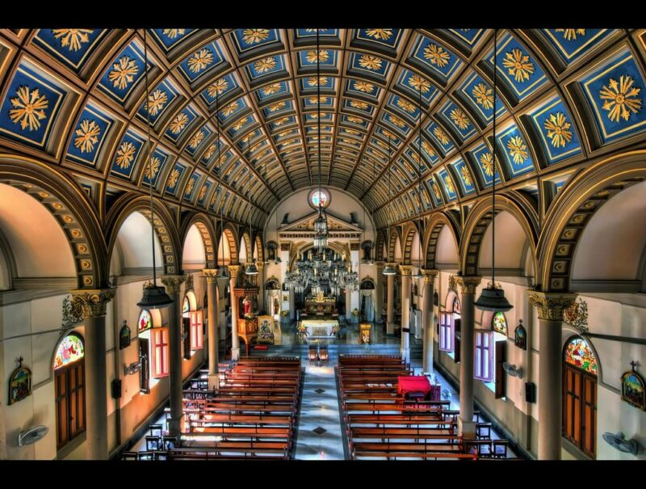

มุมมองด้านในโบสถ์ซางตาครู้ส ที่มา – [https://www.flickr.com/photos/iprahin/6563570787](https://www.flickr.com/photos/iprahin/6563570787)

ใจกลางของชุมชนนี้คือโบสถ์แห่งหนึ่งที่มีชื่อว่า โบสถ์ซางตาครู้สโดยซางตาครู้สเป็นคำมาจากภาษาโปรตุเกสที่แปลว่า กางเขนศักดิ์สิทธิ์ คุณสามารถมองเห็นโบสถ์นี้ได้อย่าง่ายดายถ้าคุณกำลังเดินทางด้วยเรือในแม่น้ำเจ้าพระยา

อีกสถานที่หนึ่งในชุมชนนี้ที่คุณควรเข้าไปชมคือศาลเจ้าแม่กวนอิม ศาลแห่งนี้มีอายุมากกว่าร้อยปีและถูกบำรุงรักษาไว้อย่างดี การได้กราบไหว้ทำความเคารพเจ้าแม่กวนอิมอาจนำสิ่งดีๆเข้ามาในชิวิตคุณก็ได้

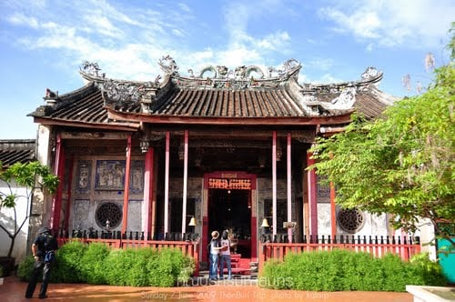

ผู้คนอาศัยอยู่ในชุมชนแห่งนี้อย่างสงบสุขมาตั้งแต่ยุคที่กรุงศรีแตกรอบที่สอง และถึงแม้ว่าจะมีคนจากหลายเชื้อชาติในชุมชนนี้ ทุกคนต่างมีหน้าตากลมกลืนเหมือนเป็นคนไทยแท้ไปแล้ว ในพื้นที่นี้ยังมีร้านกาแฟ คาเฟ่ต่างๆที่อยู่ในตึกเก่าที่คงไว้ซึ่งความแท้และดั้งเดิมของวัฒนธรรมต่างๆในชุมชนนี้ หากคุณมาที่ชุมชนกุฎีจีนแล้ว คุณไม่ควรพลาดที่จะลองขนมฝรั่งกุฎีจีนเพราะว่ากันว่าขนมชนิดนี้คือเค้กที่ถูกนำเข้ามาในไทยเป็นอันแรก และรสชาติที่คงความเป็นดั้งเดิมของเค้กนี้ก็หายากมากขึ้นไปทุกวันๆ

5\. วัดสระเกศ

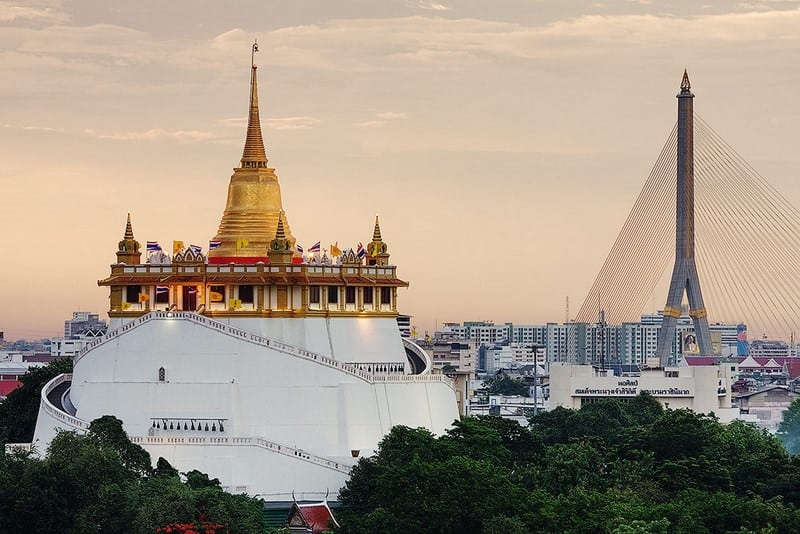

วัดสระเกศหรือวันภูเขาทองเป็นวัดที่มีความเก่าแก่มามากกว่าร้อยปี โดยวัดนี้ตั้งอยู่เขตป้อมปราบศัตรูพ่าย ภูเขาทองที่อยู่ในวัดแห่งนี้เป็นภูเขาที่ถูกสร้างขึ้นโดยมีเจดีสีทองอยู่บนยอดของภูเขาที่เป็นที่ประดิษฐานพระพบรมสารีริกธาตุ ภูเขาทองจะเป็นที่ปฏิบัติพิธีทางศาสนาสำหรับคนไทยในช่วงเทศกาลต่างๆ คนหลายคนเชื่อว่าการที่ได้เดินขึ้นไปถึงยอดภูเขาทองโดยมีบรรได 344 ขั้นแล้วนั้นคือการที่ได้เดินขึ้นไปจุดสูงสุดของสวรรค์

หากคุณกำลังมองหาจุดชมวิวและวัดที่สวยงามภายในกรุงเทพ ผมขอแนะนำให้คุณลองแวะมาชมที่นี่ดู

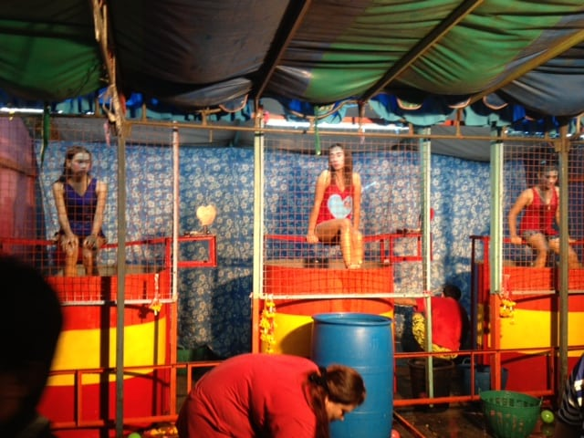

อีกอย่างที่ผมอยากบอกเกี่ยวกับวัดนี้คือถ้าคุณมีโอกาสได้มาประเทศไทยในช่วงเทศกาลลอยกระทง คุณควรแวะมาที่วัดนี้เพราะที่วัดนี้จะจัดงานลอยกระทงและมีงานวัดที่มีกิจกรรมต่างๆมากมายให้ทำ เช่นมีบ้านผีสิง ชิงช้าสวรรค์ และสาวน้อยตกน้ำให้เล่น ยังมีอาหารต่างๆที่ราคาไม่แพงมากและถือว่ารสชาติดีให้ลองชิมและรับประทาน

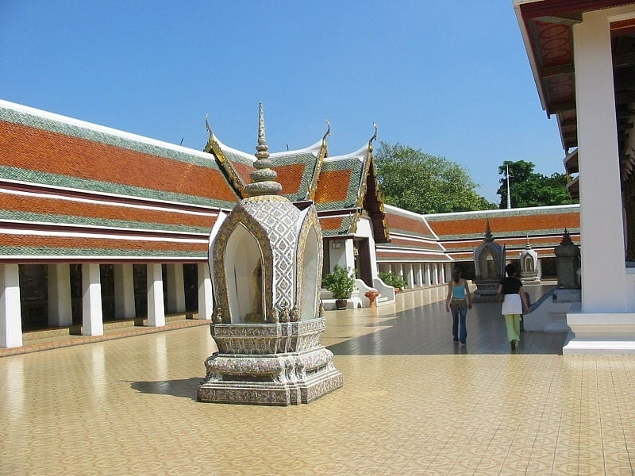

*เวลาที่เหมาะที่สุดสำหรับการเยี่ยมชม:*

ผมขอแนะนำให้คุณไปวัดนี้เร็วเพราะการจะขึ้นไปภูเขาทองจะต้องต่อคิว วัดสระเกศเปิดเวลา 0900 น. และปิด 1700 น.

6\. พิพิธภัณฑ์ ศิริราช

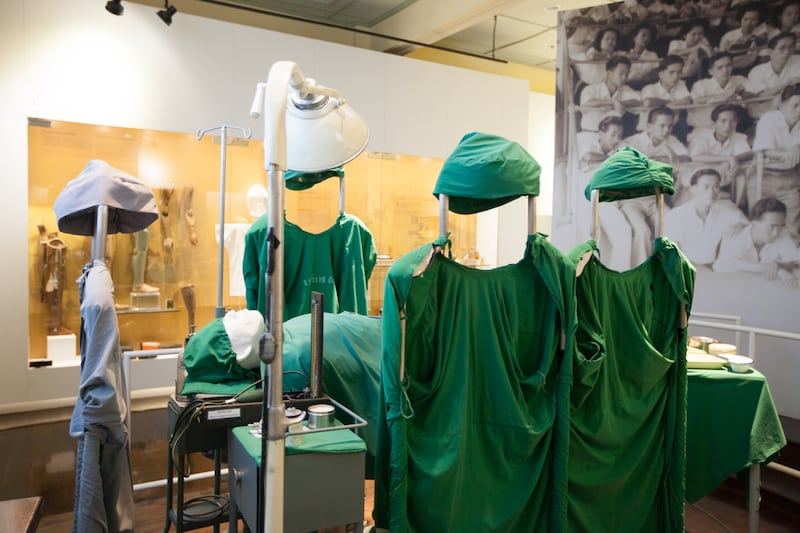

*พิพิธภัณฑ์ ศิริราช ที่มีชื่อเล่นว่า “พิพิธภัณฑ์แห่งความตาย”เพราะมีการสตาฟมนุษย์และชิ้นส่วนของมนุษย์ไว้มากมาย*

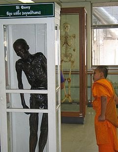

หากคุณเป็นคนไทยคุณคงรู้จัก ซีอุย ตั้งแต่คุณยังเด็กเพราะผมเชื่อว่าคุณพ่อคุณแม่คุณน่าจะบอกให้คุณอย่าดื้อไม่อย่างนั้นซีอุยจะแอบมาจับเด็กดื้อกิน และคุณคงไม่อยากตกเป็นอาหารคนอื่น พิพิธภัณฑ์ ศิริราชเป็นสถานที่จัดเก็บศพที่ถูกสตาฟไว้ของซีอุย

ซีอุยคือใครคุณคงถาม ซีอุยคือฆาตกรต่อเนื่องคนแรกของประเทศไทยที่มีชื่อเสียงโด่งดังมากๆ

หากคุณอยากเจอซีอุยเป็นถูกสตาฟไว้คุณควรมาที่นี่หลังสิบโมงเช้าและก่อนห้าโมงเย็นในทุกๆวันยกเว้นวันอังคาร

7\. วอเตอร์ไซด์ คาราโอเกะ เรสเตอร์รองท์

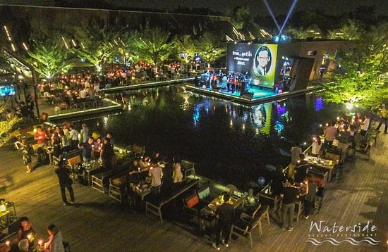

ใครๆก็หนีไม่พ้นเรื่องกินจริงๆ และถ้าหากคุณกำลังหิวหรือกำลังหาสถานที่รับประทานอาหารมื้อค่ำที่ไม่ค่อยมีนักท่องเที่ยวมากนัก คุณควรไปที่วอเตอร์ไซด์ คาราโอเกะ เรสเตอร์รองท์

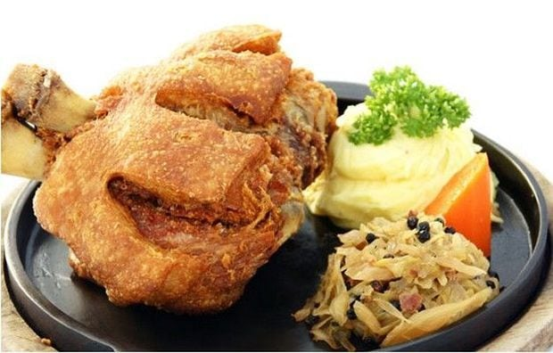

ร้านอาหารแห่งนี้มีอาหารหลากหลายประเภทให้คุณได้เลือกจากอาหารไทย ขาหมูเยอรมัน ไปจนถึงซุชิญี่ปุ่น ผมเคยพาเพื่อนชาวต่างชาติพร้อมกับเพื่อนๆคนไทยของผมไปร้านนี้ โดยแต่ละคนจะสั่งอาหารแตกต่างชนิดกัน เพื่อนๆไทยของผมได้สั่งส้มตำมาแล้วให้เพื่อนชาวต่างชาติลองชิม ส่วนใหญ่เพื่อนๆผมจะชิมแค่คำเดียวแล้วไม่ทานอีกเลย นี่อาจเป็นเพราะรสชาติจัดจ้านของส้มตำที่พวกเขารับไม่ไหว

โดยรวมแล้วอาหารที่นี่มีรสชาติดีทีเดียว ราคาก็ถือว่าไม่แพงจนเกินไปเมื่อนำสิ่งอื่นอย่างเช่นคุณภาพ สถานที่ ดนตรีสด และพนักงานเสริฟที่อัธยาศัยดี และบริการดีมาคิดรวมในราคาที่คุณต้องจ่าย

ที่นี่ยังมีห้องคาราโอเกะส่วนตัวที่คนที่นี่มักจะจองเพื่อจัดงานสังสรรค์ต่างๆ คราวที่ผมไปผมไม่ได้โทรจองล่วงหน้าและถือว่าพลาดมากๆเพราะห้องคาราโอเกะวันนั้นเต็ม หากคุณอยากจัดงานในห้องคาราโอเกะของร้านนี้แล้วคุณต้องวางแผนอย่างดีและโทรจองล่วงหน้าก่อน ไม่อย่างนั้นคุณจะพลาดเหมือนผม

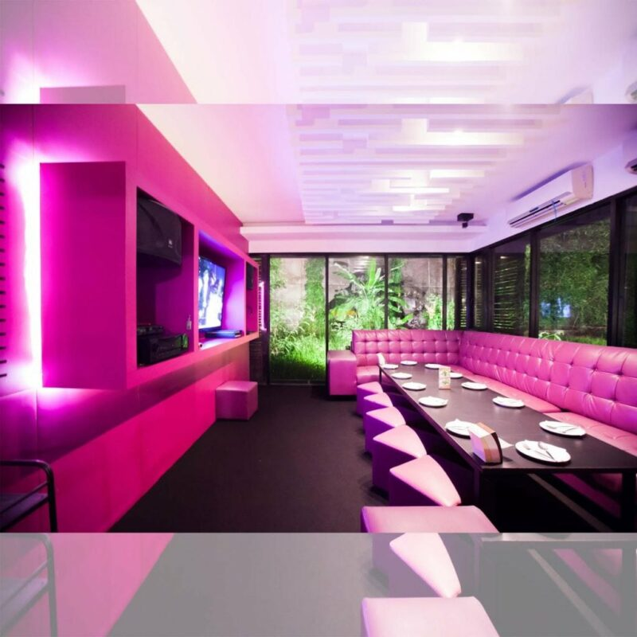

*ร้านอาหารนี้ตั้งอยู่บนถนนประดิษฐ์มนูธรรมและเปิดเวลาห้าโมงเย็นจนถึงตีหนึ่ง*

8\. สตูดิโอลำ

เมื่อตกกลางคืนและคุณยังไม่รู้ว่าจะไปไหน ผมขอแนะนำสตูดิโอลำ บาร์แห่งนี้ไม่เหมือนบาร์ทั่วไปเพราะที่นี่เล่นดนตรีแนวที่ผสมระหว่างดนตรีพื้นบ้าน หมอลำ กับดนตรีสากล

ตอนผมเพิ่งถึงเมืองไทย ผมรู้สึกว่าเพลงพื้นบ้านที่ผมได้ยินนั้นฟังยาก แต่พอนานวันเข้าไปผมก็ได้รู้สึกชินและชอบขึ้นมา และผมคิดว่ามันแปลกมากที่ชาวต่างชาติที่มาประเทศไทยส่วนใหญ่จะชอบเพลงพื้นบ้าน โดยคนไทยที่เกิดและโตในกรุงเทพมักจะไม่ค่อยชอบเพลงพื้นบ้านสักเท่าไร

คนที่ชอบเพลงพื้นบ้านหรือแนวเพลงผสมผสานจะมาที่บาร์นี้หลังมื้อค่ำ โดยบาร์นี้ยังมีเครื่องดื่มที่เป็นเอกลัษณ์เพราะพวกเขานำยาดองมาผสมกับเครื่องดื่มสากล พอผสมกันแล้วมาเป็นค็อกเทลรสชาติแปลกแต่อร่อยไม่แพ้ค็อกเทลปกติที่ผมเคยดื่มเลย ยาดองมีฤทธิรุนแรงมากและผมคิดว่าอาจไม่ค่อยดีต่อสุขภาพนัก แต่ว่าลองครั้งนึงเพื่อชิมให้รู้รสชาติจะเป็นอะไรไป

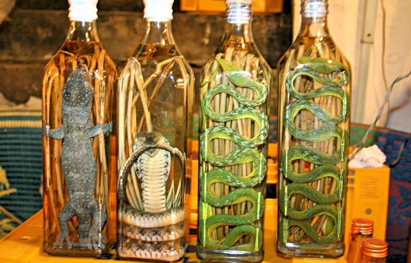

หากคุณคิดไม่ออกว่ายาดองคืออะไร – ที่มา –[http://www.taeglicher-wahnsinn-thailand.de](http://www.taeglicher-wahnsinn-thailand.de)

บาร์แห่งนี้เพิ่งถูกใช้ถ่ายทำหนังเรื่องหนึ่งทำให้คนรู้จักที่นี่มากขึ้น บาร์แห่งนี้ตั้งอยู่บนถนนสุขุมวิทซอย 51 โดยเปิดเวลาห้าโมงเย็นไปจนถึงเที่ยงคืน และปิดทุกๆวันอังคาร

9\. สปามนตรา

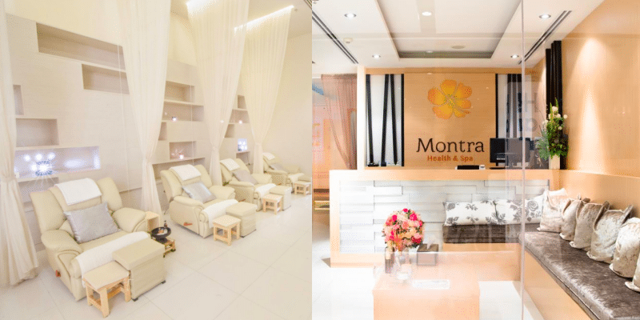

เมื่อเหนื่อยจากการทำงานมาแล้ว คนเราก็ต้องหาที่พักผ่อน ผมเลือกที่จะไปพักผ่อนที่สปามนตรา ที่นี่เขามีการนวดหลายแบบที่สามารถช่วยให้ผมผ่อนคลายและหายปวดหลังจากการนั่งททำงานในออฟฟิสของผมทั้งวันได้ คุณสามารถเลือกวิธีการนวดได้หลายแบบจากที่นี่อย่างเช่น นวดแผนไทย นวดอโรม่า และอื่นๆ

ผมมักจะใช้เวลาประมาณหนึ่งถึงสองชั่วโมงไปกับการนวดที่นี่ โดยบางทีผมถึงกับหลับในขณะนวดเพราะผมรู้สึกผ่อนคลายและสบายมากๆ

ราคาค่าบริการของสปามนตราก็ไม่แพงโดยเริ่มต้นที่ 400 บาทเท่านั้น ผมว่ามันไม่แพงเลย

สาขาจึงทำให้เป็นอีกหนึ่งสถานที่ที่เข้าถึงได้ง่าย ผมเลือกที่จะไปนวดที่สาขาเซ็นทรัลเวิลด์เพราะบางครั้งที่ผมต้องทำทุระแถวๆย่านในเมือง การเดินทางโดยใช้รถไฟฟ้าบีทีเอสทำให้สะดวกสบายมากขึ้นและหนีรถติดได้ดี เซ็นทรัลเวิลด์ก็ไม่ได้ห่างจากบีทีเอสมากนัก และในบางครั้งที่ผมไปทำทุระแถวย่านในเมืองและจำเป็นจะต้องเดินทางต่อโดยรถโดยสารแล้ว ผมอาจแวะไปนวดเพื่อหนีช่วงเวลาเร่งด่วนเพราะผมคิดว่าผมอาจถึงที่หมายในเวลาไม่ต่างกันมากนักเมื่อเทียบกับความทรมานในการฝ่ารถติดกับการรอให้รถหายติด

สปามนตราเปิดทุกวันจาก 1030 น. จนถึง 2030 น.

[http://www.montraspa.net/](http://www.montraspa.net/)

10\. บี ชู เฮอร์เบิล ทรีทเม้นท์สำหรับเส้นผมและหนังศีรษะ

เมื่อคุณมาประเทศไทยที่มีอาการร้อนและมลพิษมากมาย เส้นผมและหนังศีรษะของคุณอาจมีความมันมากและอาจให้ความรู้สึกไม่สบายกับคุณ และสิ่งนี้เป็นสิ่งที่นั่งท่องเที่ยวปกติไม่ค่อยทำกันก็คือการไปทำทรีทเม้นท์กับซาลอน

ทำไมคุณถึงไม่ไปลองทำทรีทเม้นท์สำหรับเส้นผมและหนังศีรษะของคุณที่ บีชู เฮอร์เบิล หล่ะในเมื่อราคาที่ในการบำรุงรักษาเส้นผมและหนังศีรษะของที่นี่ก็ไม่แพง ราคาเริ่มต้นของคุณผู้ชายเริ่มที่ 800 บาทคุณผู้หญิงอยู่ระหว่าง 900 ถึง 1200 บาทโดยขึ้นอยู่กับความยาวของเส้นผม ราคานี้ถือว่าถูกมากเมื่อเทียบกับราคาในต่างประเทศ

ทรีทเม้นท์ของทางร้านจะเริ่มโดยการนวดศีรษะเพื่อเตรียมพร้อมที่จะพอกเส้นผมและหนังศีรษะของคุณด้วยสมุนไพรจากธรรมชาติ และทำการอบไอน้ำให้ผมของคุณเป็นเวลา 45 นาที

หลังจากอบไอน้ำแล้ว พวกเขาจะล้างสมุนไพรออกให้หมดและสระผมให้คุณ หลังจากทำทรีทเม้นท์เสร็จ คุณจะรู้สึกเย็นหนังศีรษะและรู้สึกว่าหนังศีรษะคุณสะอาดมาก

ทรีทเม้นท์จะช่วยลดปัญหาต่างๆเกี่ยวกับเส้นผมและหนังศีรษะที่พบบ่อยเช่น หนังศีรษะมัน รังแค และผมร่วง

สิ่งที่น่าสนใจอีกอย่างคือ บี ชู เป็นแบรนด์ที่มาจากประเทศสิงคโปร์ และพวกเขาเป็นที่นิยมอย่างมากในประเทศสิงคโปร์ มาเลเซีย และจีนอีกด้วย

พวกเขามีทั้งหมด 7 สาขาในกรุงเทพโดยที่อยู่แต่ละสาขาอยู่ด้านล่าง ([Locations](https://beechooherbal.com/th/%E0%B8%AA%E0%B8%96%E0%B8%B2%E0%B8%99%E0%B8%97%E0%B8%B5%E0%B9%88%E0%B8%95%E0%B8%B1%E0%B9%89%E0%B8%87%E0%B8%82%E0%B8%AD%E0%B8%87%E0%B8%A3%E0%B9%89%E0%B8%B2%E0%B8%99%E0%B8%84%E0%B9%89%E0%B8%B2/))

BEE CHOO THAILAND LOCATIONS

Siri Avenue, Sai Mai

โทร: 02-1214419

Siam square one (floor 6)

โทร: 02-115-1300

Phatra Complex (Ratchada)

โทร: 06-1729-3434

The master @ BTS udomsuk

โทร: 02-072-6698

CITY CONNECT - KALLAPAPHRUK

โทร: 090-221-7745

Pradraw - Chaiyaphruek

โทร: 0931385214 โทร: 021471459

22 mini mall - krungthep kreetha

โทร: 093-147-1388

CASALUNAR AVENUE - CHONBURI

โทร: 096-904-7964

the crystal park (ekamai-ramindra)

โทร: 095-536-5556
