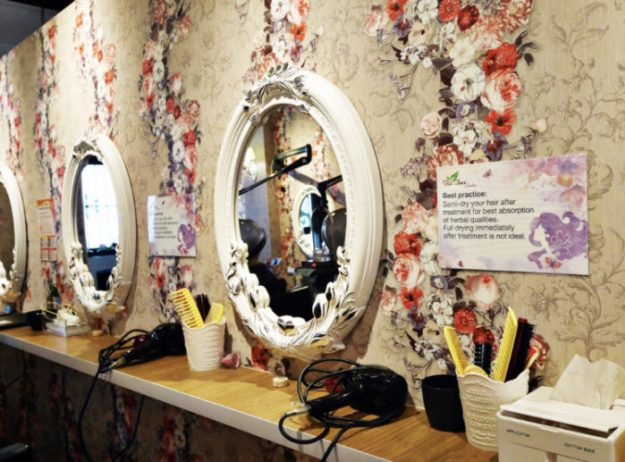
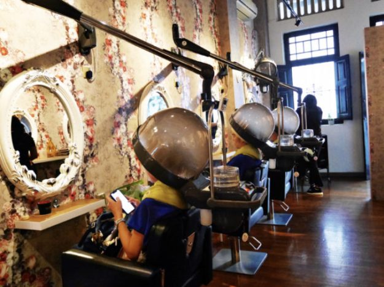
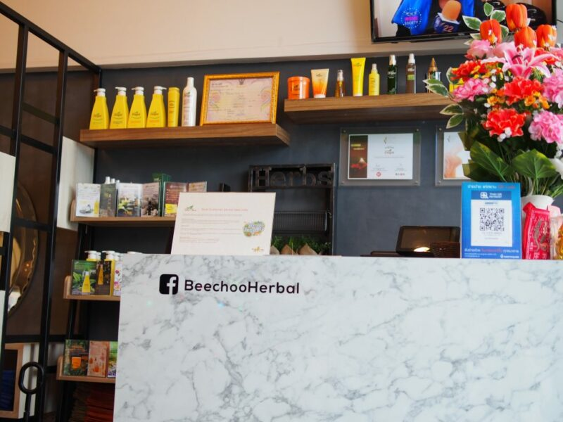
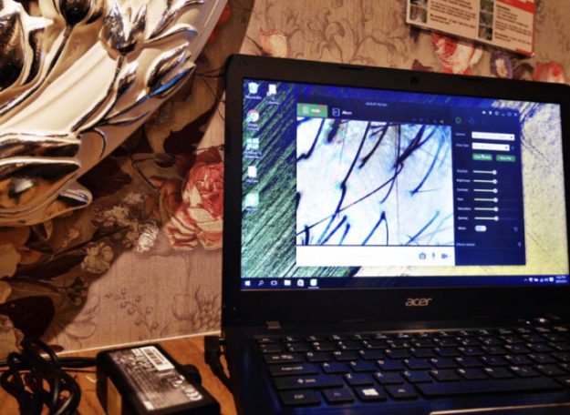
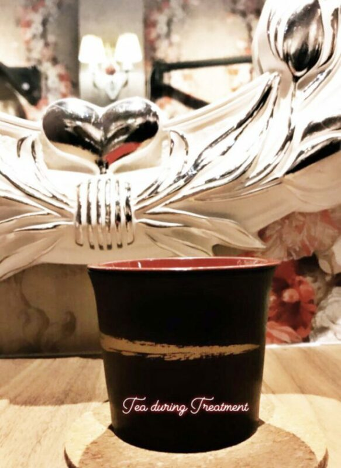
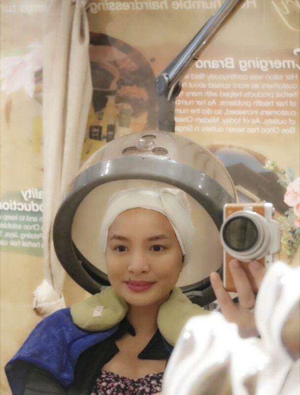
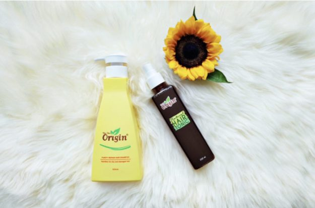

ปัญหาผมร่วงแบบร่วงเยอะมากๆจนเต็มพื้นไปหมดเป็นปัญหาที่น่ารำคาญซึ่งรบกวนดิฉันและคนที่อยู่บ้านเดียวกันกับดิฉันมานานแล้ว ปัญหาผมร่วงของดิฉันน่าจะเกิดขึ้นเพราะการให้นมลูกและการเปลี่ยนแปลงของฮอร์โมนในร่างกาย ดิฉันคิดว่าเส้นผมและหนังศีรษะควรได้รับการดูแลอย่างเร่งด่วนเพื่อแก้ปัญหาผมร่วงที่ดิฉันเป็น สถานที่ที่ดิฉันคิดว่าสามารถแก้ปัญหาเส้นผมและหนังศีรษะได้ดีที่สุดคือที่ บีชูออริจิน เพราะพวกเขามีทรีทเม้นท์สมุนไพรสำหรับหนังศีรษะและเส้นผมที่ออกแบบมาเพื่อลดปัญหาทั่วไปของหนังศีรษะและเส้นผมเช่น:

ผมร่วง

ผมขาว/ผมหงอก

หนังศีรษะมันและคัน

รังแค

ผมเสียจากเคมี

ติดเชื้อแบคทีเรีย

บีชูก่อตั้งขึ้นเมื่อปี 2002 โดยมาดาม เชีย บี ชู ซึ่งเธอมีแนวคิดในการดำเนินธุรกิจว่า “ความจริงใจมาก่อนผลกำไร” จึงทำให้ร้านของเธอกำหนดราคาค่าบริการในระดับที่คนทั่วไปสามารถจับต้องได้ พวกเขาได้รับความไว้วางใจในการให้บริการดูแลรักษาเส้นผมและหนังศีรษะตลอดมา ในขณะนี้บีชูมีทั้งหมด 4 สาขาในประเทศไทยและนับร้อยสาขาในภูมิภาคเอเซีย

ประสบการณ์แบบส่วนตัวของดิฉัน

ดิฉันไปรับบริการทำทรีทเม้นท์ที่บีชูสาขาสยามสองครั้งในระยะเวลาสองอาทิตย์และได้ใช้ผลิตภัณฑ์ของทางร้านในระยะเวลาดังกล่าวคือแชมพูและแฮร์โทนิกที่ทำมาจากสูตรสมุนไพรจีนพื้นบ้านที่หายาก โดยสมุนไพรจีนเหล่านี้จะช่วยเร่งการเจริญเติบโตของเซลล์ผมและควบคุมอาการผมร่วง การตกแต่งและบรรยากาศภายในร้านของบีชูจะมีสีโทนมองแล้วสบายตา ทำให้รู้สึกผ่อนคลายและดูเหมือนอยู่ในธรรมชาติ ดิฉันยังได้รับการให้บริการเป็นอย่างดีจากพนักงานร้าน

สิ่งแรกที่ผู้ให้บริการทำผมถามดิฉันคือ ดิฉันมีปัญหาหนังศีรษะด้านใดบ้างโดยทำการตรวจหนังศีรษะด้วยเครื่องสแกน ผู้ให้บริการทำผมบอกกับดิฉันว่าปัญหาผมร่วงของดิฉันสามารถเห็นได้ชัดเจนเพราะมีช่องว่างกว้างมากระหว่างรากผม หนังศีรษะดิฉันมีความมันน้อยเพราะดิฉันสระผมทุกวัน แต่การสระผมทุกวันทำให้มีพื้นที่สีแดงบนหนังศีรษะดิฉันซึ่งแสดงถึงอาการระคายเคืองของหนังศีรษะ

พนักงานร้านได้นำชามะตูมดื่มแล้วชื่นใจมาให้ดิฉันก่อนที่จะลงมือทำทรีทเม้นท์รักษาผมร่วง เธอเริ่มทำทรีทเม้นท์รักษาผมร่วงด้วยการสเปรย์ Ginger Wine ทั่วๆหนังศีรษะดิฉันเพื่อช่วยขจัดสิ่งสกปรกที่ตกค้างอยู่และยังนวดผ่อนคลายหนังศีรษะให้ดิฉันพร้อมทาน้ำมันมะกอกบริสุทธิ์บริเวณปลายผมของดิฉันเพื่อให้มีความชุ่มชื้น

หลังจากนั้นผู้ให้บริการทำผมก็ทาครีมสมุนไพรบีชูทั่วๆเส้นผมและหนังศีรษะดิฉันแล้วห่อด้วยแผ่นพลาสติกเพื่อเพิ่มประสิทธิภาพในการดูดซึมแร่ธาตุและสารอาหารของหนังศีรษะดิฉันในระหว่างการอบไอน้ำ การอบไอน้ำใช้เวลา 30 ถึง 45 นาที หลังจากอบไอน้ำเสร็จ ทางร้านก็สระผมให้ดิฉันด้วยแชมพูที่มีส่วนผสมจากเมนทอลซึ่งทำให้รู้สึกเย็นสบาย เมื่อสระผมเสร็จผู้ให้บริการทำผมก็เป่าผมให้หมาดๆด้วยลมเย็น การที่ไม่เป่าผมให้แห้งสนิทด้วยลมร้อนเป็นเพราะจะไปลดการดูดซึมแร่ธาตุของเส้นผม

การได้รับการดูแลจากบีชูถือว่าเป็นประสบการณ์ที่คุ้มค่า ดิฉันใช้แชมพู Purity Repair ของทางร้านทุกวันซึ่งการสระผมทุกวันของดิฉันโดยใช้แชมพูนี้ไม่ทำให้เส้นผมและหนังศีรษะดิฉันแห้งจนเกินไป อีกผลิตภัณฑ์ของทางร้านที่ดิฉันใช้คือ Natural Hair Tonic ที่ทำมาจากสารสกัดธรรมชาติ 16 ชนิดที่จะช่วยบำรุงและเสริมแร่ธาตุให้กับเส้นผมตั้งแต่รากจรดปลาย หนึ่งอาทิตย์หลังจากที่ได้ทรีทเม้นท์รักษาผมร่วงครั้งแรกกับบีชู ดิฉันสังเกตเห็นได้ว่าอาการผมร่วงของดิฉันลดลงถึง 50 เปอร์เซ็นต์ และในการทำทรีทเม้นท์รักษาผมร่วงครั้งที่สอง พวกเขาก็รักษาระดับการบริการไว้เช่นครั้งแรกโดยมีขั้นตอนเหมือนเดิมและยังทำให้ดิฉันประทับใจได้เช่นเคย ดิฉันต้องขอบอกว่าหลังจากที่ได้ทำทรีทเม้นท์ครั้งที่สอง อาการผมร่วงของดิฉันลดลงถึง 70 เปอร์เซ็นต์

ดิฉันเข้าใจแล้วว่าการบำรุงรักษาเส้นผมและหนังศีรษะนั้นสำคัญแค่ไหนโดยเฉพาะพวกเราผู้หญิง ดิฉันจะวางแผนเข้าไปทำทรีทเม้นท์ต่อกับบีชูเพื่อให้พวกเขาดูแลเส้นผมและหนังศีรษะดิฉันต่อไปอย่างแน่นอน
