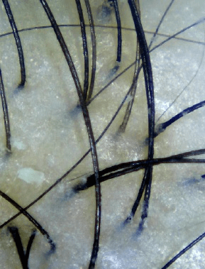
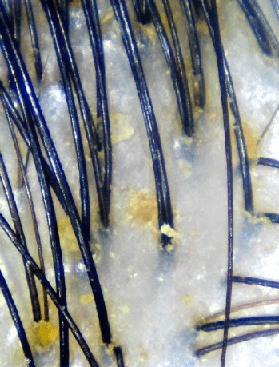

หลาย ๆ คนที่มีปัญหาหนังศีรษะแห้ง มักจะมีอาการหนังศีรษะลอกออกมา ซึ่งหนังศีรษะที่ลอกออกมานี้เป็นสาเหตุของการเกิดรังแคและเกิดอาการระคายเคืองขึ้นได้ อย่างไรก็ตามหนังศีรษะที่แห้งนี้ไม่เพียงแต่ก่อให้เกิดรังแคเท่านั้น แต่รังแคยังสามารถเกิดได้จากการที่หนังศีรษะมีความมันมากจนเกินไปด้วย

เมื่อหนังศีรษะเกิดอาการแห้ง หนังศีรษะที่ลอกออกมาจะเป็นรังแคสีขาว แต่หากหนังศีรษะมีความมัน หนังศีรษะที่ลอกออกมาจะเป็นรังแคสีเหลือง หนังศีรษะที่แห้งจะทำให้เกิดอาการคันและเป็นกลาก ซึ่งล่งผลต่อหนังศีรษะทำให้หนังศีรษะเกิดรอยแดง และเมื่อปล่อยอาการเหล่านี้ไว้ยาวนาน อาจจะทำให้เกิดอาการผมร่วง

*รังแคที่เกิดจากอาการหนังศีรษะแห้ง – เครดิตรูปภาพ Bee Choo Origin*

*รังแคที่เกิดจากอาการหนังศีรษะมัน – เครดิตรูปภาพ Bee Choo Origin*

สาเหตุของการเกิดอาการหนังศีรษะแห้งนั้นมาจากความชุ่มชื้นบนหนังศีรษะไม่เพียงพอ จึงทำให้เกิดอาการหนังศีรษะแห้งและรังแคในที่สุด ซึ่งปัญหานี้พบได้บ่อยในประเทศแถบเอเชีย เนื่องจากอุณหภูมิความร้อนและความชื้นในอากาศ ซึ่งเป็นสาเหตุของการผลิตน้ำมันออกมาบนหนังศีรษะ อีกทั้งผู้ที่ทำงานในออฟฟิศที่ต้องใช้เวลาในการทำงานอยู่ในห้องแอร์เป็นเวลานาน ก็มักจะมีปัญหาผมแห้งด้วยเช่นเดียวกัน การใช้ปริมาณแชมพูที่มากเกินไปในขณะสระผมก็เป็นอีกปัจจัยหนึ่งที่ทำให้เกิดหนังศีรษะแห้ง นอกจากนี้ยังมีปัจจัยทางด้านอายุ ซึ่งเมื่ออายุมากขึ้น การผลิตน้ำมันตามธรรมชาติของร่างกายก็จะลดลง จึงทำให้เกิดปัญหาหนังศีรษะแห้งได้

และนี่คือคำแนะนำสำหรับการป้องกันหนังศีรษะแห้งอย่างได้ผล:

ใช้แชมพูที่ไม่มีกลิ่นหรือส่วนผสมของน้ำหอม หรือใช้แชมพูที่ช่วยในเรื่องของการบำรุงหนังศีรษะ

สระผมด้วยน้ำเย็น หรือน้ำที่อุณหภูมิปกติไม่ควรสระผมด้วยน้ำอุน เพราะจะยิ่งทำให้หนังศีรษะแห้ง

ทำทรีทเม้นต์บำรุงหนังศีรษะ เพื่อป้องกัน และบำรุงรักษาอาการหนังศีรษะแห้ง มีรังแค

หลีกเลี่ยงการทำเคมีกับเส้นผมและหนังศีรษะ เช่น การย้อมสี การดัด และการทำรีบอร์น

หลีกเลี่ยงการสัมผัสกับแสงแดด

นอกจากนี้การลดปริมาณการรับประทานของหวานและเครื่องดื่มที่ผสมน้ำตาลอย่างเช่น น้ำอัดลม ชาไข่มุก กาแฟ ก็สามารถช่วยลดปัญหาหนังศีรษะได้ อาหารที่มีรสเผ็ดจัด อาหารรสเค็ม และแอลกอฮอล์ก็ถือว่าเป็นอีกหนึ่งสาเหตุของการเกิดหนังศีรษะแห้ง เพราะจะทำให้ร่างกายขาดน้ำ แนะนำให้เลือกรับประทานวิตามินให้มากขึ้นโดยการรับประทานอาหารจำพวกผักและผลไม้ อาหารเสริมจำพวกวิตามินบี 6 วิตามินบี 12 สังกะสี และน้ำมันแฟลกซีด ซึ่งอาหารเหล่านี้จะช่วยลดความมันส่วนเกินบนหนังศีรษะได้เป็นอย่างดี

ยังมีอีกหนึ่งวิธีการที่จะช่วยรักษาและบำรุงเส้นผมให้มีสุขภาพดี ผ่านการดูแลรักษาเส้นผมจากธรรมชาติ ด้วยสารสกัดจากสมุนไพรและน้ำมันจากพืช แนะนำให้มองหาผลิตภัณฑ์ที่สามารถให้วิตามินที่จำเป็นแก่เส้นผมและมอบความชุ่มชื้นให้แก่หนังศีรษะ ผลิตภัณฑ์ที่มีคุณภาพจะช่วยลดความแห้งกร้านของหนังศีรษะและยังช่วยลดความแห้งบนหนังศีรษะได้อีกด้วย

วิธีที่รวดเร็วที่สุดในการขจัดหนังศีรษะที่แห้งกร้านคือการเข้ามาใช้บริการทำทรีทเม้นต์สมุนไพรกับ Bee Choo Herbal ซึ่งมีสาขาอยู่ที่กรุงเทพมหานคร การรักษาด้วยสมุนไพรจะช่วยเติมสารอาหารและวิตามินที่จำเป็นแก่หนังศีรษะเพื่อขจัดปัญหาหนังศีรษะที่แห้งและปัญหารังแค ลองดู [video](https://www.youtube.com/watch?v=J7L7LkdQHJk&index=24&list=UUx7bazL8Sco0j3LnVnbO3Lg) ด้านล่างเพื่อดูวิธีการกำจัดรังแคบนหนังศีรษะและการรักษาเส้นผมโดยใช้สมุนไพรได้เลย!

รายละเอียดเพิ่มเติมเกี่ยวกับราคาสินค้า กรุณาคลิก ที่ link

ผลจากการใช้สินค้าและรีวิวจากผู้ใช้จริง สามารถเข้าไปดูได้ที่ Facebook ของเรา [@beechooherbal](http://www.facebook.com/beechooherbal)

Reproduced with permission of [www.beechooladies.com.sg](http://www.beechooladies.com.sg)
