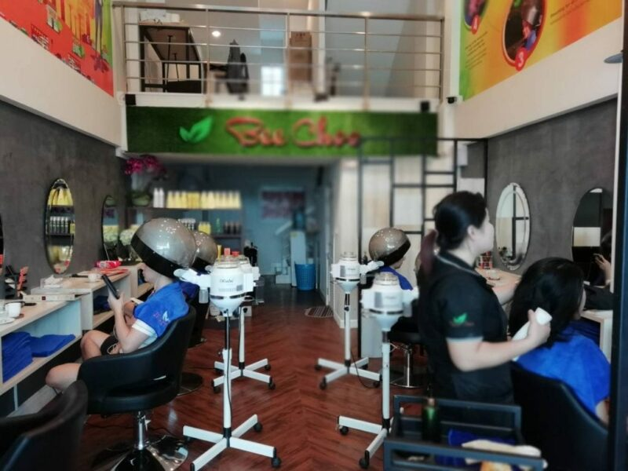
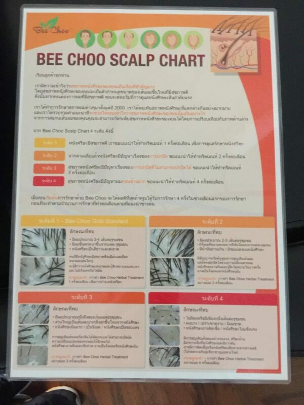
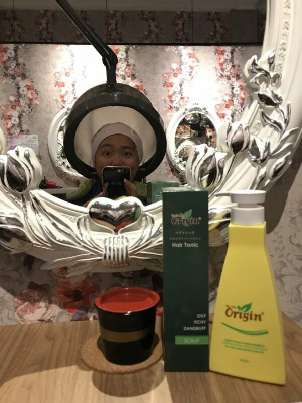
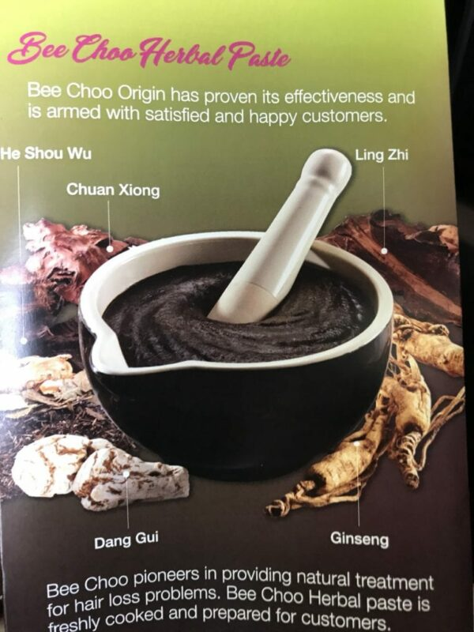
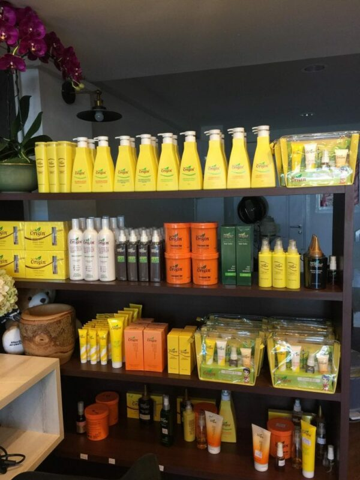
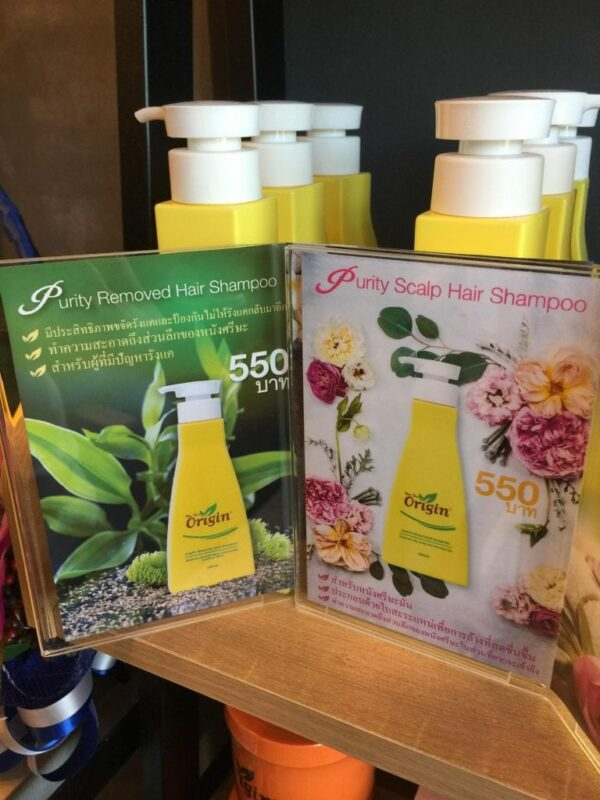
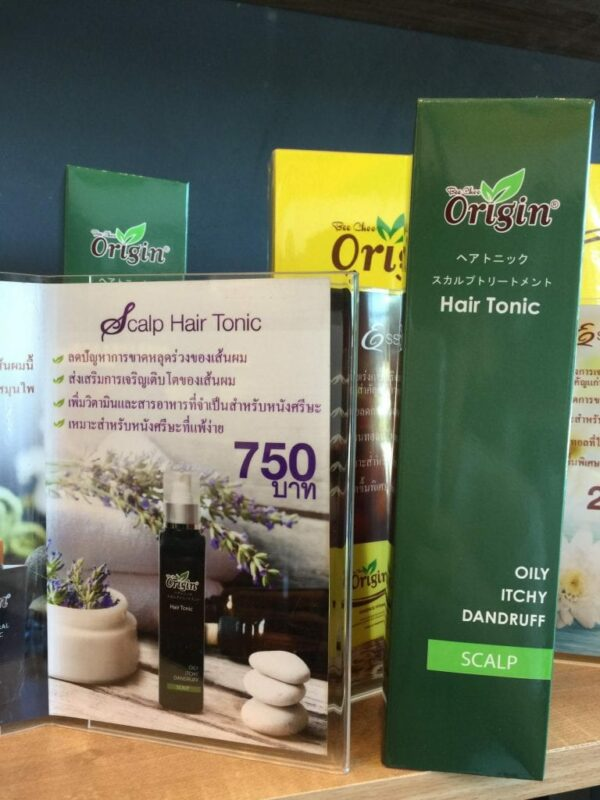
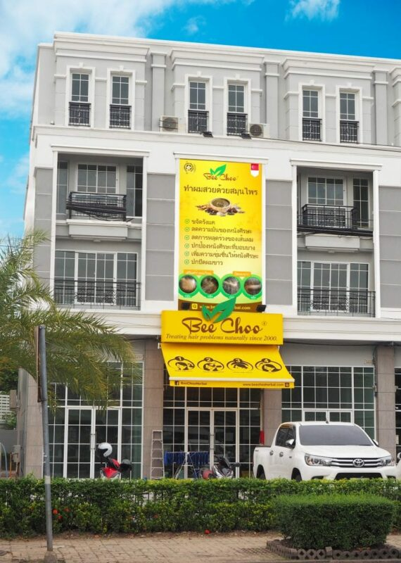

สวัสดีค่ะทุกคน เรารู้สึกตื่นเต้นมากค่ะที่จะได้มาแชร์ประสบการณ์การทำทรีทเม้นท์ครั้งแรกกับบีชู บีชูคืออะไร บีชูคือทรีทเม้นท์ซาลอนที่มีชื่อเสียง ก่อตั้งมาตั้งแต่ปี 2000 โดยมาดามเชียบีชู แบรนด์ของเธอได้รับรางวัลดีเด่นมาแล้วมากมายจากประเทศสิงคโปร์

ไม่ว่าคุณจะอายุเท่าไร คุณก็ควรจะดูแลสุขภาพและรักษาความอ่อนวัยไว้ การทำทรีทเม้นท์ที่ร้านบีชูจะช่วยดูแลสุขภาพเส้นผมและหนังศีรษะของคุณโดยบีชูเป็นทรีทเม้นท์ซาลอนที่เชี่ยวชาญด้านการบำรุงเส้นผมและหนังศีรษะโดยไม่ใช้เคมีหรือสารสังเคราะห์

ตอนที่เราเข้าไปที่ร้าน สิ่งแรกที่พบคือการต้อนรับที่ดีจากพนักงาน การตกแต่งของร้านจะคุมโทนเป็นสีที่มองแล้วสบายตาและทำให้รู้สึกผ่อนคลาย

จากนั้นจะมีพนักงานมาทำการตรวจหนังศีรษะให้เราว่าสภาพเป็นอย่างไรบ้าง โดยการตรวจจะใช้เครื่องสแกนที่ทำให้เห็นถึงรูขุมขนบนหนังศีรษะเพื่อให้เห็นแบบชัดๆว่าสุขภาพหนังศีรษะของเราเป็นอย่างไร

*คำถามที่พนักงานจะถามถึงเวลาสแกนหนังศีรษะคือ*

คันหนังศีรษะไหมคะ?

หนังศีรษะมันไหมคะ?

รู้สึกระคายเคืองไหมคะ?

โดยส่วนใหญ่แล้ว ถ้าคุณมีจำนวนเส้นผมต่อรูขุมขนมากจะแปลว่าสุขภาพหนังศีรษะของคุณถือว่าดี แต่ว่าในปัจจุบัน คนส่วนใหญ่รวมถึงตัวเราเองด้วยจะมีความเสี่ยงที่จะใช้ผลิตภัณฑ์ที่เป็นสารเคมีอย่างเช่นสีย้อมผมมากเกินไปจนทำให้เกิดการระคายเคืองของหนักศีรษะและทำให้ผมร่วงและผมบาง การหลีกเลี่ยงการใช้สารเคมีเพื่อความสวยงามจะเป็นไปได้ยากเพราะใครๆก็อยากสวยถูกไหมคะ แต่อย่ากลัวไปเลยค่ะ ร้านบีชูสามารถช่วยรักษาปัญหาผมร่วงและผมบางด้วย[ทรีทเม้นท์สมุนไพรที่ปลอดภัยและเห็นผล](https://beechooherbal.com/th/%E0%B8%A3%E0%B8%B5%E0%B8%A7%E0%B8%B4%E0%B8%A7%E0%B8%97%E0%B8%A3%E0%B8%B5%E0%B8%97%E0%B9%80%E0%B8%A1%E0%B9%89%E0%B8%99%E0%B8%97%E0%B9%8C%E0%B8%97%E0%B8%B5%E0%B9%88%E0%B8%94%E0%B8%B5/)

ขั้นตอนการทำทรีทเม้นท์ที่ร้านบีชูนี่ไม่ซับซ้อนเลยค่ะ ใช้เวลาทั้งหมดในการทำประมาณชั่วโมงครึ่ง สิ่งแรกที่พวกเขาจะทำให้หลังการสแกนหนังศีรษะคือนวดศีรษะโดยใส่ ginger wine และ hair tonic ด้วยในขณะนวด การนวดหนังศีรษะจะช่วยเรื่องการไหลเวียนของเลือด หลังจากนวดเสร็จพวกเขาจะค่อยๆทาสมุนไพรบนหนังศีรษะ

สมุนไพรของที่ร้านบีชูจะมีสองแบบคือแบบมีสีและไม่มีสีโดยทั้งสองแบบจะทำหน้าที่เหมือนกันเช่นส่งเสริมการเจริญเติบโตของเส้นผม ลดอาการผมร่วงและผมบาง ควบคุมความมันและอาการคันของหนังศีรษะและช่วยลดรังแค สิ่งที่แตกต่างกันคือแบบมีสีจะช่วยปิดผมขาวด้วยสีทองแดงจากสมุนไพรที่จะทำให้ดูเป็นธรรมชาติ

เมื่อทาสมุนไพรเสร็จแล้วเราต้องอบไอน้ำต่อเป็นเวลา 45 นาทีเพื่อให้รูขุมขนบนหนังศีรษะเปิดและทำให้การดูดซึมของสารอาหารจากสมุนไพรที่ช่วยในด้านการเจริญเติบโตของเส้นผมเป็นไปได้ดีขึ้น

หลังจากอบไอน้ำเป็นเวลา 45 นาทีแล้ว ทางร้านจะสระผมให้สองครั้งและเป่าแห้งด้วยลมเย็น คุณจะรู้สึกสดชื่นและหอมกลิ่นสมุนไพร

นอกจากนั้นแล้วหลังจากเป่าผมคุณยังสามารถเลือกได้ว่าจะใส่น้ำมันมะกอกที่ปลายเส้นผมเพื่อให้มีความชุ่มชื่นหรือทำให้ผมไม่แห้งจนเกินไป

ที่ร้านบีชูยังมีผลิตภัณฑ์ต่างๆที่มีส่วนผสมจากธรรมชาติเช่นแชมพู คอนดิชันเนอร์ แฮร์โทนิกที่ออกแบบมาสำหรับสภาพเส้นผมของคนเอเซีย

ลองดูกันว่า Purity Scalp Hair Shampoo เป็นอย่างไร แชมพูป้องกันอาการผมร่วงนี้เป็นแชมพูที่ขายดีที่สุดเพราะจะช่วยปรับสมดุลให้สภาพเส้นผม Energy Complex จะกระตุ้นการเผาผลาญ Fruit AHAS จะช่วยผลัดเซลล์ที่ตายแล้วออกจากเซลล์รากผมให้เซลล์รากผมมีพื้นที่ในการเจริญเติบโตและเตรียมพร้อมหนังศีรษะสำหรับการทำทรีทเม้นท์ด้วย Energy Concentrate ส่วน Oligoelements จะบำรุงแกนผม

หลังจากที่ล้างศีรษะแล้ว คุณยังสามารถใช้ Scalp Hair Tonic ลงบนหนังศีรษะเพื่อให้สุขภาพหนังศีรษะของคุณดีขึ้นและป้องกันการเกิดของรังแค หนังศีรษะมันและคันด้วย แฮร์โทนิกนี้ทำมาจากสมุนไพรที่มีแร่ธาตุและสารอาหารที่จำเป็นต่อเส้นผมและหนังศีรษะเพราะจะช่วยให้เส้นผมและหนังศีรษะแข็งแรงขึ้น และยังช่วยควบคุมอาการคันและการขับไขมันของหนังศีรษะอีกด้วย

แต่ถ้าหากคุณเลือก Herbal Hair Tonic คุณจะได้รับการบำรุงเส้นผมและหนังศีรษะในด้านอาการผมร่วง แฮร์โทนิกชนิดนี้ทำมาจากสมุนไพรจีนเพื่อเร่งการเจริญเติบโตของเส้นผมและควบคุมอาการผมร่วง เราว่าเหมาะมากสำหรับคนที่มีอาการผมร่วงรุนแรง สามารถใช้แฮร์โทนิกนี้ได้ทั้งก่อนและหลังการทำทรีทเม้นท์สมุนไพร หลังจากที่ทาโทนิกนี้ลงบนหนังศีรษะจะรู้สึกเหนียวหน่อยๆนะคะ

เรารู้สึกว่าประสบการณ์ที่ได้รับจากที่นี่เป็นอะไรที่คุ้มค่าเพราะนอกจากจะได้บำรุงเส้นผมและหนังศีรษะแล้ว เรารู้สึกผ่อนคลายมากๆจากการนวดศีรษะและหัวไหล่ ราคาการทำทรีทเม้นท์ที่นี่จะขึ้นอยู่กับความยาวเส้นผมของคุณโดยเริ่มต้นที่ 600 ถึง 1100 บาท เรารู้สึกสดชื่นและมั่นใจมากขึ้นหลังจากที่ได้ทำทรีทเม้นท์เพราะรู้สึกว่าการได้มาทำทรีทเม้นท์ที่นี่จะช่วยเพิ่มความสวยให้กับเส้นผมของเรา

*ศึกษาข้อมูลเกี่ยวกับร้านบีชูเพิ่มเติมได้ที่*

[www.beechooherbal.com/th](https://beechooherbal.com/th)

[https://www.facebook.com/beechooherbal/](https://www.facebook.com/beechooherbal/)

[https://www.instagram.com/rc_crispin/?hl=en](https://www.instagram.com/rc_crispin/?hl=en)
