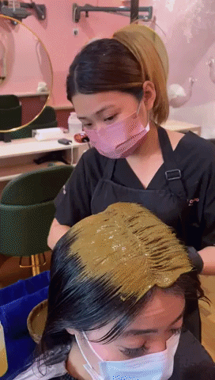
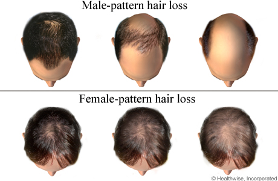
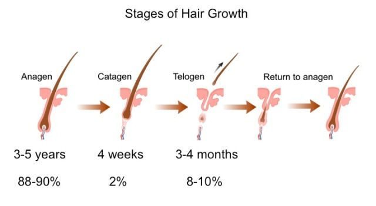
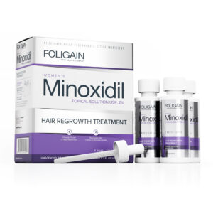
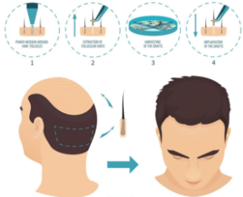
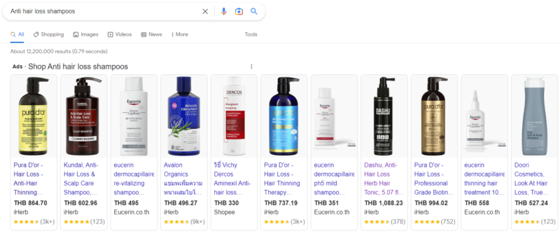

ทรีทเม้นท์บำรุงหนังศีรษะ

มีตัวเลือกการรักษาเส้นผมและหนังศีรษะมากมายในประเทศไทย แม้ว่าเราจะเรียกมันว่าการทำทรีตเมนต์ผม แต่จริงๆ แล้วมันคือทรีตเมนต์หนังศีรษะที่เราหมายถึงการรักษาหนังศีรษะที่จำเป็นเพื่อแก้ปัญหาผมร่วง ความจริงแล้ว “การทำทรีตเมนต์ผม” เช่น การยืดผม การทำสี การดัด ล้วนเป็นสาเหตุที่ทำให้ผมร่วงได้บ่อยที่สุด ในบทความนี้ เราจะพูดถึงการรักษาแบบไม่ใช้ความงามที่อ้างว่าสามารถต่อสู้กับอาการผมร่วงได้ในขณะที่เน้นด้านบน.

*ตัวอย่างทรีทเม้นท์บำรุงหนังศีรษะในไทย – Bee Choo Origin Herbal Thailan*

ก่อนที่เราจะไปแนะนำวิธีแก้ปัญหาอันดับต้นๆ ของประเทศไทย เรามาทำความรู้จักกับประเภทของผมร่วงที่เกิดขึ้นในผู้หญิงกันก่อนดีกว่า

พันธุศาสตร์

ผมร่วงประเภทนี้พบได้บ่อยที่สุด โชคดีที่พบได้บ่อยในผู้ชายมากกว่าผู้หญิง ผมร่วงจากพันธุกรรมมักเกิดจาก:

อายุ

การเปลี่ยนแปลงของรูปแบบ (เช่น วัยหมดประจำเดือน)

ยาคุมกำเนิดแบบรับประทานเอสโตรเจนหรือยาอื่นๆ

ไทรอยด์

รูปแบบผมร่วง:

ผมร่วงแบบผู้หญิงจะกระจายมากกว่าเป็นหย่อมๆ ขนส่วนหน้าเริ่มจากการแสกกลางให้กว้างขึ้น แนวขนด้านหน้าจะไม่ได้รับผลกระทบมากนัก (เมื่อเทียบกับผู้ชาย) ประกอบกับขนที่บางลง รูปแบบผมร่วงแตกต่างจากผู้ชายมาก ดังที่เห็นในภาพด้านล่าง:

*Source: https://www.healthlinkbc.ca/health-topics/hair-loss*

Telogen Effluvium

ผมร่วงชนิดนี้เกิดจากเหตุการณ์ที่กระทบกระเทือนจิตใจ เช่น ไข้เลือดออก โควิด-19 อุบัติเหตุทางรถยนต์ และแม้กระทั่งการคลอดบุตร

ความเครียดยังเป็นสาเหตุที่เป็นไปได้ของ Telogen Effluvium แม้ว่าจะต้องรุนแรงมากเพื่อกระตุ้นสิ่งนี้

โดยทั่วไปสิ่งที่เกิดขึ้นคือร่างกายของคุณเข้าสู่ภาวะช็อก วิตามินและแร่ธาตุที่สำคัญทั้งหมดจะถูกนำไปใช้ในการซ่อมแซมร่างกายหรือต่อสู้กับไวรัส ฯลฯ สิ่งนี้จะทำให้เส้นผมของคุณ 20-60% เข้าสู่ระยะเทโลเจนก่อนเวลาอันควร

*Source: https://nyhairloss.com/hair-growth-cycle*

ดังนั้นใครก็ตามที่เป็นโรค telogen effluvium จะเริ่มเห็นผมร่วงเพิ่มขึ้น 3-4 เดือนหลังจากเหตุการณ์ที่กระทบกระเทือนจิตใจ นี่คือเหตุผลที่เมื่อคุณอ่านเรื่องผมร่วงหลังคลอด คุณจะเข้าใจว่าทำไมผมร่วงหลังคลอด 3-4 เดือน ไม่ใช่ทันทีหลังคลอด

วิธีการแก้?

ผมร่วงส่วนใหญ่สามารถรักษาได้ สำหรับผู้ที่เป็นโรค Telogen Effluvium ข่าวดีก็คือ ในกรณีส่วนใหญ่ ผู้คนส่วนใหญ่จะหายได้เองด้วยการรับประทานอาหารที่เหมาะสมและพักผ่อน

สำหรับผู้ที่มีอาการผมร่วงจากพันธุกรรม การรักษาให้หายขาดนั้นทำได้ยากขึ้น แต่คุณสามารถลดความรุนแรงของมันได้อย่างแน่นอน นี่คือ 5 ตัวเลือกการรักษาผมร่วงของผู้หญิงในประเทศไทย:

1\) การรักษาหนังศีรษะด้วยสมุนไพร

หากคุณกำลังมองหาสิ่งที่ปลอดภัยและมีประสิทธิภาพสำหรับปัญหาผมเล็กน้อย ลองทรีตเมนต์หนังศีรษะด้วยสมุนไพร มีร้านเสริมสวยมากมายที่ให้บริการดังกล่าวโดยเฉพาะในเอเชียตะวันออกเฉียงใต้

การรักษาส่วนใหญ่เกี่ยวข้องกับการพันหนังศีรษะด้วยสมุนไพรจีนและปล่อยให้สารอาหารซึมซาบเข้าสู่หนังศีรษะ ส่งเสริมสุขภาพหนังศีรษะและการไหลเวียนโลหิต ชาวจีนเชื่อว่า เมื่อสุขภาพหนังศีรษะเราแข็งแรงดี สุขภาพร่างกายก็จะรักษาตัวเองได้

แนะนำสำหรับ :

ถ้าคุณกำลังพบปัญหาผมร่วง, หนังศีรษะมัน, คันหนังศีรษะ หนังศีรษะอ่อนโยน และรูขุมขนบนหนังศีรษะของคุณ

ที่จริงแล้ว หนึ่งในการทำทรีตเมนต์สมุนไพรที่ใหญ่ที่สุดจากสิงคโปร์ :

Bee Choo Origin เป็นแบรนด์ทรีตเมนต์สำหรับบำรุงหนังศีรษะที่ใหญ่ที่สุดในเอเชีย มีมากกว่า 170 สาขาทั่วโลก

คิดค้นและก่อตั้งในสิงคโปร์, 2000 โดย Madam Cheah Bee Chew, ทางสิงคโปร์ ภูมิใจเสนอในเรื่องความปลอดภัย, ราคาที่จับต้องได้ และมีประสิทธิภาพ

](../../../assets/images/blog/five-helpers-women/05-bee-choo-price-list-2022-with-color-edit.jpg)

*Source: [www.beechooherbal.com](https://beechooherbal.com/)*

ทรีตเมนต์ของบีชูทำจากสมุนไพรจีน, ปราศจากสารเคมี 100% และทำงานโดยรักษาหนังศีรษะและส่งเสริมการไหลเวียนโลหิต เมื่อหนังศีรษะและเส้นผมสุขภาพดีและแข็งแรง. ร่างกายก็จะกำจัดปัญหาผมอื่นๆ โดยธรรมชาติ เช่นหนังศีรษะมัน, ผมร่วง, รังแค และอื่นๆ

แชมพูและโทนิคชนิดพิเศษของบีชู ช่วยบำรุงและดูแลเส้นผมของให้ลูกค้าของพวกเขา เมื่อพวกเขามาใช้บริการที่Bee Choo. แนะนำให้เข้าใช้บริการอย่างน้อย 1 ครั้งต่อเดือนเพื่อหนังศีรษะที่สุขภาพดียิ่งขึ้น

Bee Choo มีทั้งหมด 8 สาขาทั่วกรุงเทพฯและปริมณฑล และชลบุรี. ถ้าความเป็นส่วนตัวและการบริการแบบพรีเมี่ยมคือสิ่งที่คุณชื่นชอบ ลองมาที่ Bee Choo Origin Herbal Thailand [ที่นี่](https://beechooherbal.com/)

ร้านทำผมที่ให้บริการทรีตเมนต์สมุนไพรบำรุงหนังศีรษะ ในไทย :

Bee Choo Origin Herbal Thailand

786 salon

Bond Beauty Bangkok Asoke

The Palettes

Serge Comtesse Sensory Prestige Hair Salon at Sofitel Bangkok Sukhumvit Hotel

2\) ยาที่ไม่ต้องสั่งโดยแพทย์

Minoxidil เป็นยาที่หาซื้อได้ตามร้านขายยาทั่วไป มักจะมาในรูปแบบของเหลวซึ่งต้องทาบนหนังศีรษะทุกวัน นอกจากนี้ยังสามารถมาในรูปแบบเม็ด

*Source: https://www.biovea.com/*

แนะนำสำหรับผู้ที่มีผมร่วงจากพันธุกรรม:

นี่คือการตบ หรือพลาด คุณจะเห็นผลลัพธ์อย่างรวดเร็วหรือไม่มีผลลัพธ์เลย ให้เวลาประมาณ 6 เดือน หากคุณเห็นผลลัพธ์ก็เหมาะกับคุณ ถ้ามันไม่เป็นเช่นนั้น อย่างไรก็ตาม ถ้ามันช่วยได้ คุณจะต้องใช้ยาต่อไปอย่างไม่มีกำหนดเพื่อรักษาผลประโยชน์

การใช้ยาที่ไม่ต้องสั่งโดยแพทย์มักมีความเสี่ยงต่อผลข้างเคียง หากคุณกำลังรับประทานยาMinoxidil โปรดระวังผลข้างเคียงที่อาจเกิดขึ้น ซึ่งรวมถึงการระคายเคืองหนังศีรษะ ขนบนใบหน้าที่ไม่ต้องการ

ยาอีกตัวคือ Finasteride (Propecia) อย่างไรก็ตาม นี่เป็นยาที่ต้องสั่งโดยแพทย์สำหรับผู้ชายเท่านั้น ไม่สามารถใช้ได้กับผู้หญิง

ผู้ชายรับประทานสิ่งนี้ทุกวันในรูปแบบเม็ด ส่วนใหญ่จะมีอาการผมร่วงช้าลง ในขณะที่บางคนอาจเห็นผมงอกขึ้นใหม่บ้าง จะใช้เวลาประมาณ 3-6 เดือนในการบอกได้ว่าใช้งานได้หรือไม่

โปรดทราบว่าอาจมีผลข้างเคียงที่อาจเกิดขึ้น ได้แก่ การสูญเสียความต้องการทางเพศ สมรรถภาพทางเพศ ความเสี่ยงในการเกิดมะเร็งต่อมลูกหมากสูงขึ้น

3\) การปลูกผม

นี่เป็นกระบวนการที่เจ็บปวด เป็นการผ่าตัดเล็กน้อย ศัลยแพทย์จะทำการถอนรากฟันเทียมทีละส่วนจากหนังศีรษะ ซึ่งเป็นบริเวณที่ผมชี้ฟูมากกว่าบริเวณที่มีผมร่วง (โดยปกติคือด้านหลังศีรษะ) เนื่องจากการสกัดไม่ได้ทำด้วยกลไกแต่ทำแบบสุ่ม คุณแทบจะไม่สังเกตเห็นความหนาแน่นของเส้นผมที่ลดลงในบริเวณผู้บริจาคหลังจากกระบวนการปลูกผมเสร็จสิ้น

*ปลูกผม*

แนะนำสำหรับผู้ที่มีปัญหาผมร่วงอย่างรุนแรง:

เนื่องจากผู้เชี่ยวชาญด้านเส้นผมที่ดูแลสามารถควบคุมจำนวนของรูขุมขนที่เก็บเกี่ยวได้ พวกเขาจึงสามารถกำหนดจำนวนการปลูกถ่ายได้อย่างแม่นยำที่พวกเขาต้องการจากสถานที่บริจาคแต่ละแห่ง จากนั้นสามารถปิดบริเวณของผู้บริจาคด้วยเส้นผมโดยรอบเพื่อปกปิดการสูญเสียเส้นผมจากบริเวณผู้บริจาคหลังกระบวนการปลูกผม ขนส่วนใหญ่จากไซต์ผู้บริจาคมักจะงอกขึ้นมาใหม่ ความเฉพาะเจาะจงของขั้นตอนนี้ยังหมายความว่าผู้เชี่ยวชาญด้านเส้นผมจะสามารถควบคุมความหนาแน่นของบริเวณผู้รับได้อย่างแม่นยำ เพื่อให้แน่ใจว่าลุคที่เสร็จแล้วเป็นธรรมชาติที่คุณจะพอใจ

การปลูกผมมีค่าใช้จ่ายสูงและเจ็บปวด จะใช้เวลาประมาณ 6 ถึง 12 เดือนกว่ากระบวนการบำบัดจะเสร็จสิ้น การเคลื่อนไหวของรูขุมขนเป็นไปอย่างถาวร ผลจะคงอยู่หลายปี

มีคลินิกปลูกผมหลายแห่งในประเทศไทย นี่คือรายชื่อคลินิกที่เป็นไปได้ที่คุณอาจต้องการหาข้อมูลก่อนที่จะตัดสินใจ:

Nirunda Cellport Clinic

Kamol Hospital

KTOP Clinic

The SLC Siam Laser Clinic

Dr. Orn Clinic

4\) การเยียวยาที่บ้าน

มีวิธีการรักษาที่บ้านมากมายที่คุณสามารถหาได้จากอินเทอร์เน็ต บางอย่างอิงจากข้อเท็จจริงทางวิทยาศาสตร์ เรื่องเล่าเก่าๆ ของแม่บ้าน นี่คือวิธีการรักษาที่บ้านบางส่วนที่ได้รับความนิยมบนอินเทอร์เน็ต

น้ำมันมะพร้าว

ว่านหางจระเข้

น้ำมันปลา

น้ำมันโรสแมรี่

มะนาว

ไข่ขาว

น้ำมันมะกอก

นวด

ไม่แนะนำ

จากประสบการณ์ของเรา น้ำมันจะทำหน้าที่ดูแลปลายผม เช่น ทำให้ปลายผมของคุณเงางามและนุ่มสลวยขึ้น แต่จะไม่ทำให้หนังศีรษะของคุณมีสุขภาพดีขึ้น กุญแจสำคัญในการแก้ปัญหาผมร่วงคือการไปที่ต้นตอของปัญหา

ดังที่ได้กล่าวไว้ก่อนหน้านี้ สาเหตุหลักของผมร่วงมักจะมาจากพันธุกรรมหรือเทโลเจนเอฟลิเวียม สำหรับความทุกข์ทรมานจากภาวะเทโลเจนเอฟลิเวียม คุณจะต้องหายเอง และคุณมีโอกาสหายได้เองสูงกว่าถ้าคุณมีสุขภาพแข็งแรง นอนหลับเพียงพอ และรับประทานอาหารที่เหมาะสม! ดังนั้น วิธีแก้ไขที่บ้านที่ดีที่สุดที่ได้ผลคือกินให้ถูกต้อง นอนอย่างน้อย 7 ถึง 9 ชั่วโมงและออกกำลังกายเป็นประจำ

การนวดหนังศีรษะจะช่วยกระตุ้นการไหลเวียนของเลือด แต่ระวังให้ดี ให้แน่ใจว่านิ้วของคุณสะอาดและอย่าดึงเส้นผมของคุณเมื่อคุณนวดหนังศีรษะ การนวด 5 นาทีก็เพียงพอแล้ว การนวดมากเกินไปหรือนวดแรงเกินไปอาจส่งผลเสียแทน

นั่นคือการเยียวยาที่บ้าน หากวิธีการดังกล่าวได้ผลจริง ธุรกิจเกี่ยวกับการดูแลเส้นผมส่วนใหญ่จะไม่สามารถอยู่รอดได้ ดีกว่าที่จะใช้การเยียวยาที่บ้านด้วยเกลือเล็กน้อย

*5) แชมพูป้องกันผมร่วง*

มีแชมพูมากมายที่ทำการตลาดตัวเองว่าเป็น คุณจะเห็นโฆษณามากมายในทีวี คนขายเร่ขายในตลาด หรือบนชั้นวางของซูเปอร์มาร์เก็ตและร้านค้าอื่นๆ ที่ขายผลิตภัณฑ์ดูแลเส้นผม

*แชมพูที่ช่วยเรื่องผมร่วง.*

แนะนำสำหรับผู้ที่มีปัญหาผมร่วงเล็กน้อย

จากประสบการณ์ของเรา แชมพูดังกล่าวอาจช่วยผู้ที่มีปัญหาผมร่วงเล็กน้อยได้ แต่ก็ไม่ได้ให้ความเป็นไปได้สูง แชมพูดังกล่าวทำงานโดยปรับสมดุลค่า pH ของหนังศีรษะหรือโดยการแนะนำสารอาหารที่หนังศีรษะอาจขาด หากคุณยุ่งเกินไปที่จะไปร้านสมุนไพรรักษาหนังศีรษะ (ซึ่งเราแนะนำเป็นอย่างยิ่งสำหรับผมร่วงเล็กน้อย) คุณสามารถเลือกแชมพูป้องกันผมร่วงได้ อย่างไรก็ตาม หากคุณกำลังมองหาแชมพูมหัศจรรย์ที่สามารถรักษาผมร่วงได้ทันที คุณจะต้องผิดหวัง หากมีแชมพูดังกล่าวอยู่ ทุกคนก็จะทราบเกี่ยวกับมัน และคงไม่มีความจำเป็นสำหรับบทความเช่นนี้เพื่อพูดคุยเกี่ยวกับตัวเลือกการรักษาผมร่วง

สำหรับผู้ที่มีอาการผมร่วงเล็กน้อย คุณมีโอกาสฟื้นตัวได้ดีขึ้นด้วยการลงมือทำอย่างรวดเร็วและไปรักษาผมร่วงด้วยสมุนไพร ปลอดภัยและมีประสิทธิภาพมากกว่าการดูแลด้วยแชมพู
