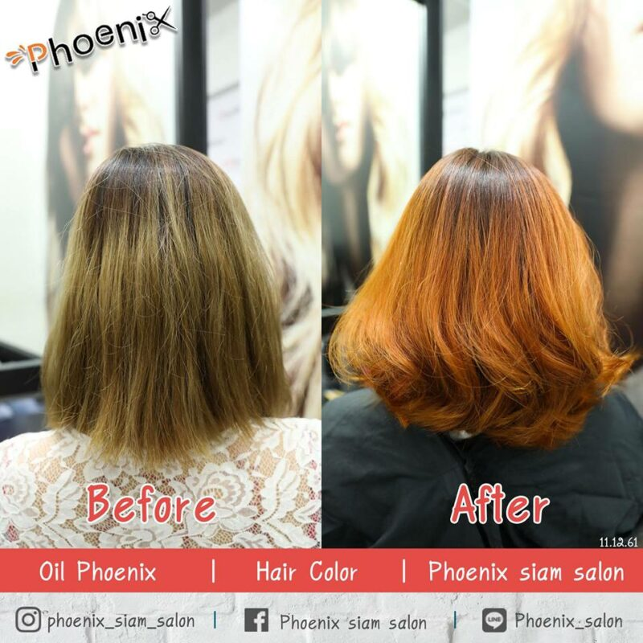
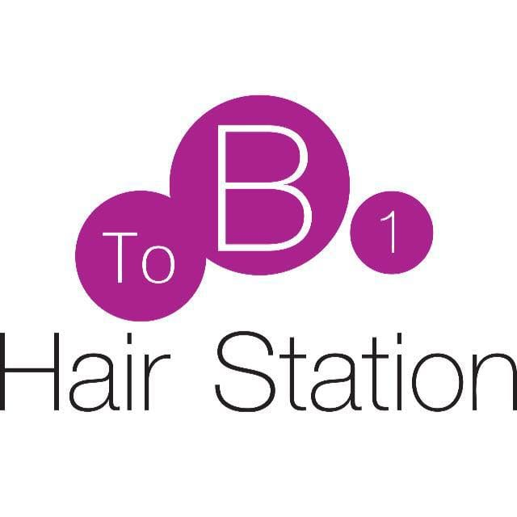
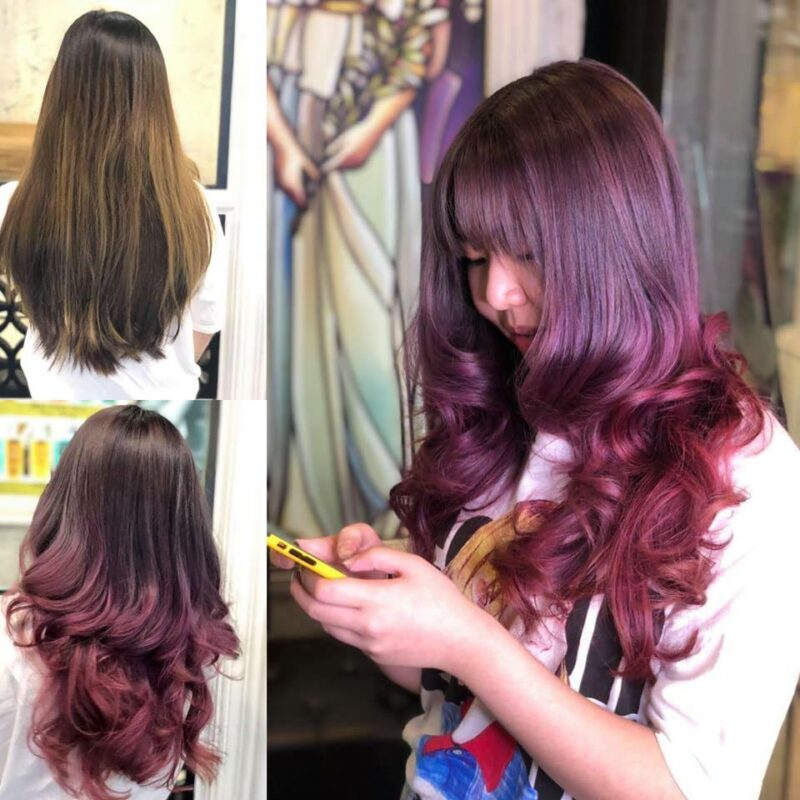
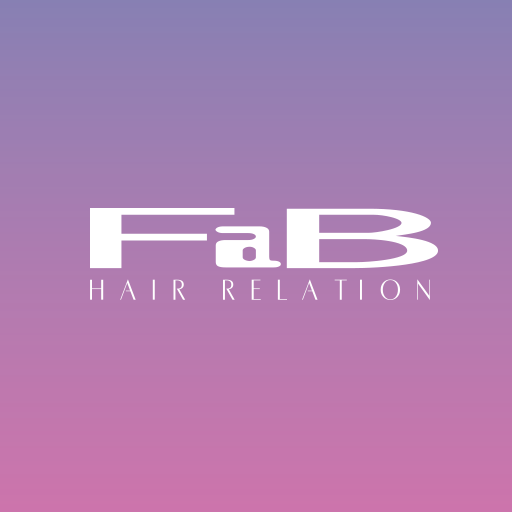
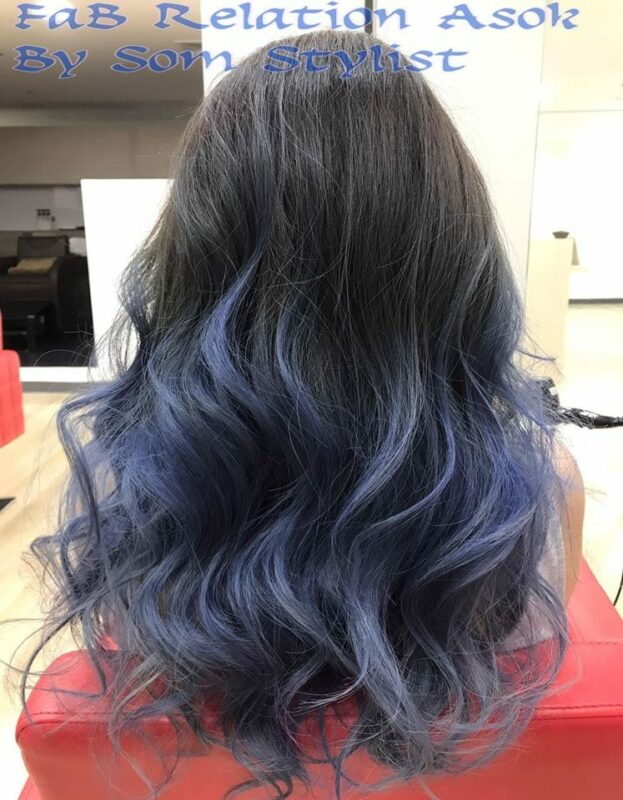
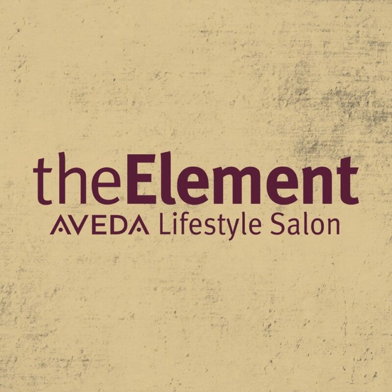
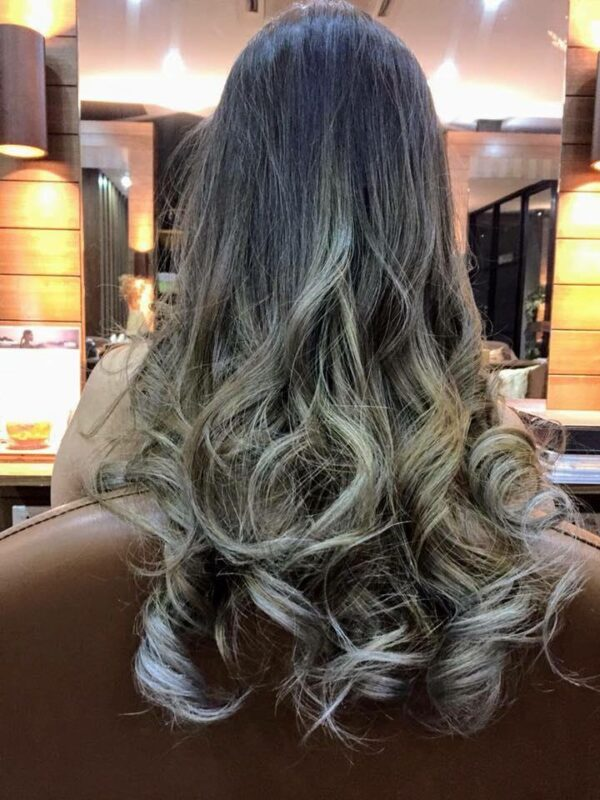
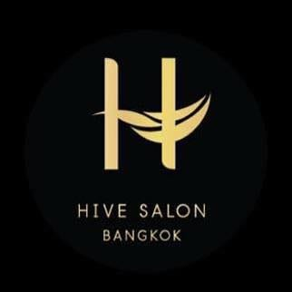
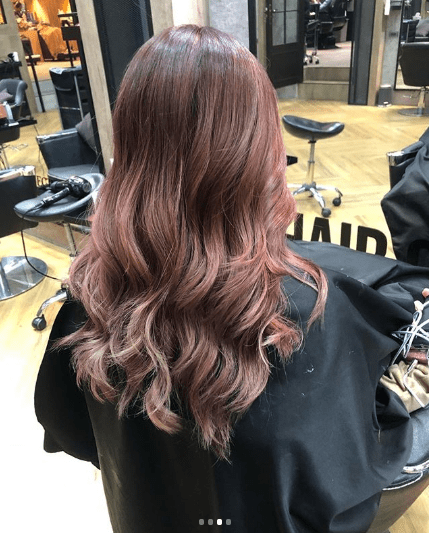
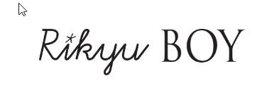

เราได้ทำการค้นหา กลั่นกรองและรวบรวมซาลอนหรือร้านทำผมที่เป็นที่นิยมมากที่สุดของคนในกรุงเทพจากอินเตอร์เน็ต โซเชียลมีเดีย และกระทู้ต่าง ๆ

โดยเราจะแสดงให้เห็นว่าความคิดเห็นของลูกค้าที่ไปใช้บริการที่ร้านแต่ละร้านเป็นอย่างไร และท้ายที่สุดเราจะแสดงความคิดเห็นด้วย

รีวิว: ซาลอนทำทรีทเม้นท์ผมในกรุงเทพมหานคร

Phoenix Siam Salon

ToB1 Hair Station

FaB Hair Relation Bangkok

The Element Lifestyle Salon

Hive Society

Rikyu By Boy

Bee Choo Herbal Thailand

รีวิวนี้จัดทำขึ้นในวันที่ 22 ธันวาคม 2561

ซาลอนตัดแต่งทรงผมที่ดีที่สุด

Rikyu by Boy Salon

ซาลอนทำสีผมที่ดีที่สุด

The Element Lifestyle Salon

ซาลอนทำทรีทเม้นท์ดูแลเส้นผมและหนังศีรษะที่ดีที่สุด

Bee Choo Herbal Thailand

ซาลอนที่ควรระวังค่าใช้จ่ายแอบแฝง

Phoenix Siam Salon

1\. Phoenix siam salon

*ชื่อร้าน*

Phoenix Siam Salon

เว็บไซต์

[https://www.facebook.com/Phoenix.siam.salon/](https://www.facebook.com/Phoenix.siam.salon/)

จำนวนสาขา

2

ที่อยู่

สยาม

อนุสาวรีย์ชัยสมรภูมิ

เรตติ้งบน Facebook

4.7/5 จาก 447 คน

เรตติ้งบน Google

4.0/5 จาก 55 คน

ค่าบริการ

ทำสี ยืด เริ่มต้น 1,500 บาท

ทรีทเม้นท์ เริ่มต้น 4,000 บาท

ข้อมูลจาก [Phoenix Siam Salon](https://www.facebook.com/Phoenix.siam.salon/)

เกี่ยวกับ Phoenix Siam Salon

ร้านทำผมใจกลางแหล่งรวมวัยรุ่นอย่างสยามแสควร์ เป็นร้านทำผมที่ดารานักร้องหลายคน ต่างตบเท้ามาเปลี่ยนลุคกันเป็นแถว มาที่นี่คุณจะได้สีผมสวยตรงตามชาร์ทดั่งใจต้องการ ซึ่งทางร้านก็จะให้คำแนะนำเรื่องสีผมกับลูกค้าอย่างใกล้ชิด อ่านต่อได้ที่

ที่มา [wongnai](https://www.wongnai.com/articles/splashlight-hair-color-trend)

ลูกค้ามีความคิดเห็นอย่างไร?

ความคิดเห็นเชิงบวก:

ร้านนี้ดีมาก ปกติแพ้ง่ายมาก ทำทั้งเคราติน olapex เปลี่ยนสีผม ไม่แพ้ซักนิด! ชอบสุดคือทำที่นี่แล้วผมนุ่มม้ากกกก ไม่เป็นยายเพิ้งผมเสียชี้ฟูละ เย่ะ! ^^ ช่างทด ลิงจุง กับพี่น้องอู๋ น่ารักมาก เป็นกันเอง ใส่ใจดีมาก เอาไปสิบกะโหลก!! 555

ความคิดเห็นเชิงลบ:

“ไปทำสีผมที่สยามมาคะ ราคาสูงมาก ช่างก็หน้าบึ้ง บริการพอใช้ได้ อยากแนะนำว่าใครไปทำสีผมหรืออะไรอื่น ควรพูดเรื่องราคาก่อนนะค่ะ เพราะตอนที่เราไปทำมาแล้ว ตอนหลังมาคิดราคาช็อกเลย แพงมาก”

ตัวอย่างบริการของทางร้าน

ที่มา [Phoenix Siam Salon](https://www.facebook.com/Phoenix.siam.salon/photos/pcb.2253665191319013/2253658024653063/?type=3&theater)

ความคิดเห็นของเรา

จากการได้อ่านรีวิวของร้านทำผมแห่งนี้จะเห็นว่ามีคนเข้ามาชมมากมาย แต่จะมีลูกค้าบางส่วนที่บอกว่าทางร้านไม่แจ้งราคาการทำผมก่อนและพอถึงเวลาจ่ายเงินก็ถึงกับตกใจกับค่าบริการที่สูงเกินที่คาดไว้

ฉะนั้นหากคุณกำลังคิดว่าจะไปใช้บริการที่นี่ คุณควรศึกษาเกี่ยวกับค่าบริการให้ดีเสียก่อน มิฉะนั้นคุณอาจต้องจ่ายเงินเกินงบเหมือนลูกค้าบางท่านก็ได้

2\. ToB1 Hair station

*ชื่อร้าน*

ToB1 Hair station

เว็บไซต์

[https://www.facebook.com/ToB1HairStation/](https://www.facebook.com/ToB1HairStation/)

จำนวนสาขา

34

ที่อยู่

เซ็นทรัลพระราม9 สยามสแควร์ซอย2 เซ็นทรัลบางนา เซ็นทรัลเวิลด์ เดอะมอลล์บางกะปิ

เรตติ้งบน Facebook

4.1/5 จาก 160 คน

เรตติ้งบน Google

–

ค่าบริการ

ทำสีผม เริ่มต้น 2500 – 4000 บาท

ทรีทเม้นท์บำรุงผม เริ่มต้น 1500 – 3500 บาท

ข้อมูลจาก [ToB1 Hair Station](https://www.facebook.com/ToB1HairStation/)

เกี่ยวกับ ToB1 Hair Station

ทูบีวัน แฮร์ สเตชั่น (ToB1 Hair Station) ซาลอนที่ได้รับความไว้วางใจจากลูกค้าเป็นอย่างดี เพราะทูบีวัน แฮร์ สเตชั่น มีช่างผมที่มีประสบการณ์ และยังยอดเยี่ยมด้วยบริการลูกค้าอย่างประทับใจ ไม่เพียงแค่ซาลอน แต่ทูบีวัน แฮร์ สเตชั่นยังเป็นสถาบันสอนทำผมอีกด้วย นอกจากนี้ ยังมีจำหน่ายอุปกรณ์ทำผมที่มีคุณภาพ ทูบีวัน แฮร์ สเตชั่น มีสาขาอยู่หลายแห่ง เพื่อที่จะบริการลูกค้าได้อย่างทั่วถึง

ที่มา: [wongnai](https://www.wongnai.com/chains/tob1-hair-station)

ลูกค้ามีความคิดเห็นอย่างไร?

ความคิดเห็นเชิงบวก:

ขั้นตอนคร่าวๆเริ่มจากช่างจะใช้เครื่องตรวจสภาพเส้นผมของเราก่อน หลังจากนั้นจะเลือกสูตรของผลิตภัณฑ์ที่เหมาะกับเส้นผมของเรา ก่อนทำลักษณะเส้นผมเราคือจะมันช่วงโคนและแห้งช่วงปลาย หลังทำเสร็จช่างจะใช้เครื่องตรวจสภาพผมเราอีกครั้งจะเห็นได้ชัดเลยว่าเส้นผมดูหนาขึ้น และถ้าจับผมคือเห็นความเปลี่ยนแปลงชัดเจนว่าผมนุ่ม ลื่นขึ้นมากๆ เป็นทรีทเม้นต์ที่เจ๋งมากๆเลย แนะนำค่ะ

ความคิดเห็นเชิงลบ:

ทำที่สาขาเซลทรัลเชียงราย เสียใจมากคะราคาขนาดนี้แต่ทำออกมาแย่มากสีผมออกมาไม่เท่ากัน ได้แต่ปลอบใจตัวเองว่าเค้ากำลังฮิตเทรนสีผม2สี ทำไม่ ถึงเดือนสีผมหลุดหมดต่อไปคงต้องไปทำสาขาในกรุงเทพแล้วคะ ไม่แน่ใจว่าผิดที่เราหรือปล่าวที่ไม่ได้บอกช่างว่าเคยฟอกสีมาแต่ช่างเองก็น่าจะรู้ราคา5,000บอกไม่ถูกเลยว่าคุ้มรึปล่าว

ตัวอย่างบริการของทางร้าน

ที่มา [ToB1 Hair Station](https://www.facebook.com/ToB1HairStation/photos/pcb.2048613788563911/2048607758564514/?type=3&theater)

ความคิดเห็นของเรา

ซาลอนทำผมนี้มีจำนวนสาขาเยอะมาก แต่คุณภาพการบริการของแต่ละสาขาอาจไม่เท่าเทียมกันถึงแม่ว่าค่าบริการจะไม่ต่างกันก็ตาม

หากคุณกำลังคิดว่าจะไปใช้บริการที่ซาลอนแห่งนี้แล้วละก็ คุณต้องตรวจสอบให้แน่ใจว่าสาขาที่คุณจะไปใช้บริการนั้นมีการเขียนรีวิวที่ดีหรือไม่เพราะถ้าคุณบังเอิญไปสาขาที่บริการไม่ดี คุณจะรู้สึกทันทีว่าไม่คุ้มค่ากับราคาที่คุณต้องจ่าย

3\. FaB Hair relation Bangkok

*ชื่อร้าน*

FaB Hair Relation Bangkok

เว็บไซต์

[https://fab-2011.com/](https://fab-2011.com/)

จำนวนสาขา

2 ในประเทศไทย

หลายสาขาในประเทศญี่ปุ่น

ที่อยู่

ทองหล่อ

อโศก

เรตติ้งบน Facebook

4.9/5 จาก 65 คน

เรตติ้งบน Google

4.1/5 จาก 13 คน

ค่าบริการ

ตัดผม 750 – 1,300 บาท

ตัดผมและสปา 1,800 บาท

ทำสีและทรีทเม้นท์ 2,200 บาท

ดัดผมและทรีทเม้นท์ 3,100 บาท

ทรีทเม้นท์ 1,700 บาท

สปาผม 1,100 บาท

ข้อมูลจาก [https://fab-2011.com/?page_id=62](https://fab-2011.com/?page_id=62)

ลูกค้ามีความคิดเห็นอย่างไร?

ความคิดเห็นเชิงบวก:

เคยใช้บริการที่ทองหล่อ แล้วชอบมาก เลยตามไปที่สาขาอโศกด้วย ร้านสวยเห็นวิวถนน เดินทางสะดวก พนักงานให้บริการดีเยี่ยม ใส่ใจลูกค้าเป็นอย่างมากที่สุด ส่วนเรื่องการทำผมประทับใจทุกครั้ง

ความคิดเห็นเชิงลบ:

การบริการอยู่ในระดับที่ดีมากๆๆ แต่คุณภาพการทำสีออกมาแย่ที่สุดเท่าที่เคยไปทำสีผมมา ปกติก็เข้าแต่ร้านที่มีช่างญี่ปุ่น ครั้งก่อนมาทำสีออกมาใกล้เคียงกับรูปตัวอย่างมาก แต่มาคราวนี้ทำออกมาเหมือนมาทำสีดำไม่มีความใกล้เคียงสักนิดเลยทั้งที่เอารูปตัวอย่างเดิมให้ดูเสียดายความรู้สึก เสียดายเวลา ผมเรายิ่งทำสีบ่อยไม่ได้กะทำครั้งเดียวจบ นี่ต้องแก้สีอีกผมแย่ขึ้นไปอีก เจ็บใจ!!

ที่มา [https://www.facebook.com/fabbangkok/](https://www.facebook.com/fabbangkok/)

ตัวอย่างบริการของทางร้าน

ที่มา [FaB Hair Relation Bangkok](https://www.facebook.com/fabasok/photos/pcb.536477440170458/536476600170542/?type=3&theater)

ความคิดเห็นของเรา

ความดูแลเอาใจใส่ลูกค้าเป็นเพียงหนึ่งในหัวใจหลักของธุรกิจให้บริการทำผมซึ่งไม่ได้หมายความว่าผลลัพธ์ของการบริการจะเป็นไปตามที่คาดหวังไว้เสมอ ท่านอาจมีความพึงพอใจต่อการดูแลเอาใจใส่ลูกค้าของพนักงานในร้าน แต่การทำสีผมอาจต้องใช้ทักษะดีเยี่ยมเพื่อให้ได้สีตามความประสงค์ของท่านและขึ้นอยู่กับความชำนาญของช่างทำสีผม

ฉะนั้นการตัดสินใจที่จะไปทำสีผมจะต้องดูเรื่องทักษะของช่างทำสีด้วยไม่ใช่เพียงแค่พวกเขาดูแลเอาใจใส่ดี

4\. The Element Lifestyle Salon

*ชื่อร้าน*

The Element Lifestyle Salon

เว็บไซต์

[https://www.facebook.com/theelementhairsalon/](https://www.facebook.com/theelementhairsalon/)

จำนวนสาขา

1

ที่อยู่

ซอยสุขุมวิท 63

เรตติ้งบน Facebook

–

เรตติ้งบน Google

3.0/5 จาก 3 คน

ค่าบริการ

ทำสี – ชาย เริ่มต้น 2,500 บาท

– หญิง เริ่มต้น 3,500 บาท

ทรีทเม้นท์ออร์แกนนิก 2,500 – 3,500 บาท

ข้อมูลจาก [The Element Lifestyle Salon](https://www.facebook.com/pg/theelementhairsalon/services/)

เกี่ยวกับร้าน The Element Life Style Salon

The Element Lifestyle Salon เป็นเอ็กครูซีฟซาลอนที่ใหญ่ที่สุดในประเทศไทย ใช้ผลิตภัณฑ์ Aveda ทั้งหมด ซึ่งปราศจากสารเคมีและเป็นผลิตภัณฑ์ที่เป็นมิตรต่อสิ่งแวดล้อม เรามีทั้งบริการสปาผมและเล็บ

ที่มา [wongnai](https://www.wongnai.com/businesses/193625gs-the-element-lifestyle-salon)

ลูกค้ามีความคิดเห็นอย่างไร?

ความคิดเห็นเชิงบวก:

หลังจากทำทรีตเม้นไป 2 วัน : ให้คะแนน 100 เต็มค่ะ ไม่มีอาการแพ้ใดๆเกิดขึ้น ไม่แสบ ไม่คัน หนังศีรษะไม่ลอกเป็นแผ่น ผมนิ่มและร่วงน้อย ขอบอกว่าอยากทำอีกจังเลย ฟินส์มากค่ะ

ความคิดเห็นเชิงลบ:

เข้ามาทำทรีตเม้นต์บำรุงสำหรับหนังศรีษะมันค่ะ บรรยากาศในร้านดีมาก มีผลิตภัณฑ์ทุกอย่างของ aveda ครบเลย ในร้าน และในห้องสระผม มีเครื่องพ่นกลิ่นหอมอโรมา ผ่อนคลายมาก พนักงานนวดมือให้ระหว่างสระผม มีผ้าห่มให้ เเต่พนักงานไม่ยิ้มแย้มเลย พูดเบามาก เวลาเเนะนำอะไร หรือบอกชื่อผลิตภัณฑ์ หรือคุณสมบัติให้เราฟัง เราไม่ได้ยินเลย ไม่มองหน้าเวลาพูดด้วย ไดร์ผมได้ทรงเเก่มาก ปกติเราม้วนผม ผมเราไม่เคยฟูเลย เเต่พอเค้าไดร์ม้วนให้ ผมเราฟู หยิกงอมากๆๆๆ พนักงานไม่ถามเลยว่าโอเคมั้ย เฟลตอนไดร์ผมมากค่ะ แต่นอกนั้นโอเค

ตัวอย่างบริการของทางร้าน

ที่มา [The Element Lifestyle Salon](https://www.facebook.com/theelementhairsalon/photos/rpp.327830744036358/1162770957208995/?type=3&theater)

ความคิดเห็นของเรา

อย่างที่แสดงความคิดเห็นของอีกซาลอนไว้ ความดูแลเอาใจใส่ลูกค้าเป็นหนึ่งในหัวใจหลักของธุรกิจการให้บริการทำผม เพียงช่างทำสีผมนั้นมีความชำนาญและทักษะดีเยี่ยมอาจไม่เพียงพอที่จะให้ลูกค้ามีความพึงพอใจสูงสุด

หากคุณพิจารณาเพียงแค่ผลลัพธ์ที่ได้จากการทำผม ก็คงไม่มีปัญหาอะไร

5\. Hive Hair & Nail

*ชื่อร้าน*

Hive Hair & Nail

เว็บไซต์

[https://www.facebook.com/hivesociety/](https://www.facebook.com/hivesociety/)

จำนวนสาขา

3

ที่อยู่

Central World

Central Embassy

The Portico

เรตติ้งบน Facebook

4.5/5 จาก 118 คน

เรตติ้งบน Google

3.5/5 จาก 16 คน

ค่าบริการ

ทำสี เริ่มต้น 2,500 บาท

ทรีทเม้นท์ เริ่มต้น 3,000 บาท

ข้อมูลจาก [Hive Hair & Nail](https://www.facebook.com/hivesociety/)

ลูกค้ามีความคิดเห็นอย่างไร?

ความคิดเห็นเชิงบวก:

ไปทำผมร้านนี้ สาขา CTW ไม่ผิดหวังเลยค่ะ แนะนำดีมาก อันไหนเหมาะกับเราหรือไม่เหมาะ แจ้งราคาลูกค้าชัดเจน ให้ลูกค้าตัดสินใจก่อนทำ ชอบมากค่ะ กลับไปทำอีกแน่นอน

ความคิดเห็นเชิงลบ:

ตอนนุ่นท้องทั้งแปดเดือนไม่ได้ไปทำผมเลยค่ะ แต่ในที่สุดตอนแปดเดือนก็ได้ตัดสินใจจะไปทำผมที่ The Hive Salon (Central Embassy) ตื่นเต้นมากกว่าในที่สุดจะได้ออกไปเสริมสวย เอาเข้าจริงๆช่างตัดผมดูหงุดหงิดและอารมณ์ไม่ดี ใช้เวลาตัดน้อยกว่า 15 นาที (สระผมยังนานกว่านี้เลยค่ะ) ตัดแบบรีบๆและแบบหงุดหงิด แทบจะไม่มองหน้าเราเลยสักครั้ง แล้วเราก็เห็นๆอยู่ว่าตัดใช้ไม่ได้เลย แต่คุณพี่เขาขี้หงุดหงิดขนาดนั้นใครจะไปกล้าทัก พอตัดเสร็จแล้วเรายังยิ้มและขอบคุณเขา แต่ตัวเค้าเองนั้นไม่ตอบรับเราเลยและเดินหนีไปแบบไม่สวัสดีเราอีกด้วยต่างหากทำไมถึงไม่มีมารยาทขนาดนี้ ในที่สุดจ่ายไปตั้ง 3000 บาท กับทรงผมที่ไม่ได้เรื่อง และประสบการณ์ที่น่าผิดหวัง อยากจะบอกเลยว่าที่นี่อยากไป เรื่องแพงปกติเราไม่สนใจนะแต่ถ้าแพงแล้วไม่ดีและไม่ professional อย่างนี้ไม่ไหวจริงๆ

ตัวอย่างบริการของทางร้าน

ที่มา [Hive Hair & Nail](https://www.facebook.com/hivesociety/photos/a.797873466904847/2823538534338320/?type=3&theater)

ความคิดเห็นของเรา

โดยทั่วไปแล้วเวลาลูกค้ามีความพึงพอใจกับการบริการและผลลัพธ์ของการบริการมาก ๆ จะเขียนรีวิวที่มีคุณภาพ มีการอธิบายแบบละเอียดซึ่งจะเป็นการช่วยโปรโมทร้านไปโดยปริยาย

แต่คุณลองคิดดูว่าทางร้านต้องทำให้ลูกค้าไม่พึงพอใจมากขนาดไหน พวกเขาจึงยอมสละเวลามาเขียนรีวิวเชิงลบยืดยาวถึงการให้บริการหรือผลลัพธ์ที่ไม่ดี

6\. Rikyu By Boi

*ชื่อร้าน*

Rikyu by Boy Salon

เว็บไซต์

[boyrikyu.com](http://boyrikyu.com)

จำนวนสาขา

2

ที่อยู่

สุขุมวิท ซอย 24

สยามแสควร์วันชั้น 2

เรตติ้งบน Facebook

–

เรตติ้งบน Google

4.7/5 จาก 91 คน

ค่าบริการ

ทำสีจากราก 2,500 บาท

เริ่มต้น 1,500 บาท ขึ้นอยู่กับความยาวเส้นผม

ข้อมูลจาก [Rikyu](http://boyrikyu.com/price/)

ลูกค้ามีความคิดเห็นอย่างไร?

ความคิดเห็นเชิงบวก:

ประทับใจกับการบริการและแนะนำเกี่ยวกับเส้นผมให้เราด้วย การบำรุงทรีตเม้นต์ก็มีทั้งก่อนและหลังทำสี การตัดก็ฝีมือถูกใจมากค่ะ

ความคิดเห็นเชิงลบ:

Aaah I’m so disappointed by this place. I went there because of the many good reviews. I wanted to have a new haircut + balayage. We started with the haircut and I first explained to the hairdresser that I wanted something new, also because my hair where so messy cause I had shaved them previously so the length were short a front, long in the back. What he did was that he just cut everywhere about 1cm. So nothing changed… My mother could do the same. I felt so sad… So then I ask him to fix that because he had taken already a lot of time doing that. Finally he fixed the back of my hair and it was ok. Just ok. Then the plan was the balayage. The result doesn’t looks like a balayage at all. There is some highlights in same places in the hair but we cannot see that at all, only under a big spot of light. I paid 4000banh for that, and 700banh for the haircut. I don’t believe it’s reasonable price at all 🙁

ตัวอย่างบริการของทางร้าน

](../../../assets/images/blog/salon-review-bangkok/13-sneak-peek-at-rikyu.png)

*ที่มา [Rikyu by Boy](https://www.facebook.com/boyrikyu/photos/a.611260255592595/1776439055741370/?type=3&theater)*

ความคิดเห็นของเรา

ซาลอนแห่งนี้มีความอาร์ท ดูเป็นศิลปะ และมีดีไซน์ดีโดดเด่น พวกเขาถึงกับมีแกลเลอรี่ศิลปะอยู่ด้านบนของร้าน

มีลูกค้ามากมายเขียนรีวิวที่ดีและมีคุณภาพพร้อมภาพประกอบให้กับซาลอนนี้

คุณสามารถรับรู้ราคาค่าบริการต่าง ๆ ของร้านนี้ผ่านเว็บไซท์ได้อย่างง่ายดาย

ซาลอนนี้มีชื่อเสียงด้านการตัดผมและทำสีผมดีเยี่ยมพวกเขายังมีเวิร์คช็อปที่เป็นเอกลักษณ์ของทางร้านอีกด้วย

หากคุณกำลังสนใจแฟชั่นแต่งผมหรือทรงผมที่กำลังเป็นเทรนด์แล้ว คุณควรแวะเข้าไปเยี่ยมเยียน Rikyu!

7\. Bee Choo Herbal Thailand

ชื่อร้าน

Bee Choo Herbal

เว็บไซต์

[https://beechooherbal.com](https://beechooherbal.com)

จำนวนสาขา

9

ที่อยู่

Bee Choo Udomsuk

Bee Choo Ratchada

Bee Choo Siam Square

Bee Choo Kallapaphruk

Bee Choo Chaiyaphruek

Bee Choo Saimai

Bee Choo Krungthep Kreetha

Bee Choo Chonburi

Bee Choo The Crystal Park Ekamai Raindra

เรตติ้งบน Facebook

5/5 จาก 43 คน

เรตติ้งบน Google

4.95/5 จาก 74 คน

ค่าบริการ

ทรีทเม้นท์สมุนไพร 800 – 1,200 บาท ขึ้นอยู่กับความยาวของเส้นผม

ลูกค้ามีความคิดเห็นอย่างไร?

ความคิดเห็นเชิงบวก:

มาครั้งแรกบริการดีมากค่ะ เจ้าหน้าที่ให้คำแนะนำและดูแลดีมากๆ มีตรวจสภาพหนังศีษะก่อนทำด้วย ทำครั้งแรกรู้สึกได้เลยว่าผมเงาขึ้นกลิ่นก็หอมอ่อนๆ ไม่ฉุนเลย ส่วนเรื่องผมขาวก็พรางได้จนแทบมองไม่เห็นเลยค่ะ เตียงสระก็นอนสบาย กลับไปใช้บริการอีกแน่นอนค่ะ ❤

ความคิดเห็นเชิงลบ:

เคยทำสีผมมาก่อนแล้วแพ้ ผมร่วงเลยร่วงเยอะมาก คันมากด้วยค่ะ ได้ยินว่าทรีทเม้นท์ร้านนี้ช่วยได้ ทรีทเม้นท์เค้าไม่มีเคมีเลยนะคะแต่มีข้อเสียคือเลือกสีไม่ได้ แต่เพื่อแก้ปัญหาผมร่วงก็ต้องยอมแหละค่ะ

ตัวอย่างบริการของทางร้าน

ความคิดเห็นของเรา

บีชูเป็นที่รู้จักในวงกว้างในแถบเอเชีย โดยบีชูประเทศไทยยึดถือคติแบรนด์ที่มีราคาโปร่งใส มีความซื่อสัตย์ และจะคอยช่วยเหลือลูกค้า นี่คือเหตุผลว่าทำไมคุณถึงสามารถรับรู้ราคาการทำทรีทเม้นท์ได้อย่างง่ายดายผ่านเว็บไซท์ของบีชู

ซาลอนทำผมของบีชูมีทักษะเฉพาะคือทรีทเม้นท์สมุนไพร โดยไม่มีบริการทำสีเคมี ดัดผม ยืดผม หรือทรีทเม้นท์อื่น ๆ

เพราะฉะนั้นหากคุณกำลังมองหาซาลอนออร์แกนิคที่มีราคาโปร่งใส ไม่แพงและสามารถเชื่อถือได้ในกรุงเทพเพื่อบำรุงรักษาหนังศีรษะแล้ว อย่าลืมแวะไปหาบีชู!
