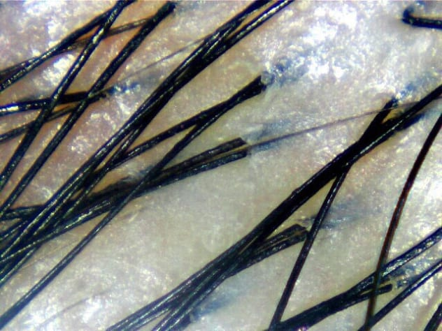
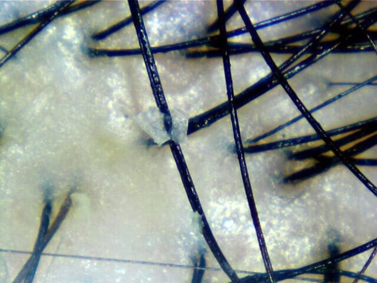
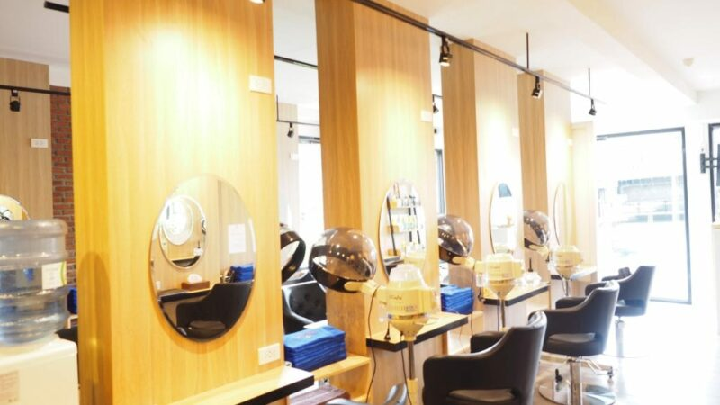
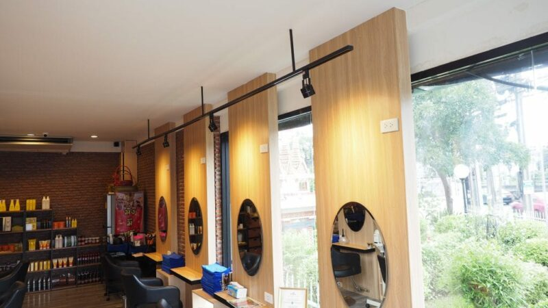
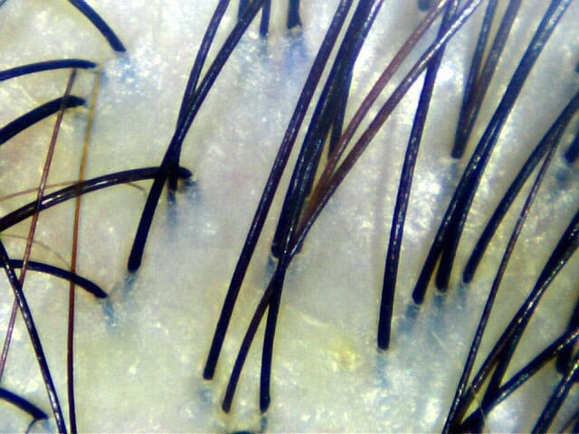
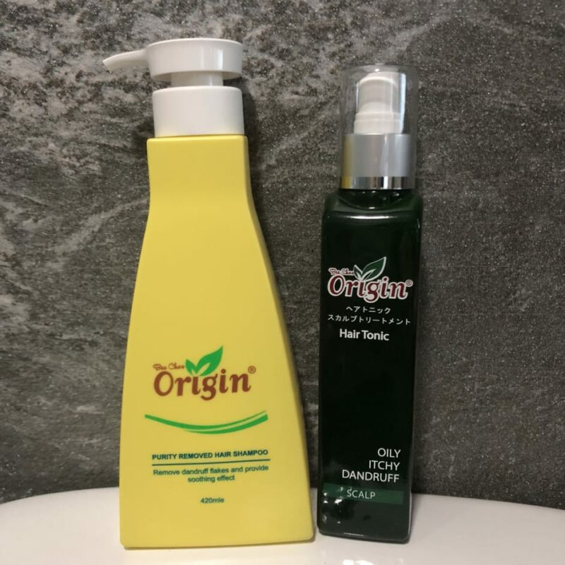
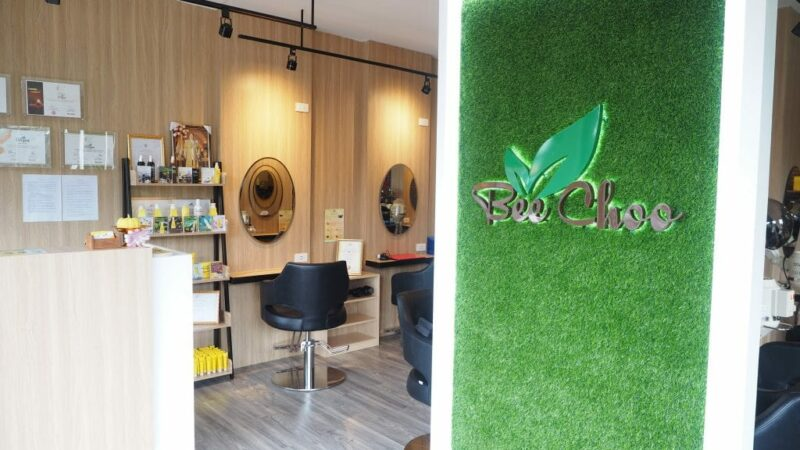

ดิฉันมีปัญหาหนังศีรษะมานานมากแล้ว มีอยู่ช่วงนึงเป็นหนักจนมีรังแค ปัญหาที่เป็นก็ไม่ได้หนักหนาถึงตายแต่ทำให้ตัวเรารู้สึกไม่สบายตัว พอเราคลอดลูกก็มีอีกปัญหาตามมาซึ่งก็คือ ผมร่วง แล้วพอตัวเลขอายุเราสูงขึ้น ผมขาวก็เริ่มมาด้วย

วิธีแก้ปัญหาต่างๆที่คนทั่วไปจะทำก็คือไปซาลอนทำผมแล้วก็ทำทรีทเม้นท์เคมีหรือทรีทเม้นท์อื่นๆที่ทางร้านจะแนะนำให้ทำเพื่อให้สภาพหนังศีรษะของเรากลับมาแข็งแรงเหมือนก่อน เราก็ทำมาตลอดแต่หลังๆจะเริ่มไม่มีเวลาเพราะต้องเลี้ยงลูก

ช่วงเดือนหลังๆที่ผ่านมาปัญหาหลักที่ดิฉันเจอคือผมร่วงและผมหงอกเพิ่มขึ้นมาก บอกตามตรงคือเครียดมากๆ แต่ยังโชคดีที่ทาง Bee Choo ยื่นข้อเสนอมาให้เราไปลองทำทรีทเม้นท์กับเขา เวลาแบบเหมาะเจาะมากๆเพราะจะตรงกับวันหยุดของดิฉันพอดี

บีชูก่อตั้งมาตั้งแต่ปี 2000 และเป็นที่รู้จักกันดี พวกเขาได้รับรางวัลดีเด่นมาแล้วมากมาย แต่ดิฉันต้องยอมรับเลยว่าไม่เคยรู้จัก Bee Choo มาก่อนที่พวกเขาจะติดต่อมาเพราะการแก้ปัญหาด้านหนังศีรษะไม่เคยเป็นปัญหาใหญ่สำหรับดิฉันจนกระทั้งตอนนี้ ดิฉันจึงเดินทางไปที่ทรีทเม้นท์ซาลอนพร้อมความคาดหวังว่าพวกเขาจะช่วยทำให้ปัญหาหนังศีรษะ ผมร่วง และปัญหาอื่นๆบรรเทาลง โดยพวกเขาบอกด้วยว่าพวกเขาสามารถสแกนตรวจหนังศีรษะเพื่อให้เห็นถึงสภาพหนังศีรษะของดิฉันในขณะนี้

วันที่ดิฉันนัดว่าจะเข้าไปทำทรีทเม้นท์เป็นวันธรรมดาเวลา 11.00 น. ที่ร้านคนไม่เยอะมาก ทางร้านบอกไว้ก่อนว่าไม่ควรมาในช่วงคนเยอะๆเช่นมาหลัง 17.00 น. หากเป็นวันธรรมดาและเสาร์อาทิตย์เพราะคนจะเยอะมากๆและอาจจะต้องรอนาน พอเข้าไปในร้าน พวกเขาก็ทำการแสกนหนังศีรษะของดิฉันตามที่ได้บอกไว้

*ก่อนทำทรีทเม้นท์ – หนังศีรษะมีอาการระคายเคือง*

*ก่อนทำทรีทเม้นท์ – รังแคบนหนังศีรษะ*

ผลการตรวจก็ตามรูปค่ะ รูขุมขนอุดตันเต็มไปด้วยไขมัน หนังศีรษะมัน ส่วนปลายของเส้นผมแห้ง มีรังแค ผมขาว หนังศีรษะในบางจุดจะมีสีแดงซึ่งแสดงถึงอาการระคายเคืองของหนังศีรษะ พอได้ยินผลก็ไม่ได้แปลกใจอะไรหรอกค่ะแต่ภาพประกอบที่เห็นจะดูน่ากลัวหน่อย

เพื่อแก้ปัญหารูขุมขนอุดตันไปด้วยไขมันและอาการระคายเคืองของหนังศีรษะ ทางร้านจะทำการนวดศีรษะโดยใช้ ginger wine และ hair tonic ก่อนหมักผมด้วยสมุนไพร การหมักผมจะอบไอน้ำไปด้วยโดยจะใช้เวลาอบ 45 นาที หลังจากหมักผมเสร็จทางร้านจะสระผมและนวดให้ผ่อนคลาย รวมทั้งหมดแล้วจะใช้เวลาทำทรีทเม้นท์ประมาณหนึ่งชั่วโมงครึ่ง

*ก่อนทำทรีทเม้นท์ – หนังศีรษะมีอาการระคายเคือง*

*หลังทำทรีทเม้นท์*

นี่คือหนังศีรษะของดิฉันหลังจากทำทรีทเม้นท์เสร็จไปแล้วสองครั้ง จะเห็นได้ว่าสะอาดขึ้นเยอะ คราบสีน้ำตาลที่ติดอยู่บางส่วนของเส้นผมคือสีย้อมธรรมชาติซึ่งจะออกเป็นสีทองแดง สีย้อมนี้จะย้อมผมขาวทั้งเส้นจนถึงโคนโดยไม่ทำให้เกิดอาการระคายเคืองหนังศีรษะเหมือนกับการทำสีเคมี ดิฉันก็ไม่คิดว่าจะทำสีผมอื่นเร็วๆนี้ก็ถือว่าไม่เป็นไร แต่ถ้าใครอยากทำแบบไม่มีสีย้อมอย่าลืมบอกพนักงานนะคะ

คืออยากจะบอกความรู้สึกจากใจจริงว่าประทับใจทรีทเม้นท์รักษาผมร่วงนี้มาก และรู้สึกคุ้มค่ากับเวลาหนึ่งชั่วโมงครึ่งที่ใช้ไปในการทำทรีทเม้นท์ ไม่ใช่เพราะทางร้านให้เรามาทำ sponsored review นะคะ แต่เป็นเพราะเชื่อแล้วจริงๆว่าการทำทรีทเม้นท์รักษาผมร่วงที่ Bee Choo จะช่วยให้สุขภาพเส้นผมและหนังศีรษะดีขึ้นจริงๆ และแน่นอนว่าดิฉันจะกลับมาเป็นลูกค้าที่ร้านนี้อย่างแน่นอน พูดถึงการบริการนะคะ พนักงานที่ดูแลดิฉันตั้งใจอธิบายปัญหาของหนังศีรษะดิฉันและวิธีการดูแลอย่างละเอียด เธอมั่นใจว่าถ้าทรีทเม้นท์ที่ได้ทำมีผลดีต่อหนังศีรษะแล้ว ลูกค้าจะกลับมาดูแลหนังศีรษะกับ Bee Choo อีกแน่นอน

ราคาถือว่าไม่แพงเมื่อเทียบกับสิ่งที่ได้รับ ดิฉันจะพูดถึงราคาเพราะเคยไปทำทรีทเม้นท์ที่อื่นมาก่อนและเมื่อเทียบราคากับที่อื่น Bee Choo ถือว่าถูกมากๆเพราะในราคาเพียงเท่านี้ ผลลัพธ์ที่ได้คือเกินราคา และราคาการทำทรีทเม้นท์เปิดเผยมาก ดิฉันเพียงเข้าไปในเว็ปก็สามารถหาราคาได้อย่างง่ายดาย ไม่เหมือนไปที่อื่นที่จะต้องเข้าไปคุยเจรจาก่อน

เราสามารถซื้อผลิตภัณฑ์เกี่ยวกับการดูแลหนังศีรษะและเส้นผมจาก Bee Choo ได้เช่นกัน ทางร้านแนะนำให้ดิฉันใช้ Purity Removed Shampoo และ Japan Scalp Tonic เพราะจะเหมาะสำหรับสภาพหนังศีรษะของดิฉันที่สุด ดิฉันนำผลิตภัณฑ์ทั้งสองอย่างกลับบ้านละใช้เป็นประจำ

หลังจากที่ได้ทำทรีทเม้นท์รอบนี้ไปประมาณ 3 อาทิตย์ ดิฉันก็แวะไปหาพวกเข้าอีกรอบ สภาพหนังศีรษะของดิฉันถือว่าอยู่ในขั้นที่ดีมาก ไม่แห้ง ไม่คันเท่าเมื่อก่อน และดิฉันเชื่อว่าถ้าทำเป็นประจำจะช่วยลดอาการผมร่วงได้ด้วยเช่นกัน

*คุณสามารถหาข้อมูลเพิ่มเติมเกี่ยวกับบีชูได้ที่เว็บไซต์และเพจของพวกเขาตามลิ้งด้านล่าง*

[www.beechooherbal.com/th](https://beechooherbal.com/th)

[www.facebook.com/beechooherbal](http://www.facebook.com/beechooherbal)
