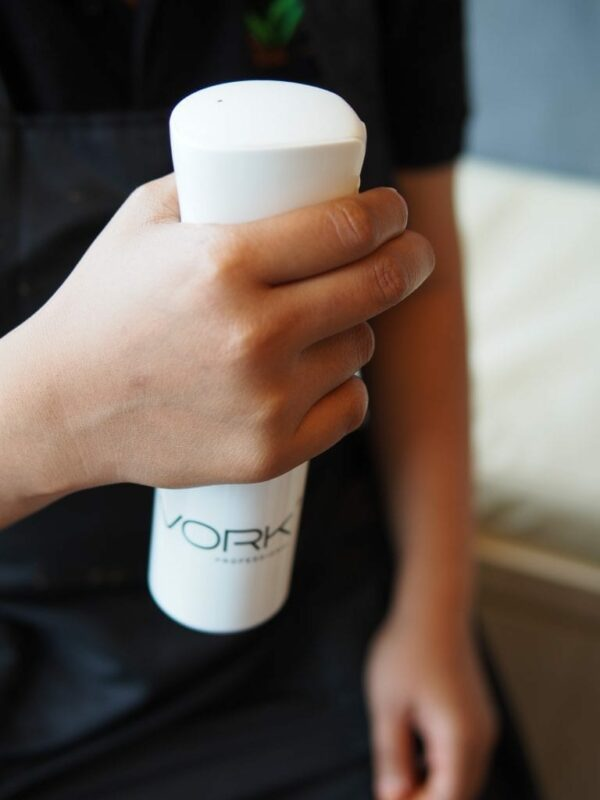
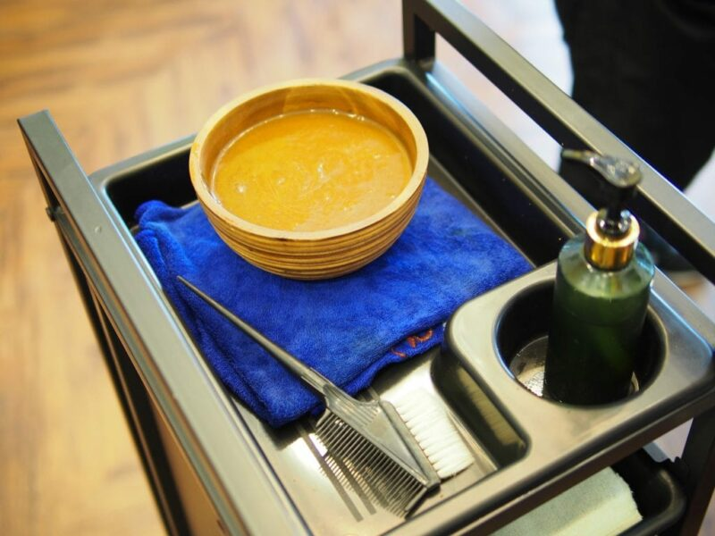
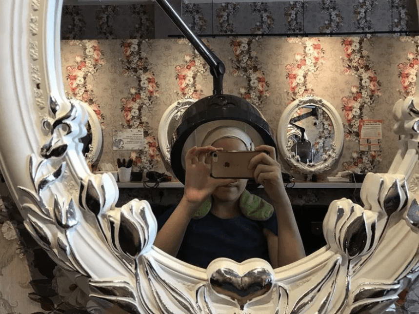
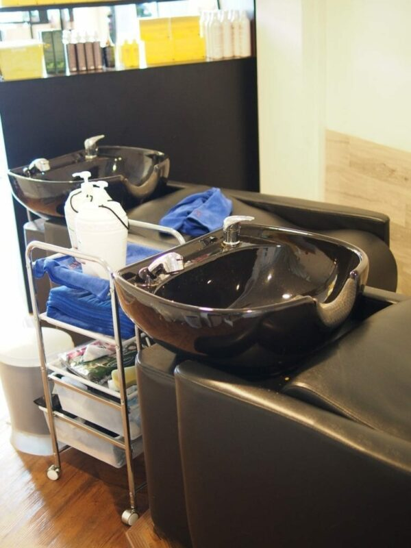
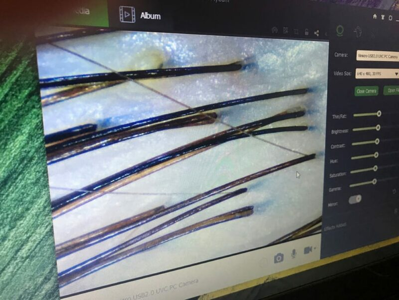
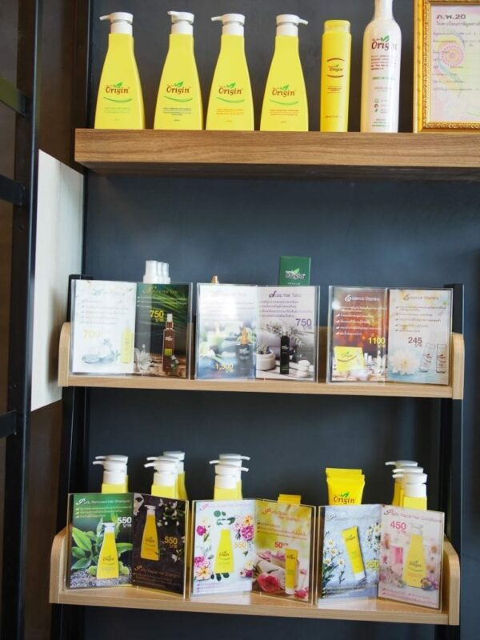

เมื่อนึกถึงการบำรุงเส้นผม ถ้าเป็นไปได้ ดิฉันจะเลือกบำรุงหนังศีรษะมากกว่าบำรุงเส้นผม สงสัยไหมคะว่าทำไม ที่ดิฉันเลือกที่จะบำรุงหนังศีรษะมากกว่าเส้นผมก็เป็นเพราะว่าในช่วงปีหลังๆดิฉันเข้าใจแล้วว่า การที่มีหนังศีรษะสุขภาพดีจะส่งผลให้สุขภาพเส้นผมดีไปด้วย เพราะการบำรุงหนังศีรษะคือวิธีการบำรุงตั้งแต่รากผม

Bee Choo Herbal

ปกติแล้วดิฉันจะไปนวดและทำทรีทเม้นท์หนังศีรษะอยู่แล้วเพื่อให้หนังศีรษะสะอาด แต่ว่าดิฉันไม่ได้ทำบ่อยเพราะทรีทเม้นท์หนังศีรษะส่วนใหญ่มักจะมีค่าใช้จ่ายที่สูง ในบางทีค่าทำทรีทเม้นท์หนังศีรษะอาจแตะ 6000 บาทเลยก็ได้

ดิฉันถือว่าโชคดีมากที่ทางบีชูเฮอร์เบิลให้โอกาสมาลองทำทรีทเม้นท์ของพวกเขา และดิฉันเพิ่งทราบว่าบีชูเฮอร์เบิลเป็นแบรนด์ลูกของบีชูออริจินซึ่งเป็นผู้เชี่ยวชาญด้านการรักษาหนังศีรษะและเป็นซาลอนคลินิกรักษาผมร่วงที่ก่อตั้งมาแล้วตั้งแต่ปี 2000

ทรีทเม้นท์สมุนไพรสำหรับหนังศีรษะและเส้นผม

ทางบีชูออริจินจะใช้ตัวยาสมุนไพรสำหรับหนังศีรษะที่ทำจากสมุนไพรล้วนๆ 100% โดยไม่มีส่วนผสมของสารเคมีใดๆทั้งสิ้นเพราะฉะนั้นแล้ว ทรีทเม้นท์ของพวกเขาจึงปลอดภัยสำหรับผู้หญิงที่กำลังตั้งครรภ์

ครีมสมุนไพรของบีชูมีสรรพคุณที่สามารถลดอาการผมร่วง รักษาผมบาง ขจัดรังแค ปิดผมขาว ผมหงอก และยังสามารถลดความมันบนหนังศีรษะได้อีกด้วย

ดิฉันได้ทำทรีทเม้นท์กับพวกเขาไปแล้วสองครั้งและรู้สึกว่าชอบมาก เวลาที่ใช้ทำทรีทเม้นท์: ประมาณ 1.5 – 2 ชั่วโมง

ขั้นตอนการทำทรีทเม้นท์

1\. การสแกนหนังศีรษะ

ก่อนที่จะทำทรีทเม้นท์ ทางร้านจะทำการสแกนหนังศีรษะให้โดยใช้เครื่องมือที่สามารถทำให้เห็นถึงสภาพหนังศีรษะที่อาจมองไม่เห็นด้วยตาเปล่า และผลการตรวจสภาพหนังศีรษะก็เป็นไปตามที่ดิฉันคาดไว้นั้นก็คือหนังศีรษะมันและมีบางส่วนเป็นจุดสีแดงที่มีอาการระคายเคืองของหนังศีรษะ และดิฉันก็คาดไว้แล้วว่ารูขุมขนบนหนังศีรษะดิฉันอุดตันไปหมดเพราะผมของดิฉันร่วงเยอะมาก ผู้ให้บริการทำผมแนะนำว่าสาเหตุที่ทำให้ดิฉันมีอาการผมร่วงและรูขุมขนบนหนังศีรษะอุดตันคือความเครียดและการอดนอน

2\. นวดหนังศีรษะเปิดรูขุมขนด้วย Ginger Hair Tonic

หลังจากการสแกนหนังศีรษะและพูดคุยถึงสาเหตุของอาการต่างๆและวิธีดูแลรักษา ผู้ให้บริการทำผมจะเริ่มทำทรีทเม้นท์ทันทีโดยพวกเขาจะนวดศีรษะให้โดยใส่ Ginger Hair Tonic ลงไปด้วยในขณะที่นวด การนวดนี้จะช่วยให้รู้สึกผ่อนคลายบริเวณศีรษะ ลำคอ และหัวไหล่ ที่สำคัญคือการนวดศีรษะด้วย Ginger Hair Tonic จะช่วยเปิดรูขุมขนบนหนังศีรษะเพื่อเพิ่มประสิทธิภาพการดูดซึมสารอาหารของหนังศีรษะ

*น้ำมันมะกอกจะถูกชะโลมลงบนปลายเส้นผมเพื่อปรับสภาพและทำให้เส้นผมนุ่มขึ้น*

4\. ใส่ครีมสมุนไพร

ลำดับต่อไปคือหัวใจของการทำทรีทเม้นท์นี้คือการทาครีมสมุนไพรเอกลักษณ์เฉพาะของทางร้าน สังเกตุเห็นของเหลวสีน้ำตาลที่อยู่ในถ้วยในรูปไหมคะ สิ่งนี้คือตัวยาสมุนไพรที่ทางร้านจะทาลงบนหนังศีรษะให้ทั่วทุกซอกและรวมถึงเส้นผมด้วย ตัวยาสมุนไพรนี้ประกอบด้วยสมุนไพรจีนพื้นบ้านต่างๆเช่นจินเส็งและตังกุยและอื่น ๆ โดยครีมสมุนไพรนี้จะมีกลิ่นแบบสมุนไพรชัดเจนและกลิ่นนี้จะติดหนังศีรษะไปประมาณสองถึงสามวัน ตัวดิฉันเองรู้สึกว่ากลิ่นสมุนไพรติดหัวไปสามวันแต่กลิ่นนี้ไม่ได้ฉุนจนเกินไปและไม่เหม็น ถือว่ารับได้ค่ะ

*5. อบไอน้ำ*

หลังจากที่ทาครีมสมุนไพรแล้ว ผู้ให้บริการทำผมจะทำการห่อผมและหนังศีรษะของดิฉันแล้วนำเครื่องอบไอน้ำมาครอบเพื่อทำการอบไอน้ำต่อไป ขั้นตอนนี้จะใช้เวลาประมาณ 45 นาที เตรียมหนังสือหรือ iPad ไปอ่านฆ่าเวลาก็ได้ค่ะ

*6. สระผมและเป่าแห้ง*

หลังจากที่หนังศีรษะได้รับสารอาหารและแร่ธาตุจากตัวยาสมุนไพรไปเต็ม ๆ แล้ว พนักงานจะทำการล้างและสระหนังศีรษะและเส้นผมให้อย่างละเอียดเพื่อให้ครีมสมุนไพรออกหมด และเมื่อสระเสร็จ เธอจะเป่าผมให้แห้งด้วยลมเย็นเพื่อไม่ให้เส้นผมและหนังศีรษะแห้งจนเกินไป หลังจากที่เป่าผมแล้ว ครีมบำรุงผมจะถูกทาลงบนเส้นผมเพื่อปรับสภาพและปกป้องเส้นผมดิฉันอีกด้วย

หลังจากทำทรีทเม้นท์แก้ปัญหาผมร่วงเสร็จ พวกเขาจะทำการสแกนหนังศีรษะให้อีกครั้งเพื่อสำรวจความเปลี่ยนแปลง คราวนี้หนังศีรษะดิฉันดูสะอาดขึ้นมาก ดูไม่มีสิ่งอุดตันรูขุมขนเหมือนก่อนทำทรีทเม้นท์แก้ปัญหาผมร่วงและมีความมันน้อยลง

*สิ่งที่ดิฉันจะแนะนำ*

สิ่งที่ดิฉันจะแนะนำ

ดิฉันขอแนะนำให้ใช้ผลิตภัณฑ์ของทางร้านควบคู่กับการทำทรีทเม้นท์ไปด้วยเพราะจะช่วยปรับความสมดุลให้กับเส้นผมและหนังศีรษะ ควบคุมความมัน ผลิตภัณฑ์ที่ดิฉันใช้จะมี Purity Scalp Hair Shampoo และ Scalp Hair Tonic ซึ่งสองตัวนี้จะช่วยรักษาความสะอาดของหนังศีรษะดิฉันระหว่างทรีทเม้นท์ครั้งนี้และครั้งถัดไป และดิฉันสังเกตุเห็นได้ว่าการใช้ผลิตภัณฑ์สองชนิดนี้สามารถช่วยให้อาการผมร่วงของดิฉันลดน้อยลง ทำให้อาการผมบางของดีฉันดีขึ้น และทำให้หายจากการมีรังแค แต่รู้ไว้ก่อนนะคะว่าการทำทรีทเม้นท์ของร้านบีชูสามารถทำให้สีผมของคุณเปลี่ยนไปเป็นสีโทนน้ำตาลเพราะจะมีส่วนผสมสมุนไพรที่ทำหน้าที่ปิดผมขาว เส้นผมของดิฉันที่ผ่านการฟอกสีถูกเปลี่ยนเป็นสีที่เข้มขึ้นแต่ดิฉันไม่มีปัญหาเพราะสีที่ได้มาหลังจากการทำทรีทเม้นท์ดูเป็นธรรมชาติมากค่ะ

หากคุณกำลังมองหาสถานที่บำรุงและดูแลรักษาหนังศีรษะของคุณหรือกำลังมองหาวิธีรักษาผมร่วง รักษาผมบาง หนังศีรษะมันและการมีรังแค ขอบอกเลยว่าทรีทเม้นท์รักษาอาการผมร่วงของบีชูเหมาะมากค่ะ จากที่ดิฉันเคยทำทรีทเม้นท์บำรุงรักษาหนังศีรษะที่อื่นมาก่อน ต้องบอกเลยค่ะว่าทรีทเม้นท์ของซาลอนคลินิกรักษาผมร่วงบีชูราคาเหมาะสมและคุ้มค่ามากสำหรับสิ่งที่ได้รับค่ะ

สิ่งที่อาจเป็นข้อจำกัดของที่นี่คือกลิ่นสมุนไพรที่ติดตามไปหลังจากการทำทรีทเม้นท์และสีผมที่อาจเปลี่ยนไปนิดหน่อย

*ราคาการทำทรีทเม้นท์ขึ้นอยู่กับความยาวของเส้นผมค่ะ โดยราคาเริ่มต้นในวันที่ดิฉันไปทำคือ 600 บาทค่ะ*

หาข้อมูลเพิ่มเติมได้ที่เว็บไซต์ของพวกเขา [ที่นี่](https://beechooherbal.com/th) และเพจเฟสบุค[ที่นี่](http://facebook.com/beechooherbal) ค่ะ
